# 前言

Spring Cloud Function 是一个具有以下高级目标的项目：

- 通过函数促进业务逻辑的实现，可以将函数设置为HTTP端点。
- 将业务逻辑的开发生命周期与任何特定的运行时目标分离，以便相同的代码可以作为 Web 端点、流处理器或任务运行。
- 支持跨无服务器提供商的统一编程模型，以及独立运行（本地或在 PaaS 中）的能力。
- 在无服务器提供程序上启用 Spring Boot 功能（自动配置、依赖注入、指标

可以直接通过HTTP请求与单个的函数进行交互，同时为spring.cloud.function.definition或者spring.cloud.function.routing-expression参数提供您要调用的函数的名称

在https://www.cnblogs.com/9eek/archive/2022/04/07/16113603.html可以看到演示

而spring.cloud.function.routing-expression允许使用spel表达式

# 环境搭建

漏洞影响版本：3.0.0.RELEASE <= Spring Cloud Function <= 3.2.2

spring项目

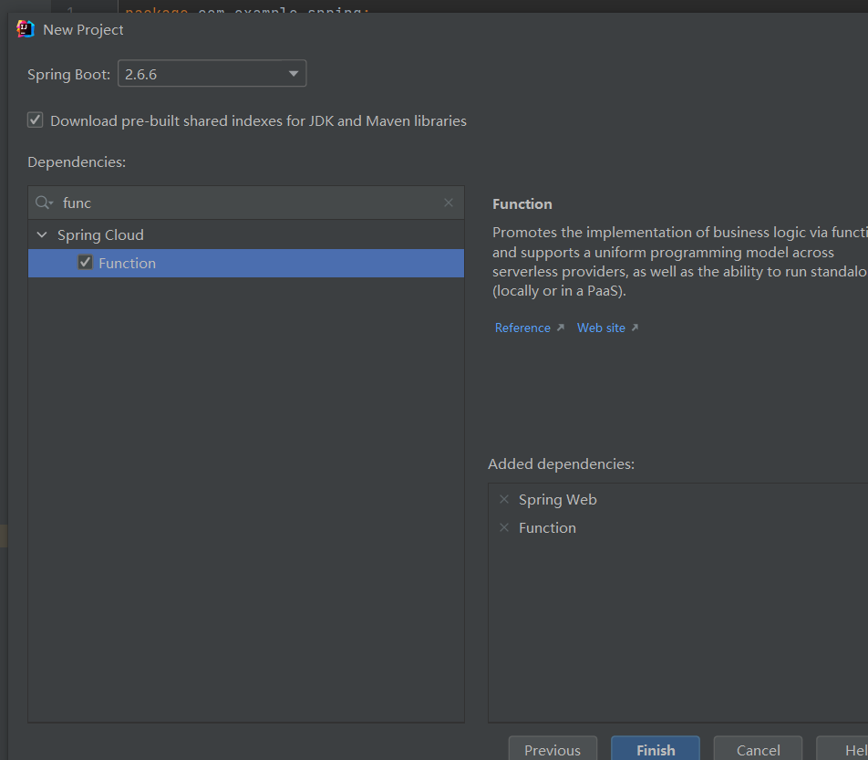

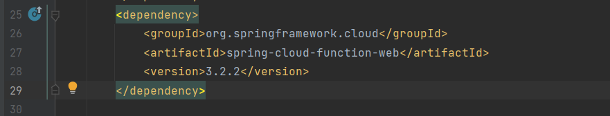

我使用的是3.2.2的版本

# 漏洞复现

直接启动新创建的spring项目，不用做任何修改

直接抓包修改

```
POST /functionRouter HTTP/1.1
Host: 127.0.0.1:8080
Cache-Control: max-age=0
Upgrade-Insecure-Requests: 1
User-Agent: Mozilla/5.0 (Windows NT 10.0; Win64; x64) AppleWebKit/537.36 (KHTML, like Gecko) Chrome/100.0.4896.60 Safari/537.36
Accept: text/html,application/xhtml+xml,application/xml;q=0.9,image/avif,image/webp,image/apng,*/*;q=0.8,application/signed-exchange;v=b3;q=0.9
Accept-Encoding: gzip, deflate
Accept-Language: zh-CN,zh;q=0.9
Connection: close
Content-Type: application/x-www-form-urlencoded
spring.cloud.function.routing-expression:T(java.lang.Runtime).getRuntime().exec("calc")
Content-Length: 0


```

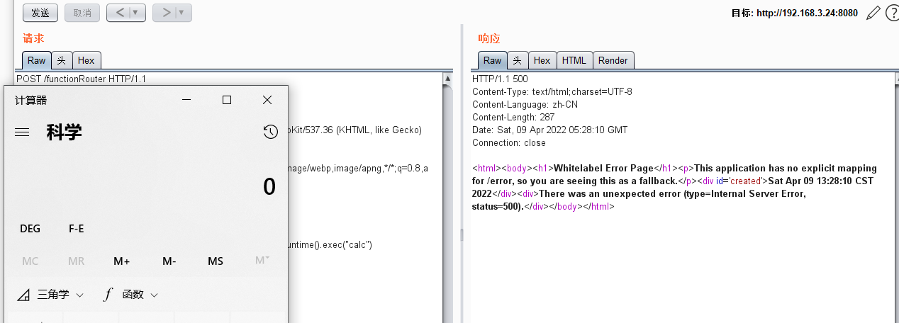

# 漏洞分析

参考了一些博客和官方的commit记录，最后的漏洞触发点在RoutingFunction的functionFromExpression中

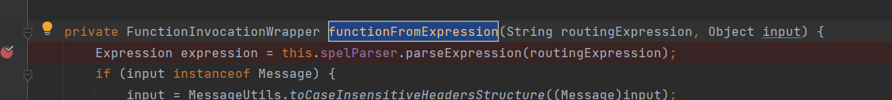

最后解析的是传入的第一个参数routingExpression，看一下可控不

找一找哪里对这个函数进行了调用，可以找到一个route方法而且在这个类里面

有好几个地方都调用了

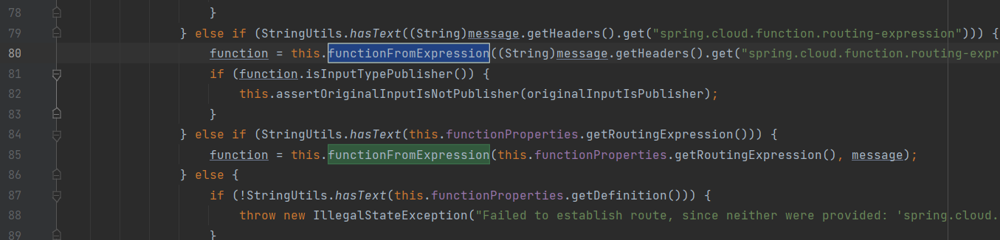

先从复现的调用栈来开始吧

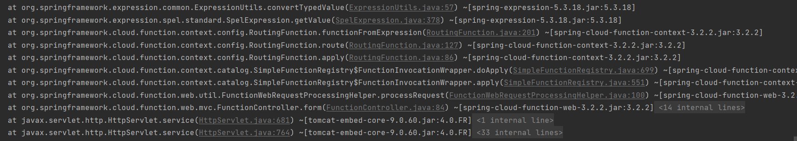

入口点在FunctionController的form方法里面

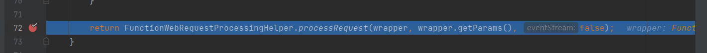跟进这里的processRequest

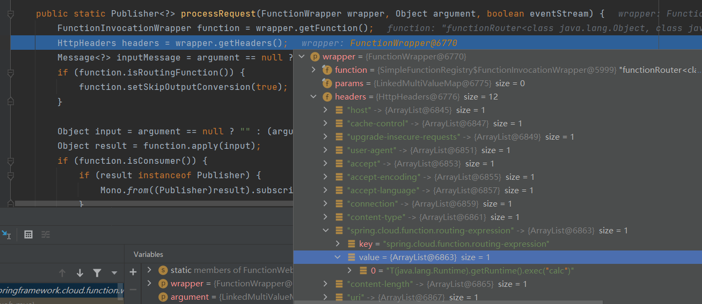

其实这里wrapper的headers的内容就是我们http数据包的一些请求头的内容构成的一个数组

接下来的会通过MessageBuilder.withPayload(argument).copyHeaders(headers.toSingleValueMap()).build()来请求头的信息编译成Message放入inputMessage中，最在放入input参数中，通过function.apply方法调用

跟进这里的apply方法

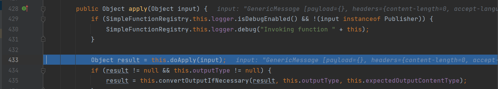

接着调用doApply方法

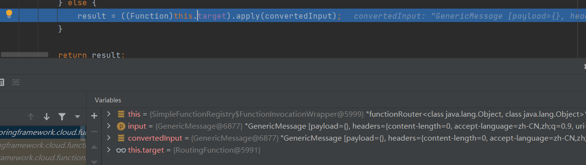

这里的this.target指向了RoutingFunction类，跟进apply方法来到RoutingFunction的apply方法

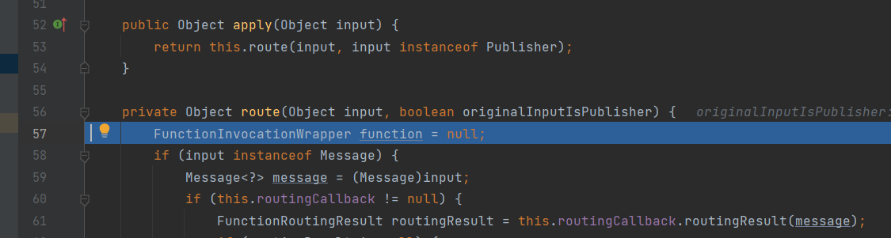

跟进来到前面提到的route方法，向下步进

如果请求头存在spring.cloud.function.routing-expression字段，则进入下面的代码区域

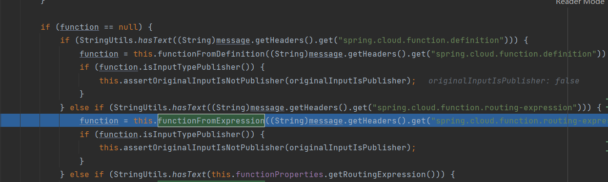

```
function = this.functionFromExpression((String)message.getHeaders().get("spring.cloud.function.routing-expression"), message);
```

调用了漏洞触发函数functionFromExpression并传入两个参数，第一个是请求头中的spring.cloud.function.routing-expression的值，第二个是整个message的值

跟进functionFromExpression

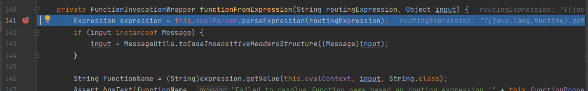

对spring.cloud.function.routing-expression的值进行spel表达式解析，最后看一下getValue中this.evalContext的值

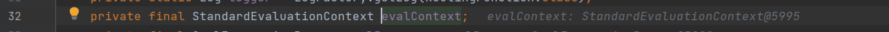

是StandardEvaluationContext，那就没问题了，可以解析类，最后达到spel表达式注入

# 补丁分析

补丁参考地址https://github.com/spring-cloud/spring-cloud-function/commit/0e89ee27b2e76138c16bcba6f4bca906c4f3744f

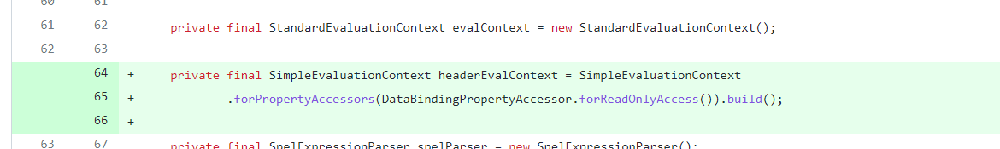


和大多数Spel漏洞的修复一样，都是引入了SimpleEvaluationContext来修补，这里的headerEvalContext就是使用SimpleEvaluationContext来解析的

# 写在最后

这个漏洞的理解其实并不难，和Spring Cloud Gateway一样是一个spel注入漏洞，更多的理解我觉得是对组件的一个理解，像Spring Cloud Gateway增加路由刷新路由的操作，然后会去调用什么函数走到最后spel注入的代码块，这个漏洞也一样，要去了解动态路由functionRouter，看过一些文章，他们最开始的调用栈并不是form方法，也可能也是组件版本的一些影响，但是最后都是走到了RoutingFunction的apply方法


参考链接

https://www.cnblogs.com/wh4am1/p/16062306.html

https://www.anquanke.com/post/id/271167#h2-1

https://blog.csdn.net/weixin_44112065/article/details/123965187

https://www.cnblogs.com/9eek/archive/2022/04/07/16113603.html
